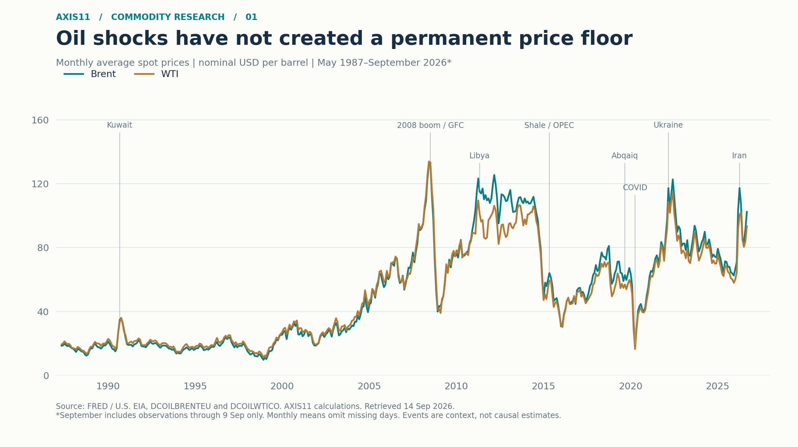
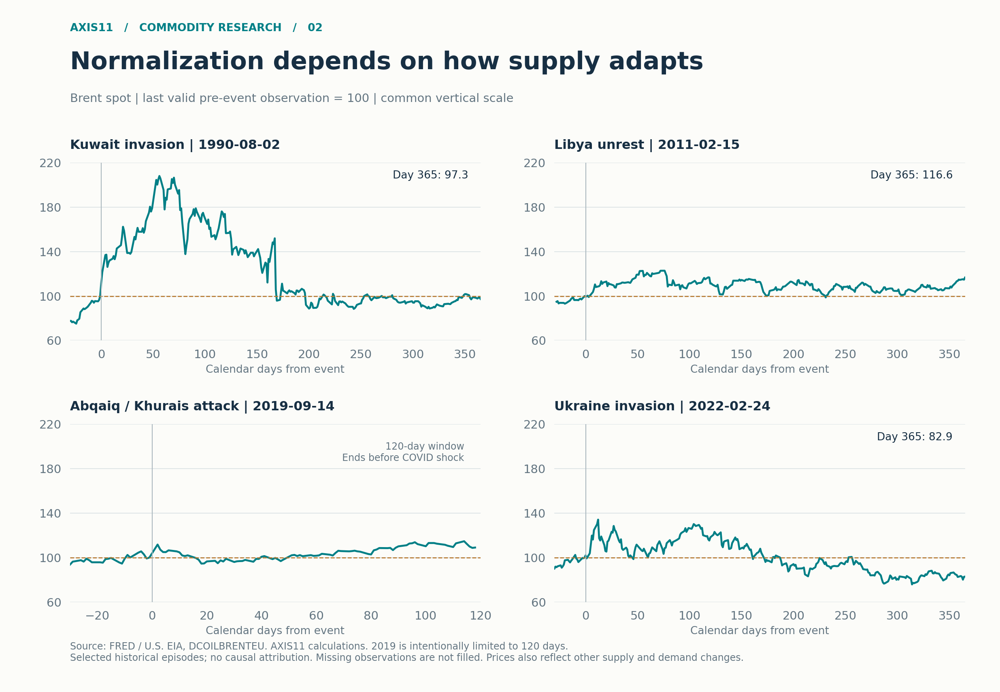

*From resource scarcity to supply-route scarcity*

원유 시장의 장기적인 변화를 이해하려면 지하에 존재하는 원유와 소비자에게 도착할 수 있는 원유를 구분해야 한다. 셰일 혁명은 경제적으로 개발 가능한 자원의 범위를 넓혔다. 그러나 유전이 존재한다는 사실만으로 봉쇄된 해협이나 파괴된 송유관을 대체할 수는 없다. 자원은 풍부해졌지만, 특정 시점과 지역에서 공급은 여전히 부족할 수 있다.

**나의 기본 견해는 수송 정상화를 전제로 한 중기 유가 하락이다. 다만 현재의 물리적 공급 차질은 단기 급등을 충분히 정당화한다.** 앞으로 6~12개월의 방향과 앞으로 몇 주의 가격 경로가 서로 다를 수 있다는 점이 이번 분석의 출발점이다. 이 분석의 초점은 시장이 공급 차질의 지속 기간을 언제 짧게 보기 시작하는가에 있다. 협상 유인과 공급·수요의 적응이 그 기대를 바꾼다면, 유가의 하락은 실제 수송 정상화보다 먼저 시작될 수 있다.

## 1. 고갈 우려에서 공급의 경제성으로

2000년대 초중반 원유 시장을 지배했던 주요 우려 중 하나는 수요 증가를 생산이 따라잡을 수 있느냐는 것이었다. 당시 신흥국의 빠른 성장과 단기 공급 제약은 가격 상승을 뒷받침했다. 연준의 2008년 회고도 그해 상반기 급등 배경으로 신흥국 수요와 제한적인 공급을 지목한다[^fed2008]. 이를 단순히 투기나 고갈 공포만으로 설명하는 것은 충분하지 않다.

이후 수평시추와 수압파쇄가 결합하면서 과거에는 개발 경제성이 낮았던 원유가 공급원으로 편입됐다. 셰일 혁명의 핵심은 원유가 무한해졌다는 것이 아니라, **가격과 기술이 변화하면 추가로 생산할 수 있는 자원이 크게 늘어났다는 것**이다. 댈러스 연준은 셰일이 공급비용 곡선을 완만하게 만들고 장기 가격을 제약하는 메커니즘을 설명했다[^dallas2019].

이 변화가 가격에 분명히 드러난 시기는 2014~2016년이다. 세계은행은 미국 셰일 생산 확대, OPEC 정책 변화, 지정학적 우려 완화에 이어 수요 전망 악화가 하락에 기여했다고 분석했다[^wb2018]. FRED 일별 자료로 계산한 Brent 연평균은 2013년 108.56달러에서 2016년 43.64달러로 낮아졌다[^brent].

다만 공급이 시장에 반응하는 시차는 여전히 존재한다. 댈러스 연준의 2026년 6월 분석에 따르면 가격 신호에 반응한 신규 생산이 주요 송유관에 도달하기까지 6~8개월이 걸릴 수 있다. 자본 지출 규율, 동반 생산되는 천연가스의 수송 제약, 장비 부족도 증산을 제한한다[^dallas2026]. **기술은 중기 공급의 대응력을 높였지만, 단기 가격의 확정적인 상한선을 만든 것은 아니다.**



*그림 1. 일별 관측치의 월평균, 명목 달러/배럴. 2026년 9월은 9일까지의 부분 월이다. 2008년 금융위기와 2020년 팬데믹도 표시했다. 두 시기의 급락을 분쟁 이후 공급 복원이나 셰일만의 효과로 해석해서는 안 된다. 출처: FRED, AXIS11 계산.*

## 2. 전쟁이 계속돼도 유가는 정상화될 수 있다

유가는 전쟁의 존재보다 전쟁이 실제 공급과 수요에 미치는 변화에 반응한다. 생산 복구, 재고 사용, 교역 경로 변경과 수요 둔화가 작동하면 전쟁이 끝나기 전에도 가격이 낮아질 수 있다. 그러나 모든 충격에서 정상화의 속도가 같지는 않다.

**1990~1991년: 공급 충격과 불확실성의 해소.** 이라크의 쿠웨이트 침공 직전 Brent는 19.93달러였다. 이후 90일 안의 최고 가격은 41.45달러였지만, 사건 1년 후에는 19.40달러였다. 셰일 이전에도 가격 복원이 나타났다는 점에서, 이런 패턴을 셰일 혁명의 독점적인 결과로 볼 수 없다[^brent].

**2019년: 복구 속도가 가격을 결정한 사례.** 사우디 Abqaiq·Khurais 시설 피격 직전 61.25달러였던 Brent 현물은 9월 16일 68.42달러로 상승했지만, 9월 30일에는 60.99달러로 내려왔다. Aramco는 당시 생산 수준을 11일 만에 복구했다고 밝혔다[^brent][^aramco]. 초기 손실의 크기만큼이나 손실의 지속 기간이 중요했다. 다만 연말에는 다시 가격이 올라, 초기 충격 해소가 이후의 지속적인 하락을 뜻하지는 않았다.

**2022년: 전쟁 종료 없이 진행된 가격 조정.** 러시아 침공 직전 Brent는 99.29달러였고 3월 8일 133.18달러에 도달했다. 1년 후에는 82.31달러였다. 연평균도 2022년 100.93달러에서 2023년 82.49달러, 2025년 69.14달러로 낮아졌다[^brent]. 세계은행은 러시아 수출의 다른 시장으로의 전환, 미국 등 비OPEC 공급 확대와 수요 여건을 설명한다[^wb2024]. 러시아 원유가 세계 시장에서 완전히 사라지는 시나리오와 실제 교역 재편의 결과는 달랐다.

**2011년: 정상화가 오래 걸린 반례.** 리비아 사태 초기인 2월 15일을 기준으로 하면, Brent는 직전 103.12달러에서 90일 내 126.64달러까지 올랐고 1년 후에도 120.25달러였다. 2011~2013년 연평균은 모두 100달러 이상이었다[^brent]. 공급 여유가 부족한 환경에서 충격이 반복되면 위험 프리미엄과 실물 부족이 오래 지속될 수 있다. 단순한 '전쟁 급등 후 매도' 법칙은 성립하지 않는다.



*그림 2. 사건 직전 마지막 유효 관측치를 100으로 환산. 가로축은 달력일이다. 2019년은 팬데믹 영향을 섞지 않도록 120일까지만 표시하며, 나머지는 365일까지 표시한다. 각 패널의 세로축 범위는 동일하다. 비교 사례를 선별한 사례 비교 분석이며 인과관계 추정이나 전체 분쟁의 통계적 검정이 아니다. 출처: FRED, AXIS11 계산.*

| 사건 기준일 | 직전 Brent | 이후 90일 내 최고 | 90일 후 | 1년 후 |
|---|---:|---:|---:|---:|
| 쿠웨이트 침공 · 1990-08-02 | $19.93 | $41.45 | $34.30 | $19.40 |
| 리비아 사태 초기 · 2011-02-15 | $103.12 | $126.64 | $113.72 | $120.25 |
| 사우디 시설 피격 · 2019-09-14 | $61.25 | $68.42 | $67.44 | — |
| 러시아의 우크라이나 침공 · 2022-02-24 | $99.29 | $133.18 | $116.41 | $82.31 |

*단위: 명목 달러/배럴. 90일 내 최고는 사건일~89일 후의 관측치 중 최고. 90일·1년 후는 각각 90일·365일 후 당일 또는 이전의 마지막 유효 관측치. 2019년의 1년 후 값은 팬데믹 충격이 겹치므로 비교에서 제외했다. 사건일은 분석 기준점이며 가격에는 사건 이전 정보도 반영돼 있다.*

이 사례들의 공통된 교훈은 **정상화에는 작동 경로가 필요하다**는 것이다. 2019년에는 시설 복구가 빨랐고, 2022년 이후에는 교역 재편과 공급·수요 조정이 있었다. 현재 호르무즈를 통과하지 못하는 원유가 과거 러시아 원유처럼 목적지만 바꾸면 이동할 수 있는 것은 아니다. 항로 자체가 막힌 상황에는 다른 해법이 필요하다.

따라서 현재 시장을 어느 과거 전쟁과 닮았는지로 분류하기보다, 공급 대응과 교역 재편이 추가 손실을 흡수하는 환경인지, 반복되는 차질이 그 대응을 압도하는 환경인지 구분해야 한다. 중기 하락 전망은 전자의 방향으로 이동할 것이라는 판단에 근거한다.

## 3. 현재 시장: 자원의 희소성보다 수송의 희소성

이번 노트의 FRED 최신 관측일은 **2026년 9월 9일**이다. 이날 Brent 현물은 **109.51달러**, WTI 현물은 **97.26달러**였다[^brent][^wti]. 두 값은 현물 벤치마크이며, 이후 보도되는 근월물 선물과 날짜·계약·인도 조건이 다르다.

9월 14일 Reuters 보도에서는 사우디 East-West 송유관 중단, 해협에서의 선박 피격, Bab el-Mandeb 부근의 위험 확대가 확인됐다. 예정됐던 오만 회의도 연기됐다[^reuters-oil]. 이 상황에서는 우회 송유관의 존재를 곧바로 가용 공급으로 계산할 수 없다. 명목 수송능력, 실제 가동률, 항만 선적과 목적지 도착량은 별개다.

```chart
{
  "type": "line",
  "title": "2026년 Brent·WTI 현물 가격 추이",
  "subtitle": "2026년 일별 현물 가격 · 명목 달러/배럴 · FRED 최신 관측일 9월 9일",
  "source": "FRED / U.S. EIA, DCOILBRENTEU 및 DCOILWTICO. AXIS11 계산.",
  "x": "date",
  "xType": "date",
  "yLabel": "USD / barrel",
  "height": 380,
  "series": [
    { "key": "brent", "label": "Brent" },
    { "key": "wti", "label": "WTI" }
  ],
  "dataFile": "axis11_oil_2026_daily.csv"
}
```

*그림 3. FRED 일별 현물, 2026년 9월 9일까지. 결측일은 채우지 않고 유효 관측점 사이를 연결한다. 선물 가격은 이 계열에 섞지 않았으며, 9월 11일 이후의 사건도 반영하지 않았다. 출처: FRED, AXIS11 계산.*

가격에는 실제 공급 부족에 더해 추가 차질에 대한 불안, 예방적 재고 확보와 금융시장 포지셔닝도 반영될 수 있다. 그러나 현물·선물 가격만으로 이들의 기여도를 분리할 수는 없다. '현재 상승분 대부분이 투기'라고 단정하거나, 특정 금액을 전쟁 프리미엄으로 빼서 적정 가격을 계산할 근거는 아직 부족하다.

현재의 공급 부족을 확인하는 지표와 그 부족이 얼마나 지속될지를 평가하는 지표는 구분해야 한다. 현물과 근월물의 강세가 이어지더라도, 협상과 수송 복원에 대한 기대가 달라지면 이후 인도분의 가격은 먼저 하락할 수 있다. 다음으로 살펴볼 것은 이러한 기대를 바꿀 정치적 유인이다.

## 4. 협상 신호: 발언보다 실제 의지

현 시점의 핵심은 미국과 이란이 시간에 따라 부담하는 비용과, 기다림을 통해 얻을 수 있다고 판단하는 이익이 다르다는 점이다. 선거와 국내 정치, 재정 부담과 군사적 제약은 양측의 협상 유인을 서로 다른 속도로 변화시킨다. 따라서 강경한 발언과 협상 의지를 반대 방향으로 해석할 필요는 없다. 압박을 높여 더 유리한 조건을 확보하려는 행동은 타협을 준비하는 과정에서도 나타날 수 있다.

**강경 발언이 강해졌다는 이유만으로 협상 타결 가능성이 낮아졌다고 판단하기는 어렵다.** 중요한 것은 발언의 수위보다 그 압박이 각국의 계산을 어떻게 바꾸는가다. 추가 압박으로 얻을 이익이 남아 있다고 판단하면 대치는 이어질 수 있지만, 기다리는 비용이 더 빠르게 증가한다면 강경한 태도를 유지하면서도 협상을 서두를 유인은 커진다.

이 계산은 미국과 이란만의 사정으로 결정되지 않는다. Reuters는 홍해 항로에 대한 후티의 위협이 호르무즈 해협의 수송 차질과 맞물리면서, 일부 걸프 국가들이 미국의 대응에만 의존하기보다 이란과 독자적인 외교를 추진해야 할 필요성을 높이고 있다고 보도했다[^reuters-gulf]. 이는 압박의 확대가 이란의 협상력을 높이는 동시에, 피해를 부담하는 주변국들의 타협 요구도 강화할 수 있음을 시사한다. 미국과 이란의 포괄적 합의가 어려운 상황에서도 주변국은 자국의 수송과 경제적 이해를 지키기 위한 제한적 합의를 추진할 유인이 있다.

물론 협상의 필요성이 커진다고 협상이 곧바로 진전되는 것은 아니다. 걸프–이란 회담 연기와 후티의 대사우디 공격은 압박이 외교적 접촉을 어렵게 만들 수도 있음을 보여준다. 그러나 단기적인 협상 차질과 타협 유인의 약화는 같은 의미가 아니다. 공개적인 대립이 심해지는 동안에도, 그 대립을 지속하는 비용은 커질 수 있다.

유가의 전환점은 합의 발표보다, 시장이 관련국들의 판단이 ‘더 버티는 편이 유리하다’에서 ‘타협하는 편이 유리하다’로 이동하고 있다고 인식하는 순간에 먼저 나타날 수 있다. 현재의 공급 차질이 심해지더라도 협상 의지가 충분히 커졌다고 평가한다면, 시장이 예상하는 차질의 지속 기간은 오히려 짧아질 수 있다. 이 경우 실제 수송 회복에 앞서 전쟁 위험 프리미엄이 축소되면서 유가가 하락할 수 있다.

이 분석에서 주목하는 가능성은 바로 여기에 있다. 압박의 확대가 당장의 공급 위험을 높이는 효과보다, 타협을 앞당길 것이라는 기대를 강화하는 효과가 커지는 순간이다. 역설적으로 가장 강경한 언행이 오가는 시기가 유가의 추가 상승 구간이 아니라, 시장이 협상 가능성을 먼저 반영하기 시작하는 전환 구간이 될 수도 있다.

## 5. 향후 흐름: 중기 정상화, 단기 불안정

향후 6~12개월에는 공급 대응과 수요 조정이 누적되고, 제한적인 수송 복원도 진행되면서 유가에 하방 압력을 가하는 경로를 기본 시나리오로 본다. 여기에는 완전한 종전 없이도 일부 수송 경로를 회복할 수 있으며, 추가적인 시설 훼손과 생산국의 감산이 그 효과를 모두 상쇄하지는 않을 것이라는 판단이 포함돼 있다. **6~12개월은 이러한 조정을 평가하는 기간이며, 유가 하락의 시작 시점을 뜻하지 않는다.**

| 경로 | 시장의 기대를 바꿀 조건 | 예상 가격 반응 |
| --- | --- | --- |
| 점진적 정상화 · 기본 | 제한적 협상 진전, 우회 수송 확대와 복구 전망의 신뢰도 상승 | 완전한 정상화 이전부터 장기 차질에 대한 프리미엄 축소. 이후 공급 대응과 수요 조정이 하방 압력 강화 |
| 장기 공급 차질 · 주요 상방 위험 | 호르무즈·홍해 차질 지속과 협상 교착으로 예상 차질 기간 연장 | 고유가 지속 또는 추가 급등. 수요 둔화보다 공급 손실이 우세 |
| 협상 기대의 빠른 재평가 · 하락 가속 | 당사국이 타협을 선호한다는 신뢰할 만한 신호, 중재안 수용과 요구 조건의 유연화 | 합의 발표와 물동량 회복 이전에 위험 프리미엄이 빠르게 축소 |

과거의 60달러대는 자동적인 목표 가격이 아니다. 2025년 Brent 현물 연평균 가격은 배럴당 69.14달러였지만, 이는 역사적 참고값이다. 수송 정상화 이후의 가격은 그동안 조정된 수요와 공급, OPEC+의 대응에 따라 달라질 것이다. 특히 고유가로 약해진 수요가 남아 있는 상태에서 공급이 회복된다면 하락 압력이 예상보다 커질 수 있고, 생산국의 감산이 이를 상쇄한다면 하락 폭은 제한될 수 있다.

**이 하락 경로가 반드시 ‘마지막 급등’을 거쳐야 하는 것은 아니다.** 시장이 협상 의지의 변화를 먼저 반영하면, 추가적인 가격 급등 없이도 하락이 시작될 수 있다. 따라서 마지막 정점을 기다리는 전략은 공급 불안이 가장 크게 보이는 시기에 이미 진행되는 기대의 변화를 놓칠 위험이 있다.

수요 측면에서 주목하는 것은 고유가에 대한 적응이 수송 정상화 이후에도 남을 가능성이다. 단기적인 소비 절감은 가격이 내려가면 되돌아올 수 있지만, 효율 개선이나 대체 기술로의 전환은 더 오래 지속될 수 있다. 세계은행의 2025년 분석도 전기차 보급을 석유 수요를 제약하는 요인으로 지적했다[^wb2025].

이 분석의 가설은 수송이 복원될 때 시장이 마주하는 수요가, 차질 발생 이전에 예상했던 수요보다 약할 수 있다는 것이다. 전기차 보급은 그 가능성을 높이는 구조적 요인이며, 향후 6~12개월에는 고유가에 따른 소비 조정과 경기 둔화의 영향이 더 직접적인 변수가 될 수 있다. 공급 경로의 복원과 약해진 수요가 겹친다는 기대가 형성된다면, 유가는 현재의 물리적 부족이 해소되기 전부터 이를 반영할 수 있다.

## 6. 향후 관측 지표

다음 지표로 중기 하락 시나리오를 점검한다. 협상 유인과 시장 반응은 가격 전환의 신호로, 실제 수송량은 정상화의 진행 정도를 확인하는 보조 지표로 살펴본다.

| 관측 대상 | 중기 하락 견해를 강화 | 상방 위험을 강화 |
|---|---|---|
| 협상 유인과 조건의 변화 | 강경한 언행 속에서도 요구 조건이 유연해지고, 주변국이 제한적 합의를 구체적으로 추진 | 추가 압박의 기대이익을 높게 평가하며 요구 조건 강화, 중재안 거부와 협상 경로 단절 |
| 공급 악재에 대한 가격 반응 | 새로운 공격이나 차질에도 상승 폭이 줄고, 상승분을 빠르게 반납하는 반응이 반복 | 비슷한 규모의 악재에도 상승 폭이 커지고 높은 가격이 유지 |
| 현물 가격·선물곡선 | 현물 할증 완화, 또는 근월물 부족이 지속되는 가운데 원월물이 하락하며 중기 정상화 기대 반영 | 현물·근월물 강세가 원월물까지 확산되며 장기 부족을 가격에 반영 |
| 최종 수요·제품 재고 | 제품 소비와 정제마진 약화가 제품 재고 증가와 함께 나타나며 수요 조정 확인 | 높은 가격에도 제품 소비가 견조하고 재고 감소 지속 |
| 비중동 공급·OPEC+ 대응 | 비중동 생산·수출 확대 전망의 신뢰도가 높아지고, OPEC+의 상쇄 감산 가능성은 제한 | 생산 확대 계획 후퇴, 수출 제약 또는 공급 회복분을 흡수할 감산 의지 강화 |
| 수송 복원 · 보조 확인 | 송유관·항만·해협의 회복이 지속되며 정상화 기대를 뒷받침 | 반복적 재피격과 우회 경로 차질로 예상 복구 기간 연장 |

백워데이션은 가까운 인도 시점의 원유가 나중에 받을 원유보다 비싼 상태를 말한다. 근월물 가격이 유지되고 원월물 가격만 하락하면 백워데이션은 오히려 확대될 수 있으므로, 곡선의 기울기와 만기별 가격 변화를 구분해 살펴본다.

어느 한 지표만으로 전환을 판단하지는 않는다. 특히 악재에 대한 가격 반응 둔화는 포지션 조정이나 이미 반영된 기대 때문일 수도 있다. 그러나 협상 조건의 유연화, 원월물 가격 하락, 수요 약화가 함께 나타난다면, 현재의 공급 부족에도 불구하고 시장이 그 지속 가능성을 낮게 평가하기 시작했다는 해석에 힘이 실린다.

반대로 현물 부족이 원월물 가격 상승으로 확산되고, 공급 대응과 수요 조정도 지연된다면 중기 하락 견해를 약화시켜야 한다. 이는 단순히 정상화 시점이 늦어지는 문제가 아니라, 높은 가격을 유지시키는 조건이 예상보다 오래 지속된다는 신호다.

**중기 하락 견해의 핵심은 공급 확대와 교역 재편, 수요 조정이 추가적인 공급 훼손보다 우세해질 것이라는 판단이다.** 높은 가격은 이러한 적응과 정치적 타협을 촉진할 수 있다. 유가의 전환점은 그 과정이 완료되는 날이 아니라, 시장이 공급 차질의 지속 기간을 짧게 보기 시작하는 시점에 나타날 수 있다. 따라서 전쟁과 물리적 공급 부족이 이어지는 상황에서도 중기 하락 경로는 열려 있다.

## 데이터와 해석

- 기준일: 2026년 9월 14일. FRED API에서 내려받은 최신 관측일: 2026년 9월 9일. 뉴스 확인 범위는 9월 14일 공개 보도까지다.
- 계열: DCOILBRENTEU, DCOILWTICO. 원자료 제공기관은 U.S. Energy Information Administration, 배포 플랫폼은 FRED, Federal Reserve Bank of St. Louis다. 일별, 비계절조정, 명목 USD/배럴이다. 최신 IEA·EIA 수급 전망은 사용하지 않았다.
- 결측값은 유지한다. 월평균·연평균은 해당 기간의 유효 일별 관측치 산술평균이며 보간하거나 전일 값으로 채우지 않는다. 차트의 선은 유효 관측점 사이를 연결한다. 부분 월은 완결 월과 구분한다.
- 사건 비교는 같은 Brent 현물 계열을 사용한다. 2008년·2020년 수요 충격, 사전 반영, OPEC 정책 등 교란 요인이 존재하므로 차트만으로 분쟁이나 셰일의 독립적인 효과를 추정하지 않는다.
- 현재 및 과거 가격과 전망을 구분했다. 목표 가격·시나리오 확률은 정량적으로 추정하지 않았다. 본문에 인용된 과거 기관 전망은 당시의 분석이며 현재 전망으로 재사용하지 않았다.

[^brent]: FRED, [Crude Oil Prices: Brent – Europe (DCOILBRENTEU)](https://fred.stlouisfed.org/series/DCOILBRENTEU). 2026-09-14 API 조회, 원자료 EIA. 가격·수익률·기간 평균은 AXIS11 계산.

[^wti]: FRED, [Crude Oil Prices: WTI – Cushing, Oklahoma (DCOILWTICO)](https://fred.stlouisfed.org/series/DCOILWTICO). 2026-09-14 API 조회, 원자료 EIA.

[^fed2008]: Federal Reserve, [Annual Report 2008: Monetary Policy and the Economic Outlook](https://www.federalreserve.gov/boarddocs/rptcongress/annual08/sec1/c1.htm).

[^dallas2019]: Federal Reserve Bank of Dallas, [Breakeven oil prices underscore shale's impact on the market](https://www.dallasfed.org/research/economics/2019/0521), 2019-05-21.

[^wb2018]: World Bank, [What triggered the oil price plunge of 2014–2016 and why it failed to deliver an economic impetus in eight charts](https://blogs.worldbank.org/en/developmenttalk/what-triggered-oil-price-plunge-2014-2016-and-why-it-failed-deliver-economic-impetus-eight-charts), 2018.

[^dallas2026]: Federal Reserve Bank of Dallas, [Oil prices are up; whither the Texas boom?](https://www.dallasfed.org/research/swe/2026/swe2614), 2026-06.

[^aramco]: Saudi Aramco, [Saudi Aramco reports strong 2019 results despite difficult macro environment](https://www.aramco.com/en/news-media/news/2020/saudi-aramco-full-year-2019-results), 2020-03.

[^wb2024]: World Bank, [Oil prices remain volatile amid uncertainty arising from geopolitical conflict](https://blogs.worldbank.org/en/opendata/oil-prices-remain-volatile-amid-uncertainty-arising-geopolitical-conflict), 2024-01.

[^reuters-oil]: Reuters, [Oil prices jump more than 2% after new strikes on Saudi, Strait of Hormuz](https://www.reuters.com/business/energy/oil-prices-jump-more-than-3-after-new-strikes-saudi-strait-hormuz-2026-09-13/), 2026-09-14; URL은 UTC 9월 13일 기준.

[^reuters-gulf]: Reuters, [Houthis' Yemen advance leaves Gulf states with uncomfortable choice](https://www.reuters.com/world/middle-east/houthis-yemen-advance-leaves-gulf-states-with-uncomfortable-choice-2026-09-13/), 2026-09-13.

[^wb2025]: World Bank, [Falling Commodity Prices Could Mute Inflation Risks from Trade Tensions](https://www.worldbank.org/en/news/press-release/2025/04/29/commodity-markets-outlook-april-2025-press-release), 2025-04-29.
