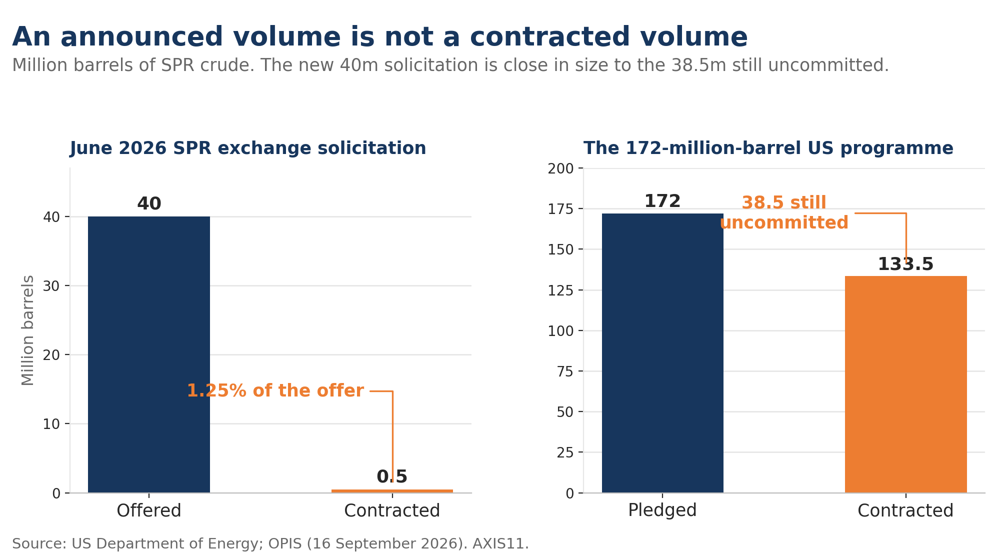
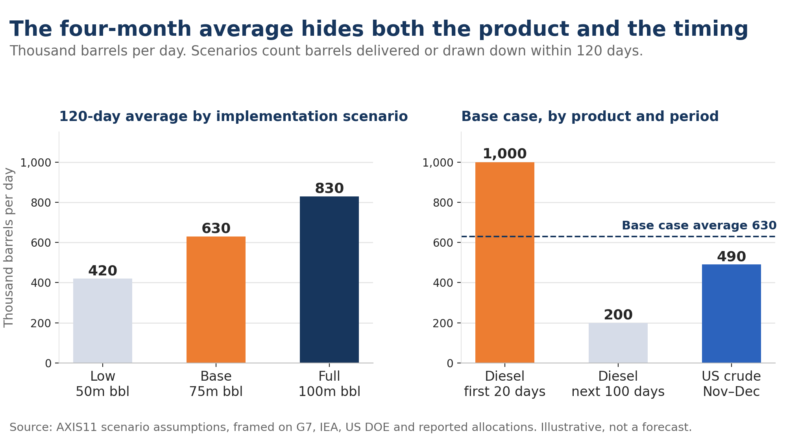

*From reserve announcement to physical supply: what the G7's 100 million barrels really means*

A strategic reserve release is usually reported as a single number. If a government announces 40 million barrels, the natural assumption is that 40 million barrels of additional oil are about to hit the market.

That is rarely how it works.

An announcement may set the maximum amount available, but companies still have to accept the terms, sign contracts and take delivery. In some countries, governments do not release physical barrels at all; they simply lower the minimum inventories that private companies are required to hold. Even after oil leaves a strategic reserve, it may replace an import or move into commercial storage rather than immediately increase refinery throughput.

The US experience in June 2026 shows how large the gap can be. The Department of Energy (DOE) offered to exchange up to 40 million barrels of SPR crude. Only 500,000 barrels were confirmed as awarded — **1.25% of the amount offered** — and the counterparty was crude trader Vitol rather than a refiner.[^1][^2][^3]

That episode raises the question at the centre of this note: **how much of an announced reserve release actually becomes usable market supply?**

The distinction is particularly important after the G7's 2 October announcement of up to 100 million barrels of crude and diesel.

---

## 1. A "Reserve Release" Can Mean Several Different Things

Strategic reserves are inventories held for supply disruptions. IEA members are generally required to hold oil stocks equivalent to at least 90 days of net imports. That is not the same as 90 days of domestic consumption, and net exporters have no equivalent requirement.

The structure also differs across countries. Stocks may be owned directly by governments or specialised agencies, while other countries require private companies to maintain minimum inventories. Reserves can contain both crude oil and refined products.[^4]

As a result, the phrase **"reserve release"** can describe several different transactions.

| Mechanism | What happens | Why the headline volume may differ from actual supply |
|---|---|---|
| Sale from public stocks | Companies buy crude or products, usually through a tender | Awards and delivery may fall short of the amount offered |
| Loan or exchange from public stocks | Companies receive oil now and return it later, usually with additional barrels | Participation depends on repayment economics and delivery terms |
| Relaxation of private stockholding obligations | Companies are allowed to run inventories below the previous minimum | Companies may choose not to use all of the newly available inventory |

The DOE distinguishes explicitly between SPR sales and exchanges. A sale transfers crude through competitive bidding. An exchange lends crude to a company, which later returns the barrels along with an additional premium volume.[^5]

Relaxing a private stockholding requirement works differently again. No oil needs to move from government storage into commercial tanks. Instead, inventory that a company already owns becomes available for use. The IEA makes the same distinction when reporting collective releases, separating public stock draws from reductions in industry stockholding obligations.[^6]

Suppose a company is required to hold 10 million barrels and the requirement is cut to 8 million. It can now draw 2 million barrels.

But it does not have to.

If the company decides to keep 9.5 million barrels as protection against further disruption, only 500,000 barrels are actually drawn.

The distinction is simple but important: **2 million barrels became available; only 500,000 barrels entered use.**

---

## 2. Announced, Contracted and Delivered Barrels Are Different Numbers

The stages of an SPR release need to be kept separate.

| Stage | What the number represents | What remains unknown |
|---|---|---|
| Policy commitment | The amount a government intends to make available | Terms, participation and timing |
| Solicitation | Maximum volume offered to companies | Amount companies will actually take |
| Award | Volume companies have agreed to receive | Timing of physical delivery |
| Physical delivery | Oil transferred from strategic stocks into commercial channels | Whether it is refined, stored or exported |
| Refinery runs / product sales | Crude processed or refined product distributed | How much represents additional consumption rather than displacement of other supply |

Once reserve oil is genuinely released, it does increase the amount of supply available to the market even though no new oil has been produced.

What it does **not** necessarily do is increase final consumption barrel for barrel.

Suppose a US refiner receives 1 million barrels from the SPR and cancels a 1 million barrel import. Its refinery throughput may not change at all. But the cargo it no longer imports is now available to another buyer.

That is still a global supply effect.

The opposite can also happen. SPR crude may leave government storage but initially move into commercial inventory rather than directly into a refinery. Immediate refinery runs remain unchanged, but usable inventories and the market's buffer increase.

For that reason, public stock draws, commercial inventories and refinery runs need to be read together.

---

## 3. Why Did Only 500,000 of the 40 Million US Barrels Get Taken?

DOE offered up to 40 million barrels in its June exchange. The confirmed award was just 500,000 barrels to Vitol. By the time bids closed, OPIS reported that US crude futures had fallen to around $80 a barrel.[^1][^2][^3]

The economics of an exchange are very different from simply buying discounted crude.

A company receives oil today but has to return more oil later. It therefore compares the value of obtaining the barrel now with the expected cost of replacing it in the future.

As the immediate value of crude falls relative to that future repayment obligation, the exchange becomes less attractive. Freight, location and crude quality narrow the economics further: a barrel that does not fit a company's refinery configuration or logistics network may not be worth taking even if it is technically available.

That is the key reason an SPR solicitation cannot be treated as supply already delivered to the market.

**The government determines how many barrels are available. The market determines how many are worth taking under the terms offered.**

The individual June bids were not disclosed, so the 1.25% contracting rate cannot be attributed to crude prices alone. But the episode shows clearly why an offered volume and a contracted volume are not interchangeable.

---

## 4. What Has the G7 Actually Committed?

On 2 October, the G7 announced the release of up to 100 million barrels of crude and diesel stocks, coordinated through the IEA.

Implementation is intended to begin immediately and run over four months, with a substantial volume of diesel released within the first 20 days. The G7 also called for full implementation of commitments made in March, while noting volumes already delivered, and agreed to avoid restrictions on energy exports among members and coordinate refinery maintenance.[^7][^8]

The distinction between crude and diesel matters.

A barrel of crude still has to reach a suitable refinery and pass through the refining system before it becomes diesel, gasoline or another usable product. Its value therefore depends on crude grade, refinery configuration, logistics and available processing capacity.

Diesel has already passed through that bottleneck.

Provided specifications and logistics are compatible, a barrel of reserve diesel can move directly through refiners, wholesalers or distributors into the product market. It does not need additional refinery capacity before it can address a diesel shortage.[^4]

That makes the diesel portion of the G7 release potentially more immediate than an equivalent volume of crude.

### The 100 million barrels also cannot simply be added to the March pledge

The IEA says that around 325 million barrels of the 400 million announced in March had been released by 2 October. Roughly 75 million barrels therefore remained undelivered relative to the original headline commitment.[^9]

That creates an important accounting problem.

The new 100 million barrel announcement should not automatically be added to the earlier 400 million and described as a cumulative 500 million barrel release.

But neither can we simply subtract the outstanding 75 million barrels and conclude that only 25 million barrels are new.

To know the genuinely incremental commitment, the country allocations need to be reconciled with the earlier programme.

The distinction is between two separate questions:

**How much has the G7 added to its previous commitment?**

and

**How many barrels will physically reach the market over the next four months?**

Those numbers need not be the same.

The US programme illustrates the problem.

On 29 September, DOE launched another exchange for up to 40 million barrels, with bids due on 6 October and deliveries scheduled for November and December. The solicitation is part of the existing 172-million-barrel US commitment rather than a separate new programme.[^10]

As of 5 October, therefore, **those 40 million barrels are offered, not contracted.**

OPIS reports that 133.5 million barrels of the 172 million US commitment have already been contracted, leaving roughly 38.5 million barrels outstanding. The new 40 million barrel solicitation is almost exactly the size of that remaining commitment.[^2]

It is better understood as the final instalment of an existing pledge than as 40 million barrels of additional supply.

The exact international allocation is not yet final. The FT has reported a structure of roughly 40 million barrels of US crude, 50 million barrels of European diesel and the remainder from Asia. Reuters reported that a 50 million barrel diesel / 50 million barrel crude split had been under discussion.[^11][^12]

These reports are useful for sizing the programme, but they should not be treated as an official country-level allocation.

---

## 5. How Large Is 100 Million Barrels?

A headline volume becomes more useful once it is converted into a daily rate.

For simplicity, the calculations below treat four months as **120 days**. Actual delivery schedules will differ.

| Calculation | Daily equivalent | Interpretation |
|---|---:|---|
| 100m barrels ÷ 120 days | ~830kb/d | Full programme delivered within four months |
| 50m barrels of crude ÷ 120 days | ~420kb/d | Assuming a 50:50 crude/diesel split |
| 50m barrels of diesel ÷ 120 days | ~420kb/d | Direct addition to product availability |
| 40m barrels of US crude ÷ 61 days | ~660kb/d | Full US solicitation delivered in Nov–Dec |

Against a global oil market of roughly 100mb/d, 830kb/d is about **0.8% of supply**. The IEA's September report puts projected 2026 world oil supply at 100.7mb/d.[^13]

It is common to describe 100 million barrels as roughly one day of global oil consumption. That is mathematically true but not especially useful for judging the market impact because the barrels will not arrive in a single day.

The rate of release matters more.

Nor should 0.8% automatically be interpreted as economically insignificant. Oil demand and supply are relatively inelastic in the short run. When the market is already short of physical barrels, a relatively small change in available supply can have a much larger effect on the shortage — and therefore on price.

The diesel component is more significant when measured against the market it is actually intended to relieve.

Reuters reports that the 50 million barrels of European diesel under discussion would equal roughly 3% of the EU's annual diesel and gasoil consumption and about 17% of its emergency diesel and gasoil stocks.[^12]

Spread evenly over 120 days, 50 million barrels would be equivalent to roughly **9% of average EU diesel and gasoil consumption during those four months**.

That calculation ignores seasonality, location and the actual release schedule, but it shows why the product mix matters. The same volume that looks small against the global oil market can be substantial when concentrated in a specific product and region.

Timing matters as well.

If, for illustration, 20 million barrels of diesel were released in the first 20 days, that would amount to **1mb/d**. If the remaining 30 million barrels were then spread over the next 100 days, the rate would fall to 300kb/d.

No official figure has been given for the first-20-day diesel volume. This is a worked example, not an announced schedule.

---

## 6. How Much Is Likely to Reach the Market?

The G7 announcement still leaves too many details unresolved to produce a precise forecast.

Country-level contracts are incomplete, the extent to which companies will use relaxed private stockholding requirements is unknown, and detailed delivery schedules have not been published.

The table below therefore does not assign probabilities. It asks a narrower question:

**If different shares of the reported programme are actually implemented within four months, how much physical supply reaches the market?**

For the arithmetic, I use the reported structure of 40 million barrels of US crude, 50 million barrels of European diesel and 10 million barrels from other regions or products.

| 120-day implementation scenario | US crude | European diesel | Other regions/products | Released or used | Average supply |
|---|---:|---:|---:|---:|---:|
| Low implementation | 15m | 30m | 5m | **50m barrels** | **420kb/d** |
| Base case | 30m | 40m | 5m | **75m barrels** | **630kb/d** |
| Full implementation | 40m | 50m | 10m | **100m barrels** | **830kb/d** |

Only barrels physically delivered from public stocks or actually drawn after a relaxation of private stockholding requirements count toward these scenarios. Offered, permitted or merely contracted volumes do not.

The base case assumes that 30 million of the 40 million US barrels, 40 million of the 50 million European diesel barrels and 5 million of the remaining 10 million are supplied within the period.

These are working assumptions, not historical estimates.

The higher implementation rate for diesel reflects both the current product shortage and the G7's stated intention to front-load part of the release. The US crude assumption is lower because participation still depends on the economics of the exchange and the outcome of the tender. The remaining allocation is marked down further because both its composition and release mechanism remain unclear.

The resulting 75 million barrel central case happens to match the amount still outstanding from the March programme. That is coincidence, not an assumption that the March shortfall will simply be carried into the new programme.

There is also no reason to extrapolate the June US contracting rate of 1.25% across the entire G7 release. Market conditions have changed, and a direct diesel release or relaxation of private stockholding requirements has very different economics from an SPR crude exchange.

The four-month average also hides potentially large differences in timing.

If 30 million barrels of US crude are delivered during November and December, the flow rate during those two months is roughly 490kb/d.

If 20 million of the assumed 40 million barrels of European diesel arrive during the first 20 days, the initial flow is 1mb/d, followed by roughly 200kb/d over the remaining 100 days.

A four-month average of 630kb/d therefore misses an important part of the story: **the supply effect will vary substantially by product and by month.**

For now, a reasonable working range is **50–100 million barrels actually implemented within four months**, with 75 million as a central scenario.

That is not a statistical confidence interval and should not be read as one. Until tender results, country allocations and execution data become available, there is no basis for assigning a precise probability to any single implementation rate.

---

## 7. What Matters From Here

The headline announcement is now less important than the execution data.

| What to watch | Why it matters |
|---|---|
| US awards after the 6 October tender | Shows how much of the 40m barrel solicitation companies actually accept, and on what return terms |
| US deliveries in November–December and SPR stock data | Shows how quickly awards become physical supply |
| European country-level mechanism and product allocation | Distinguishes direct releases from loans and relaxed private stockholding obligations |
| G7 first-20-day implementation data | Shows how much diesel is actually front-loaded |
| Public, obligated and commercial inventories | Distinguishes barrels used from barrels simply transferred into commercial storage |
| Diesel spot premia, crack spreads and refinery runs | Tests whether the physical product shortage is easing |
| Reconciliation of March and October commitments | Determines how much of the October announcement is genuinely incremental |

One final point matters for exchanges in particular.

An SPR exchange brings supply forward; it does not permanently create it.

Borrowed crude eventually has to be returned to the reserve, together with the additional premium barrels required by the exchange. Once market conditions normalise, that creates a flow in the opposite direction as commercial barrels move back into strategic storage.

The immediate easing of a shortage is real. But it should not be confused with a sustained increase in oil production.

That is ultimately the right way to read strategic reserve announcements.

The question is not whether the announced barrels are "real." It is **how many become usable supply, in which product, on what timetable and under what terms.**

The US experience makes the distinction clear: a solicitation for 40 million barrels and an award of 500,000 barrels are two very different numbers.

The same discipline should be applied to the G7's 100 million barrel announcement.

**The headline tells us how much governments are prepared to make available. Contracts, inventory drawdowns and physical deliveries will tell us how much supply the market actually gets.**

---

## Sources and Basis of Calculation

Data as of 5 October 2026.

The worked examples, implementation rates and the assumption of 20 million barrels of diesel in the first 20 days are AXIS11 assumptions used for scenario analysis. They are kept separate from officially announced figures.

Official documents were used where available. Country allocations reported by the FT and Reuters are treated as indicative rather than final. The June DOE award notice appeared in search indexes but returned an error when accessed directly, so the contracted volume was cross-checked against OPIS reporting and the counterparty against separate award reporting.

---

## Notes

[^1]: U.S. Department of Energy, "Energy Department Issues RFP to Advance President Trump's 172-Million-Barrel Strategic Petroleum Reserve Exchange," 10 June 2026. Solicitation for up to 40 million barrels. <https://www.energy.gov/hgeo/opr/articles/energy-department-issues-rfp-advance-president-trumps-172-million-barrel>

[^2]: OPIS, "As US Wraps Up Planned SPR Releases, About 40 Million Bbl Yet to Be Committed," 16 September 2026. 500,000 barrels awarded from the June solicitation; US crude futures around $80 when bids were due. <https://www.opis.com/resources/energy-market-news-from-opis/as-us-wraps-up-planned-spr-releases-about-40-million-bbl-yet-to-be-committed/>

[^3]: FINWIRES, "US DOE Awards 500,000-Barrel SPR Crude Exchange to Vitol," 22 June 2026. <https://finwires.com/en/article/us-doe-awards-500-000-barrel-spr-crude-exchange-vitol-6883335> / DOE award notice: <https://www.spr.doe.gov/posting/EXCHANGE/FY26%20SPR%20Oil%20Release%20No.%203/1-Request%20for%20Proposal/FY26%20SPR%20Oil%20Release%20No.%203%20Award%20Information.pdf>

[^4]: IEA, "Oil Security and Emergency Response." <https://www.iea.org/about/oil-security-and-emergency-response>

[^5]: U.S. Department of Energy, "SPR Sales and Exchanges." <https://www.energy.gov/hgeo/opr/spr-sales-and-exchanges>

[^6]: IEA, "IEA Confirms Member Country Contributions to Collective Action to Release Oil Stocks," 19 March 2026. Country contributions, separating public stocks from industry obligations. <https://www.iea.org/news/iea-confirms-member-country-contributions-to-collective-action-to-release-oil-stocks-in-response-to-middle-east-disruptions>

[^7]: G7, "Déclaration du G7 sur la sécurité énergétique mondiale et la stabilité des marchés," 2 October 2026. 100 million barrels coordinated by the IEA, beginning immediately over four months, with a significant diesel release in the first 20 days. <https://www.elysee.fr/G7evian/2026/10/02/declaration-du-g7-sur-la-securite-energetique-mondiale-et-la-stabilite-des-marches>

[^8]: Présidence de la République, "Visioconférence des dirigeants du G7 sur la situation énergétique mondiale," 2 October 2026: "jusqu'à 100 millions de barils sous 4 mois." <https://www.elysee.fr/emmanuel-macron/2026/10/02/visioconference-des-dirigeants-du-g7-sur-la-situation-energetique-mondiale>

[^9]: IEA, "Executive Director Participates in G7 Leaders' Meeting on Energy Security and Markets," 2 October 2026. Around 325 million barrels released under the March action, over 80% of the 400 million pledged. <https://www.iea.org/news/executive-director-participates-in-g7-leaders-meeting-on-energy-security-and-markets>

[^10]: U.S. Department of Energy, "United States Energy Department Continues Execution of Strategic Reserve Release Commitments," 29 September 2026. Exchange of up to 40 million barrels, bids due 6 October, delivery in November and December. <https://www.energy.gov/articles/united-states-energy-department-continues-execution-strategic-reserve-release-commitments>

[^11]: Financial Times, "G7 agrees oil and diesel reserve release," 2 October 2026. Reported US, European and Asian supply structure. <https://www.ft.com/content/97200b07-755c-40ce-a50b-b51666bd4b7e>

[^12]: Reuters, "Europe Discussing Plan for Diesel Stock Releases After US Pressure, Source Says," 2 October 2026. The 50 million barrel diesel and 50 million barrel crude structure; 50 million barrels of diesel is about 17% of EU emergency diesel and gasoil stocks, or about 3% of annual consumption. <https://www.reuters.com/business/energy/europe-discussing-plan-diesel-stock-releases-after-us-pressure-source-says-2026-10-02/>

[^13]: IEA, "Oil Market Report — September 2026." World oil supply projected at 100.7mb/d in 2026. <https://www.iea.org/reports/oil-market-report-september-2026>