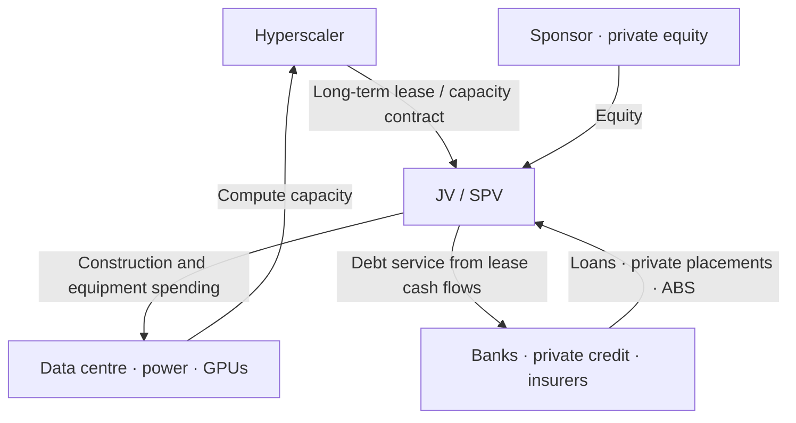

*The credit channels of AI investment, widening from operating cash flow to corporate bonds and SPVs*

AI infrastructure investment continues to expand at a pace that has exceeded earlier expectations. According to [reporting that cites Moody's](https://www.barrons.com/livecoverage/fed-meeting-rate-decision-september-warsh/card/higher-interest-rates-add-to-data-center-builders-borrowing-costs-AivKHJsZU5JvaU1zpNMJ), hyperscaler capex is projected to reach roughly $785bn in 2026 and surpass $1tn in 2027. The increase is being driven by demand across model training, inference, enterprise AI services and cloud capacity. At the same time, the useful economic life of existing computing assets may be proving longer than initially assumed. Nebius’s recent decision to raise prices for Nvidia GPUs, including the H100, suggests that even older-generation accelerators continue to retain meaningful economic value as demand for AI compute remains strong.

The fundamentals behind this investment remain strong. Hyperscalers have a long history of investing heavily ahead of future demand, most notably in cloud infrastructure and data centres, and those investments have generated substantial returns over time. AI could follow a similar path.

The concern, however, is the sheer scale and speed of the current investment cycle. This note does not argue that AI demand is illusory, attempt to call a peak in AI-related equities, or suggest that the current cycle will necessarily end in a crisis comparable to the dot-com bust. I use AI every day and see firsthand both its utility and the strength of underlying demand. The question is not whether AI has value, but whether the amount of capital being committed—and increasingly borrowed—to build the infrastructure around it can generate sufficient returns.

This investment cycle differs from earlier ones in one important respect. Historically, hyperscalers could fund most large-scale investment from the operating cash flow generated by their existing businesses. AI investment has now reached a scale where capex is growing faster than cash flow, pushing financing beyond internal funds and traditional corporate borrowing. Capital is increasingly being raised through private placements, project bonds, asset-backed securities and SPV structures. As a result, the economic risk of AI investment is no longer concentrated among hyperscaler shareholders. It is increasingly being distributed across corporate bond investors, banks, insurers and private credit providers. The issue is not simply that debt is rising. Financial markets naturally direct capital towards opportunities offering attractive expected returns, and abundant financing allows more AI infrastructure to be built. That investment creates additional demand for semiconductors, data centres and power infrastructure. Strong demand and expectations of future growth then attract more capital, which enables another round of investment. **Capital enables investment, investment creates demand, and that demand attracts more capital — a reflexive cycle.** As long as demand continues to expand and expected returns remain high, this structure can accelerate the investment cycle. But the same mechanism can work in reverse. If expectations for future demand or investment returns weaken, the adjustment would no longer be confined to hyperscaler equity holders. It could propagate through a much broader part of the financial system. That widening transmission channel is what makes the current AI investment cycle different, and what deserves closer attention.

A new industry moving in the right direction does not mean that every investor will earn an attractive return. The dot-com and telecom investment cycle is a useful example. Long-term demand for the internet and fibre-optic networks ultimately materialised, but many companies invested heavily in overlapping infrastructure to capture the same expected demand. Capacity expanded faster than the market could absorb it, leaving heavily indebted companies and their investors exposed to substantial losses. AI may face a similar question. Several companies are investing aggressively toward broadly the same future market, with AGI as a common long-term objective. Yet it remains unclear whether consumers will ultimately use multiple general-purpose AI services at the same time or concentrate their activity on a small number of platforms, as happened with search and email. Specialised enterprise models and multi-model usage may allow a broader range of providers to coexist, so there is no basis for assuming that the market will consolidate around a single winner. The more important point is that multiple companies are building capacity simultaneously against similar expectations of future demand, before the eventual winners, market structure and pricing economics are known. **The industry can ultimately fulfil its growth expectations while individual investments made along the way still generate poor returns.**

This note therefore has two aims.

1. To establish the scale of corporate bond and off-balance-sheet financing currently supporting AI investment.
2. To examine how, and on what scale, losses could spread into the credit market if AI demand falls short of expectations or monetisation takes longer than anticipated.

Before doing so, the numbers need to be separated carefully. The $785bn of capex represents a use of funds, while the $240bn of bond issuance represents one source of financing for that investment. They cannot be added together. SPV financing and future lease commitments may also finance assets already captured within capex figures, creating further overlap. Keeping these categories separate is important. Otherwise, adding investment and financing figures together would overstate both the physical scale of AI infrastructure investment and the amount of financial leverage supporting it.

---

## 1. Rising Investment Is Changing How AI Capex Is Financed

What stands out about AI investment in 2026 is not only its scale, but how quickly spending expectations have continued to rise. Amazon, Microsoft, Alphabet and Meta alone are expected to invest about $725bn this year, while estimated hyperscaler capex rises to roughly $785bn when Oracle and other major AI infrastructure operators are included. Until recently, much of this investment could be funded comfortably from operating cash flow. That is becoming more difficult as capex grows faster than internally generated cash. Oracle provides a clear example. [The company generated $32bn of operating cash flow in FY2026, but capex of $55.6bn pushed free cash flow to negative $23.7bn](https://investor.oracle.com/investor-news/news-details/2026/Oracle-Announces-Record-Q4-and-FY-2026-Results-Driven-by-Cloud-Infrastructure--Cloud-Applications/default.aspx). Across the large technology companies more broadly, rising capex is also expected to reduce combined free cash flow to its lowest level since the global financial crisis.

This does not necessarily indicate financial stress. These companies still generate substantial operating cash flow, while AI-related revenue is growing quickly. The difficulty is that returns are hard to measure: Microsoft discloses some Azure AI and Copilot metrics, Amazon and Alphabet do not separate AI from cloud revenue, and Meta captures much of the benefit through advertising efficiency and engagement. Investment is therefore rising faster than internal cash generation, while the payback period remains uncertain. **As this gap widens, external financing is becoming more important and the financing structure is changing as follows.**

| Category | Confirmed scale, 2026 | What the number means |
|---|---:|---|
| Hyperscaler capex | About $785bn | Physical and accounting investment to be spent in 2026 — a use of funds |
| Hyperscaler bond issuance | About $240bn | A source of funds covering capex and other financing needs |
| Major AI off-balance-sheet and project finance | About $170–180bn | Range of publicly reported SPV, project-loan, ABS and private-capital deals, including multi-year commitments and undrawn amounts |
| Payment commitments on uncommenced leases | About $1.09tn | Undiscounted nominal multi-year payments for facilities not yet in use |

These figures should not be added together as a measure of “total AI investment.” The first is annual capex, the second and third are financing sources, and the fourth is a multi-year contractual commitment. Together, however, they show how AI investment is expanding beyond capex funded by operating cash flow and conventional on-balance-sheet financing.

---

## 2. $240bn of Bonds Is Becoming a New Source of Supply for the Investment-Grade Market

The most visible shift is in the corporate bond market. Moody’s expects hyperscalers to issue about $240bn of bonds in 2026, more than double the $100bn-plus issued in 2025. By 2027, it expects borrowing across the broader AI industry to reach roughly $375bn.

One way to put $240bn into perspective is to compare it with a national budget. [Poland’s draft 2027 budget calls for PLN 977.6bn, or roughly $263bn, of central-government spending](https://www.reuters.com/business/poland-sees-2027-budget-deficit-71-gdp-growth-3-2026-08-28/). Poland is a top-20 economy, with nominal GDP of around $1.1tn in 2026. In other words, annual bond issuance from a small group of technology companies is approaching the scale of an entire year of central-government spending by a major European economy and is growing at a remarkable pace.

It is a meaningful amount within the US bond market.

| Comparison | Market size | Share represented by hyperscalers' $240bn |
|---|---:|---:|
| 2026 US IG corporate issuance forecast | $1.8tn | 13.3% |
| 2026 US technology-sector IG issuance forecast | $360bn | 66.7% |
| 2025 long-term US corporate bond issuance | $2.22tn | 10.8% |
| 2025 long-term US Treasury issuance | $4.82tn | 5.0% |

Large-scale corporate bond issuance does not translate one-for-one into higher Treasury yields. Its most direct effect is on corporate funding costs, through new-issue premiums and the additional supply that credit investors must absorb. The effect on government bonds is more indirect. With large fiscal deficits and Treasury issuance already contributing to pressure on term premia and real rates, rising IG supply competes for the same pool of long-duration capital held by insurers, pension funds and asset managers. Portfolio reallocation and interest-rate hedging can therefore transmit some of that pressure into the Treasury market.

AI-related bond issuance alone cannot explain the recent rise in long-term yields. The more relevant point is that government and corporate borrowing are increasing at the same time. The $1.8tn forecast for US IG issuance in 2026 and the $4.82tn of long-term Treasury issuance in 2025 are not fixed ceilings. **If AI investment and fiscal deficits continue to expand, both sectors will be competing for a larger share of the same long-term capital pool, potentially raising the cost of funding for both.**

---

## 3. Public Credit Spreads Are Stable, but Supply Pressure and Credit Risk Are Different Questions

Heavy issuance does not mean that the market is already pricing broad credit deterioration. Public credit spreads remain tight despite the rapid increase in AI-related financing. As of 17 September 2026, the ICE BofA US Investment Grade OAS stood at 78bp and the High Yield OAS at 270bp, both close to their lowest levels in three years.

| Measure | End-2025 | 2026 high | 17 September 2026 |
|---|---:|---:|---:|
| [ICE BofA US Corporate Index OAS](https://fred.stlouisfed.org/series/BAMLC0A0CM) | 79bp | 94bp | 78bp |
| [ICE BofA US High Yield Index OAS](https://fred.stlouisfed.org/series/BAMLH0A0HYM2) | 281bp | 346bp | 270bp |

This distinction matters. Supply pressure is about how much new debt the market must absorb; credit risk is about whether borrowers can ultimately service that debt. The first is already increasing, while the second has yet to show up meaningfully in public credit spreads.

Stable public credit spreads do not mean that every AI project can raise capital on the same terms. [The $18bn loan backing Project Jupiter in New Mexico, which Oracle is expected to lease, has recently been quoted at 89–91 cents on the dollar](https://www.reuters.com/business/finance/oracles-18-billion-data-center-debt-under-pressure-ft-reports-2026-09-18/). Local opposition, delays in power and gas permitting, and concerns around Oracle’s rising debt burden and credit-rating downgrade have left banks holding more of the loan than originally intended.

Project Jupiter does not indicate broader deterioration in the AI credit cycle. Instead, it illustrates how project-level risk can emerge even while public credit spreads remain tight. Data centres may share the same underlying AI demand outlook, but their economics differ by location, power availability, permitting, construction costs, tenant credit and contract terms. As the number and scale of projects increase, so does the likelihood that some face delays, cost overruns or weaker-than-expected economics.

When that happens, banks may struggle to distribute loans as planned, while private investors may require higher yields to absorb the risk. **Project-level financing can therefore begin to reprice well before stress becomes visible in broad public credit indices.**

The next question is where that risk ultimately sits when the debt is structured outside hyperscalers’ balance sheets.

---

## 4. SPVs Change Who Funds the Investment and Holds the Risk

This is where SPVs and other off-balance-sheet structures become important. The [BIS Quarterly Review](https://www.bis.org/publications/qr-202603) describes hyperscalers increasingly using off-balance-sheet arrangements alongside conventional corporate bonds to finance AI infrastructure. In the typical structure, a separate JV or SPV acquires and develops the data centre, funded by equity from a sponsor consortium and debt raised through private placements or project finance. The hyperscaler may hold only a minority equity stake, while committing to the project through a long-term lease or capacity offtake agreement. Depending on the structure, it may also provide minimum-payment commitments, completion support or residual-value guarantees.

The SPV does not make the underlying investment disappear. It changes who provides the capital, where the debt sits, and when the hyperscaler pays for the capacity. Legally, the construction debt remains within the SPV, but economically the hyperscaler’s long-term contract is often the main source of debt service. From the hyperscaler’s perspective, part of the upfront capex is effectively converted into lease or service payments spread over several years. For investors, the credit rests not only on the physical assets — land, data centres and GPUs — but also on the hyperscaler’s contractual payments and guarantees.

The structure is not inherently problematic. It can isolate project risk, match long-lived assets with long-term funding and avoid requiring the hyperscaler to bear the full construction cost upfront. The more important question is who ultimately bears the loss if the project underperforms.

- If the hyperscaler guarantees minimum payments or residual value, much of the economic risk ultimately returns to the hyperscaler.
- If those guarantees are limited, SPV lenders and equity investors bear more of the risk from construction delays or declining asset values.
- If banks cannot distribute the loans as planned, larger-than-expected exposures remain on their balance sheets.
- If private funds and insurers participate across multiple projects, aggregate and overlapping exposures become difficult to identify from public information.

This uncertainty matters because it makes total leverage, overlapping exposures, refinancing needs and contingent obligations difficult to measure. In normal conditions, the risk appears dispersed across different investors and structures. But if a common assumption — such as AI demand or the residual value of AI infrastructure — is revised down, exposures that appear separate can be repriced in the same direction at the same time.

---

## 5. Around $170–180bn of Additional Financing Is Visible

The scale of this financing is difficult to measure precisely because the same project can appear in several forms — as total development cost, project loans, private bonds and lease commitments — while some announced facilities remain undrawn. Double counting is therefore a significant risk. [The Financial Times counted more than $120bn of AI data-centre debt that technology companies including Meta, Oracle, xAI and CoreWeave had already moved off their balance sheets through SPVs by early 2026](https://www.ft.com/content/0ae9d6cd-6b94-4e22-a559-f047734bef83). Adding the subsequently disclosed Anthropic Big Sky financing of roughly $34.4–35bn and the $27bn Alphabet–Blackstone Crux AI package would bring the headline total to around $182bn. However, the Crux package includes $5bn of equity, reducing the debt component to roughly $177bn. Given differences in reporting dates, possible overlap in project scope and the inclusion of undrawn commitments, a precise total would imply more certainty than the available data supports. This note therefore uses approximately $170–180bn as a working range for publicly disclosed SPV, project-finance and related private-capital transactions. The figure includes both debt and equity and should not be interpreted as additional debt alone.

| Published deal or tally | Published amount | Structure and interpretation |
|---|---:|---|
| FT early-2026 tally of SPV debt | Over $120bn | Off-balance-sheet debt related to AI data centres at Meta, Oracle, xAI, CoreWeave and others. May overlap with some of the individual projects below |
| Meta Hyperion | About $27bn | JV owned 80% by Blue Owl and 20% by Meta. Meta leases the facility and provides a conditional residual-value guarantee |
| Anthropic Big Sky | About $34.4–35bn | A compute SPV acquires TPUs and issues bank loans, ABS and subordinated debt secured on Anthropic's chip-lease payments |
| [Alphabet–Blackstone Crux AI](https://www.reuters.com/world/asia-pacific/banks-provide-22-billion-chip-loan-blackstone-alphabet-cloud-venture-bloomberg-2026-09-16/) | $22bn loan + $5bn equity | Syndicated bank loan secured on TPUs and customer contracts. Possible later refinancing in the bond market |
| Oracle Project Jupiter | $18bn loan | A project Oracle is to lease. An individual case of delayed loan sales and falling prices |

More important than the aggregate amount is the change in how that investment is financed. A single data-centre project can now be funded by corporate bonds, bank loans, private credit and institutional capital, with different investors holding claims at different levels of seniority. What was once largely a corporate capex decision is increasingly becoming a broader credit-market exposure.

---

## 6. $1.09tn of Leases Have Not Yet Commenced

[Reuters's tally of disclosures by Microsoft, Meta, Oracle, Amazon and Alphabet](https://www.reuters.com/business/retail-consumer/ai-data-centre-race-builds-1-trillion-lease-burden-big-tech-2026-08-04/) put future nominal payments on uncommenced leases at about $1.09tn as of August 2026.

| Company | Nominal payment commitments on uncommenced leases |
|---|---:|
| Microsoft | $329.1bn |
| Meta | $279.0bn |
| Oracle | $260.0bn |
| Amazon | $137.2bn |
| Alphabet | $85.2bn |
| Total | About $1.09tn |

An uncommenced lease is a contract that has been signed but has not yet begun, typically because the facility is still under construction or not yet available for use. It therefore does not yet appear as a current lease liability or cash capex. Once the facility becomes available, the hyperscaler recognises a right-of-use asset and lease liability, with cash payments following over the life of the contract.

The $1.09tn is therefore not investment already made. It represents future capacity that hyperscalers have contractually secured, and those commitments in turn provide developers and SPVs with the revenue visibility needed to finance and build the underlying infrastructure.

Nor can the $1.09tn be treated as equivalent to construction cost. It is the undiscounted sum of payments over many years and may include the lessor’s financing cost and return, operations and maintenance, and compensation for residual-value risk. Without detailed contract terms, the underlying construction cost cannot be derived precisely.

A sensitivity analysis can nevertheless give a sense of the economic scale. If the payments are spread over an average of 15–19 years and discounted at 5–8%, the $1.09tn of nominal commitments has a present value of roughly $550–750bn. Allowing two years before the facilities enter service reduces that range to approximately $470–680bn. These figures are not current capex; they approximate the economic value of future capacity already under contract.

A further sensitivity illustrates the potential scale of infrastructure supported by those commitments. If buildings, power and cooling account for roughly 35% of total AI data-centre investment, and if the lease commitments mainly represent those physical assets, a present value of $550–750bn would correspond to roughly $1.6–2.1tn of total AI and data-centre investment.

That estimate should be treated cautiously. Some leases may include GPUs, servers or neocloud compute capacity rather than physical infrastructure alone, which would reduce the implied total. The calculation also depends heavily on lease duration, discount rates and the timing of commencement.

**The $1.6–2.1tn range is therefore not an estimate of committed capex. It is a sensitivity exercise combining the economic value of future lease commitments with an assumed data-centre cost structure to illustrate the potential order of magnitude of infrastructure those contracts could support.**

---

## 7. Neoclouds Offer a Clearer View of the Cash Flow–Capex Gap

Hyperscalers can fund AI investment with cash flow from large existing businesses and access to investment-grade credit. Neoclouds have less of that cushion: their revenues are more directly tied to AI compute, while their expansion depends more heavily on external capital. They therefore provide a clearer test of the economics of AI infrastructure itself. The point at which a neocloud can fund capex from operating cash flow offers an indication of when AI compute infrastructure can begin to finance its own expansion rather than relying primarily on outside capital.

| Company | Demand indicator | 2026 investment and funding burden | Current assessment of when cash flow crosses |
|---|---|---|---|
| CoreWeave | 2Q26 revenue $2.58bn (roughly double a year earlier), backlog about $104bn at end-June | Capex guidance $31–35bn; over $20bn of debt and equity financing secured by September; a further $3bn convertible in September | Even with fast revenue growth, 2026 capex is hard to fund internally. Whether external funding declines is the key indicator for 2027–2028 |
| Nebius | 1Q26 revenue $399mn, 2Q about $575mn | Capex $20–25bn; $4.34bn of convertible debt. Plans to fund about 60% of growth from customer prepayments | More important than a near-term OCF–capex crossover is how far customer prepayments replace external borrowing |
| Nscale | Contracted revenue over $103bn | 1H26 revenue $140.6mn, net loss $1.02bn, $3.1bn of convertibles | The largest gap between contract size and current cash generation. Customer concentration and the pace of contract execution are key |

CoreWeave illustrates the gap clearly. [Depreciation and interest expense together reached 81% of revenue in the first quarter of 2026](https://www.barrons.com/articles/coreweave-earnings-stock-price-13d24b29) and remained close to that level in the second quarter, when [$1.39bn of depreciation and amortisation and $640mn of net interest expense amounted to 79% of revenue](https://investors.coreweave.com/news/news-details/2026/CoreWeave-Reports-Strong-Second-Quarter-2026-Results/default.aspx). Revenue has doubled, but assets and debt have expanded alongside it. Backlog provides visibility on future demand, but not immediate cash flow: GPUs and data-centre capacity must be secured upfront, while revenue is recognised over the life of the contracts. The available disclosures do not support a reliable estimate of when operating cash flow will cover capex, but with 2026 capex guidance exceeding three times annualised second-quarter revenue, external funding remains essential in the near term.

Nebius provides a different model. [The company expects customer prepayments from Meta and Microsoft to fund roughly 60% of its growth requirements, with debt and equity covering the remaining 40%](https://www.reuters.com/technology/nebius-says-well-funded-ai-race-after-closing-43-billion-debt-raise-2026-03-23/). Prepayments are particularly valuable because they both validate demand and bring forward cash without interest expense. They also increase exposure to customer concentration and contractual performance obligations.

One risk that has not yet materialised is rapid deterioration in GPU economics. [Nebius has recently raised prices on some older GPUs, including the H100](https://www.reuters.com/technology/nebius-hikes-ai-cloud-prices-again-demand-computing-power-soars-2026-09-17/), suggesting that utilisation and pricing power remain strong even for previous-generation hardware. Current evidence therefore does not support the assumption that GPU collateral values necessarily collapse with each new generation. **The more important indicators are whether GPU rental rates, utilisation and secondary-market values begin to decline together, particularly when the debt and lease obligations financing those assets extend beyond the current demand cycle.**

For neoclouds, this is also where equity and credit risk begin to interact. As long as operating cash flow remains below investment requirements, expansion depends on repeated access to debt, convertible bonds, customer prepayments or new equity. If equity valuations fall, raising the same amount of capital requires greater dilution; if credit conditions tighten at the same time, debt becomes more expensive or less available. The financing model therefore remains highly dependent not only on AI demand, but on continued access to capital until internal cash generation catches up with investment.

---

## 8. AI Finance Is Entering an Already Crowded Market for Long-Term Capital

AI data-centre finance is entering a market where demand for long-term capital is already substantial. Private credit expanded rapidly after the pandemic as tighter bank regulation and reduced bank lending created room for non-bank lenders, and it now finances corporate acquisitions, commercial real estate, infrastructure and asset-backed assets. Estimates of the global private credit market range from roughly $1.2tn to $2tn, depending on whether they measure fund AUM or loans outstanding and whether they include asset-based finance alongside direct lending.

Bank regulation, however, has recently begun to move in the opposite direction. US regulators [finalised a rule easing the enhanced supplementary leverage ratio (eSLR) for GSIBs in November 2025](https://www.federalregister.gov/documents/2025/12/01/2025-21626/regulatory-capital-rule-modifications-to-the-enhanced-supplementary-leverage-ratio-standards-for-us), effective from April 2026. The reduction in required capital is modest at the holding-company level, but much larger at the bank subsidiaries that conduct Treasury dealing and other balance-sheet-intensive activities. [Further proposals announced in March 2026](https://www.federalreserve.gov/newsevents/pressreleases/bcreg20260319a.htm) would also reduce capital requirements under the Basel III framework and GSIB surcharge, although these changes have not yet been finalised.
 
In practice, lower capital requirements give banks more balance-sheet capacity for activities such as Treasury underwriting, dealer inventories, warehouse loans awaiting distribution and credit lines to private funds. This matters because links between banks and non-bank lenders have already expanded rapidly: US bank lending to non-depository financial institutions exceeded $1tn by mid-2025, after growing at an average rate of roughly 23% a year since 2010, compared with about 4% for total bank lending.

There is no reason to assume that additional balance-sheet capacity will flow directly into AI. But data-centre finance is becoming a large new source of relatively high-spread assets for banks and private credit investors at the same time that regulatory constraints are easing. **That combination increases the financial system’s capacity to fund the AI build-out and can delay the point at which financing itself becomes a constraint on investment.**

It can also change where the risk remains. If a project loan cannot be syndicated, as in Project Jupiter, greater balance-sheet capacity allows banks to hold the exposure for longer rather than forcing an immediate sale. That can act as a shock absorber in the short run, but it does not remove the risk — it leaves more of it on bank balance sheets until the exposure can be distributed or repaid.

The competition for capital becomes clearer when compared with commercial real estate. US commercial and multifamily mortgage debt [exceeded $5.02tn in the first quarter of 2026](https://www.mba.org/news-and-research/newsroom/news/2026/06/18/commercial-and-multifamily-mortgage-debt-outstanding-crosses--5-trillion-in-first-quarter-2026).

| Holder | Commercial and multifamily mortgage debt |
|---|---:|
| Banks | About $1.9tn |
| Agencies, GSEs and related MBS | About $1.2tn |
| Life insurers | About $775bn |
| CMBS, CDOs and other ABS | About $637bn |
| Others (state and local government, pension funds, finance companies and so on) | About $510bn |
| Total | About $5.02tn |

Around $936bn of CRE mortgages are estimated to mature in 2026. With office vacancies still elevated and property values adjusting to higher rates, some borrowers will have to refinance at materially higher funding costs. Against that backdrop, AI data-centre loans, private bonds and ABS offer investors another growing pool of long-duration credit assets.

Private credit AUM, CRE mortgages and AI project finance should not be added together. The categories overlap, and banks, insurers and private funds can participate in the same transaction. From the perspective of capital providers, however, they are not entirely separate markets. The same institutions are being asked to absorb rising Treasury and hyperscaler bond issuance, CRE refinancing, CMBS and other asset-backed finance, and a growing volume of AI data-centre debt.

- Rising US Treasury supply and hyperscaler public corporate bonds
- Refinancing of existing commercial and multifamily mortgages
- CMBS, ABS and asset-backed finance
- AI data-centre project loans and private bonds

The roughly $170–180bn of AI-related off-balance-sheet financing remains small relative to the $5tn-plus US commercial and multifamily mortgage market and smaller still relative to global credit markets. What matters is its growth rate, the limited transparency of private transactions, and the fact that it draws on many of the same balance sheets already financing government debt, corporate credit and CRE refinancing.

The question is therefore not whether AI finance has already created a systemic credit problem. **It is whether the market can continue to identify where the risk ultimately sits as the volume, complexity and overlap of AI financing continue to grow.**

---

## 9. The Risk Lies in Conditional Feedback

AI investment is expanding at exceptional speed and scale, while its financial exposure is spreading beyond technology shareholders into corporate bonds, banks, private credit and insurance capital. As discussed at the outset, abundant capital enables more investment, investment creates demand, and strong demand attracts further capital. The cycle becomes vulnerable when the direction reverses — particularly if falling asset prices reflect weaker expectations for the underlying economics of AI rather than a broader market correction.

A possible feedback loop would look like this:

1. Expectations for AI revenue, utilisation or customers’ ability to fund future spending weaken.
2. Technology equities fall, while the expected residual values of GPUs and data centres and the credit value of lease and offtake contracts are marked down.
3. SPV loans and private bonds reprice, spreads widen and refinancing becomes more difficult.
4. Minimum-payment commitments, residual-value guarantees and future lease obligations receive greater scrutiny as debt-like claims on hyperscaler cash flow.
5. Hyperscalers face greater pressure on free cash flow, while neoclouds become more dependent on dilutive equity issuance, convertible debt or more expensive refinancing.
6. Higher funding costs and reduced access to capital constrain further investment, weakening expectations for future AI infrastructure demand and putting additional pressure on asset values and equity prices.

The risk is therefore not any single link in this chain. It is the possibility that several links begin to reinforce one another at the same time.

---

## Conclusion

The AI-related SPV and off-balance-sheet financing visible today is not large enough, by itself, to threaten the financial system. Hyperscaler credit quality remains generally strong, public IG and HY spreads show little sign of stress, and GPU pricing and neocloud revenues continue to indicate strong demand for AI compute.

This note therefore does not argue that AI investment is failing or that a systemic credit event is approaching. Nor should the risk be overstated by adding $1.09tn of uncommenced lease commitments to current debt or annual capex.

**What has changed is who finances the investment and who ultimately bears the risk.** AI infrastructure was once funded largely through hyperscalers’ internal cash flow, leaving much of the investment risk with their shareholders. That exposure is now spreading across corporate bond investors, banks, private credit, insurers and SPV investors — many of the same institutions already absorbing rising government borrowing and a large wave of commercial real estate refinancing.

The key risk is therefore not the losses visible today, but the possibility of a common repricing if expectations for AI economics weaken. A decline in technology equities alone does not impair the credit structure. The feedback becomes more important if the same change in expectations simultaneously reduces equity valuations, GPU and data-centre values, the value of lease and offtake contracts, and access to refinancing.

If AI demand and monetisation remain strong, today’s financing may ultimately prove to have funded infrastructure ahead of a large and durable market. If monetisation takes longer or returns fall short of expectations, financing structures that appear diversified may prove to depend on the same underlying assumptions.

**We cannot yet know which outcome will prevail. What can be measured is how much capital is being committed, where the leverage sits, who ultimately holds the risk, and how those exposures are becoming connected. Those are the financial channels that need to be watched as the AI investment cycle grows.**

---

## Monitoring dashboard

| Indicator | Current observation | Warning sign |
|---|---|---|
| Incremental revenue relative to AI capex | Definitions inconsistent across companies; cannot be tallied directly | Revenue and utilisation revised down by investment cohort |
| Capex / operating cash flow | At some companies capex growth is outpacing OCF growth | OCF revised down while capex is maintained |
| Hyperscaler bond issuance | About $240bn expected in 2026 | Wider new-issue premiums, lower order-book coverage |
| IG and HY OAS | 78bp and 270bp; no broad stress | Watch for AI issuers' and projects' spreads widening relative to the index before the index itself |
| Neocloud financing burden | CoreWeave 2026 capex $31–35bn; dependent on external funding | Rising interest and depreciation burden; repeated ATM and convertible issuance |
| Customer concentration | 52% of Nscale's current revenue from a single customer | Deterioration in customer credit or contract reductions |
| Contract and debt maturities | Possible mismatch between long leases and customer contracts at Oracle and others | Debt and lease maturities becoming longer than customer contracts |
| GPU economic life | Prices even for older GPUs such as the H100 currently rising | Utilisation, hourly prices and second-hand prices falling together |
| SPV guarantees | Minimum-payment, residual-value and backstop terms vary by deal | Off-balance-sheet items moving into rating-adjusted debt |
| Equity dilution | Neoclouds expanding convertible and equity fundraising | ATM and convertible issuance rising amid falling share prices |
| Project debt prices | Project Jupiter quoted at 89–91 cents | Failed loan sales, rising warehouse balances, postponed refinancing |

---

## Key sources

- [BIS Quarterly Review, March 2026](https://www.bis.org/publications/qr-202603)
- [Moody's: AI infrastructure boom and hyperscaler financing](https://www.moodys.com/web/en/us/insights/podcasts/credit-currents/ai-s-infrastructure-boom--how-trillion-dollar-spending-is-changi.html)
- [Barron's: Moody's 2026 hyperscaler Capex and debt issuance estimates](https://www.barrons.com/livecoverage/fed-meeting-rate-decision-september-warsh/card/higher-interest-rates-add-to-data-center-builders-borrowing-costs-AivKHJsZU5JvaU1zpNMJ)
- [Reuters: AI data-centre race builds $1 trillion lease burden for Big Tech](https://www.reuters.com/business/retail-consumer/ai-data-centre-race-builds-1-trillion-lease-burden-big-tech-2026-08-04/)
- [Meta: Blue Owl joint venture for the Hyperion data center](https://about.fb.com/news/2025/10/meta-blue-owl-capital-develop-hyperion-data-center/)
- [Financial Times: Anthropic Big Sky private-credit financing](https://www.ft.com/content/c49e0eff-0776-4103-8eaf-1b049fbf9d3f)
- [Reuters: Oracle's $18 billion Project Jupiter debt under pressure](https://www.reuters.com/business/finance/oracles-18-billion-data-center-debt-under-pressure-ft-reports-2026-09-18/)
- [Reuters: $22 billion Crux AI loan](https://www.reuters.com/world/asia-pacific/banks-provide-22-billion-chip-loan-blackstone-alphabet-ai-cloud-venture-bloomberg-2026-09-16/)
- [Reuters: Nebius financing and Capex plan](https://www.reuters.com/technology/nebius-says-well-funded-ai-race-after-closing-43-billion-debt-raise-2026-03-23/)
- [Reuters: Nebius GPU pricing](https://www.reuters.com/technology/nebius-hikes-ai-cloud-prices-again-demand-computing-power-soars-2026-09-17/)
- [Barron's: CoreWeave first-quarter 2026 results and funding plan](https://www.barrons.com/articles/coreweave-earnings-stock-price-13d24b29)
- [CoreWeave: second-quarter 2026 results](https://investors.coreweave.com/news/news-details/2026/CoreWeave-Reports-Strong-Second-Quarter-2026-Results/default.aspx)
- [Reuters: CoreWeave $3 billion convertible debt sale](https://www.reuters.com/legal/transactional/coreweave-launches-3-billion-convertible-debt-sale-2026-09-17/)
- [Reuters: Nscale IPO filing](https://www.reuters.com/technology/ai-cloud-firm-nscale-files-us-ipo-2026-09-18/)
- [FRED: ICE BofA US Corporate Index OAS](https://fred.stlouisfed.org/series/BAMLC0A0CM)
- [FRED: ICE BofA US High Yield Index OAS](https://fred.stlouisfed.org/series/BAMLH0A0HYM2)
- [Mortgage Bankers Association: Commercial and multifamily mortgage debt outstanding](https://www.mba.org/news-and-research/newsroom/news/2026/06/18/commercial-and-multifamily-mortgage-debt-outstanding-crosses--5-trillion-in-first-quarter-2026)
- [Federal Register: final rule modifying the enhanced supplementary leverage ratio](https://www.federalregister.gov/documents/2025/12/01/2025-21626/regulatory-capital-rule-modifications-to-the-enhanced-supplementary-leverage-ratio-standards-for-us)
- [Federal Reserve: March 2026 proposals to modernise the regulatory capital framework](https://www.federalreserve.gov/newsevents/pressreleases/bcreg20260319a.htm)
- [ABA Banking Journal: bank loans to non-depository financial institutions](https://bankingjournal.aba.com/2026/02/loans-to-non-depository-financial-institutions-new-granularity-and-a-rapidly-growing-segment/)
- [Reuters: Poland's 2027 budget](https://www.reuters.com/business/poland-sees-2027-budget-deficit-71-gdp-growth-3-2026-08-28/)
