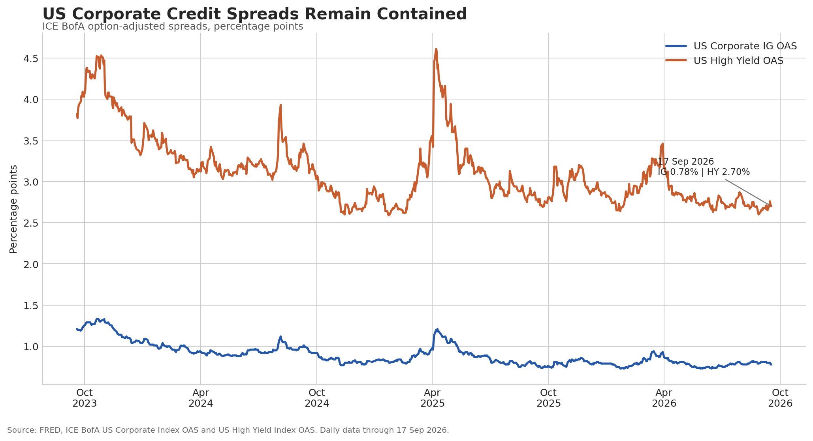
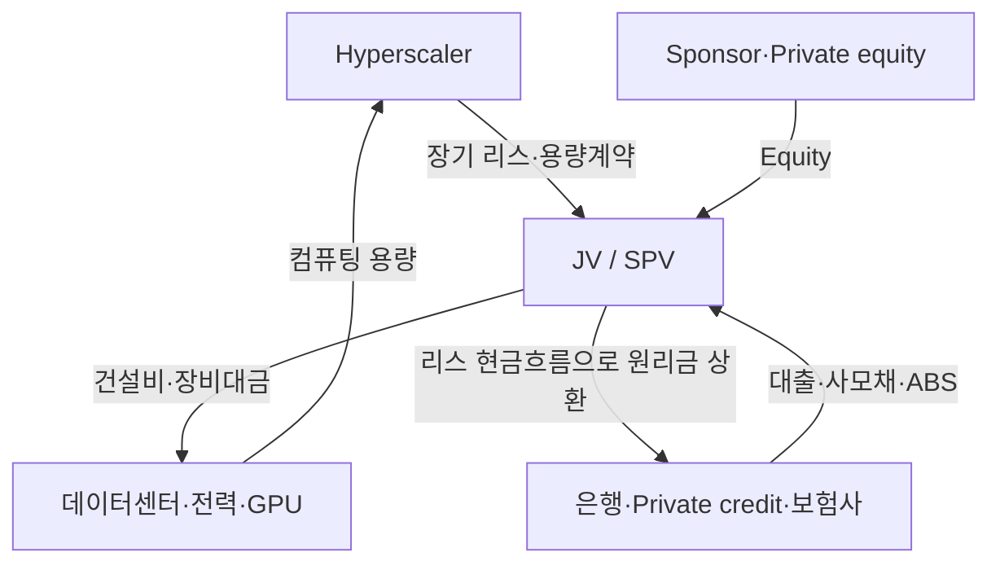

*영업현금흐름에서 회사채와 SPV로 넓어지는 AI 투자의 신용경로*

AI 인프라 투자가 예상보다 빠르게 커지고 있다. [Moody's가 인용된 보도](https://www.barrons.com/livecoverage/fed-meeting-rate-decision-september-warsh/card/higher-interest-rates-add-to-data-center-builders-borrowing-costs-AivKHJsZU5JvaU1zpNMJ)에 따르면 hyperscaler의 2026년 투자지출은 약 7,850억 달러, 2027년에는 1조 달러를 넘어설 전망이다. 투자가 계속 상향되는 가장 직접적인 이유는 수요가 강하기 때문이다. 모델 학습뿐 아니라 추론, 기업용 AI 서비스와 클라우드 용량 수요가 동시에 증가하고 있다. 최근 Nebius가 H100을 포함한 일부 Nvidia GPU의 사용가격을 인상한 사실도 구형 GPU의 경제적 가치가 예상보다 오래 유지되고 있음을 보여준다.

이는 기본적으로 긍정적인 신호다. Hyperscaler는 과거에도 미래 성장을 위해 막대한 금액을 투자했고, 클라우드와 데이터센터 투자는 장기간에 걸쳐 높은 수익으로 이어졌다. 필자도 매일 AI를 사용하면서 효용과 수요의 강도를 체감하고 있다. 이 글은 AI 수요가 허상이라고 주장하거나, AI 주가의 고점을 예측하거나, Dotcom 버블 같은 금융위기의 재현을 선언하려는 글이 아니다.

다만 이번 투자 사이클에는 과거와 다른 변화가 있다. 과거의 대규모 투자는 대부분 기존 사업에서 창출되는 영업현금흐름의 범위 안에서 감당할 수 있었다. 그러나 이제는 AI 투자 증가 속도가 현금흐름 증가 속도를 앞서면서 자금조달 경로가 회사채와 은행대출을 넘어 private placement, project bond, ABS, SPV 등으로 빠르게 확장되고 있다. 이는 AI 투자의 경제적 위험이 더 이상 hyperscaler 주주에게만 집중되지 않는다는 의미다. 회사채 투자자와 은행, 보험사, private credit 투자자까지 AI 투자 사이클의 위험을 함께 부담하기 시작했다. 여기서 중요한 것은 단순히 부채가 늘어난다는 사실이 아니다. 금융시장은 끊임없이 새로운 고수익 투자처를 찾고, 풍부한 자금은 AI 인프라에 대한 추가 투자를 가능하게 한다. 늘어난 투자는 다시 반도체, 데이터센터, 전력 인프라 등에 대한 수요를 만들고, 강한 수요와 성장 기대는 더 많은 자금을 끌어들인다. **자금이 투자를 만들고, 투자가 수요를 만들며, 그 수요가 다시 새로운 자금을 끌어들이는 재귀적 사이클이 형성되는 것이다.** 이 구조는 수요가 계속 증가하는 동안에는 투자 확대를 가속하지만, 기대수익률이나 최종 수요에 대한 가정이 흔들릴 경우 그 충격 역시 더 넓은 금융시장으로 전달될 수 있다. 이번 AI 투자 사이클에서 주목해야 할 변화는 바로 이 지점이다.

새로운 산업의 방향이 옳다는 사실과 모든 투자자가 좋은 수익을 얻는다는 것은 같은 말이 아니다. 닷컴·통신 투자 사이클에서도 인터넷과 광통신의 장기 수요는 현실이 됐다. 그러나 여러 기업이 동일한 수요를 선점하기 위해 네트워크를 중복 구축했고, 수요가 설비를 모두 흡수하기까지 시간이 걸리면서 높은 부채를 사용한 기업과 투자자는 큰 손실을 경험했다. AI에서도 모든 기업이 비슷한 최종시장과 AGI를 목표로 투자하고 있다. 소비자가 장기적으로 여러 개의 범용 AI를 동시에 사용할지, 이메일·검색처럼 소수 플랫폼으로 집중될지는 아직 알 수 없다. 기업용 특화 모델과 멀티모델 사용이 공존할 가능성도 충분하므로, 이를 ‘한 회사만 살아남는다’고 단정할 수는 없다. 중요한 점은 승자와 가격구조가 정해지기 전에 여러 기업이 같은 미래 수요를 전제로 동시에 설비를 건설하고 있다는 것이다.

이 글에는 두 가지 목적이 있다.

1. AI 투자에 사용되는 회사채와 부외 금융이 현재 어느 정도 규모인지 파악한다.
2. AI 수요가 예상보다 약해지거나 수익화가 늦어질 경우, 손실이 어떤 경로와 규모로 크레딧 시장에 전달될 수 있는지 살펴본다.

먼저 숫자의 성격을 구분해야 한다. **7,850억 달러의 Capex는 자금의 사용처이고, 2,400억 달러의 채권 발행은 그 투자를 조달하는 자금의 원천이다. 두 수치를 합산할 수 없다.** SPV 금융과 미개시 리스도 해당 Capex와 중복될 수 있다. 이 구분을 하지 않으면 AI 투자의 물리적 규모와 금융 레버리지를 동시에 과대계상하게 된다.

---

## 1. 투자 증가는 긍정적이지만 자금조달의 성격을 바꾸고 있다

2026년 AI 투자는 규모가 큰 것만이 아니라 전망치가 계속 상향됐다는 점이 특징이다. Amazon, Microsoft, Alphabet과 Meta의 2026년 투자액만 약 7,250억 달러로 추정되고 있으며, Oracle과 다른 AI 인프라 사업자를 포함한 hyperscaler 지출 전망은 약 7,850억 달러까지 올라왔다. [Oracle은 FY2026에 영업현금흐름 320억 달러를 창출했지만 Capex가 556억 달러에 이르면서 FCF가 마이너스 237억 달러](https://investor.oracle.com/investor-news/news-details/2026/Oracle-Announces-Record-Q4-and-FY-2026-Results-Driven-by-Cloud-Infrastructure--Cloud-Applications/default.aspx)로 전환됐다. 대형 기술기업 전체에서도 Capex 증가로 합산 FCF가 금융위기 이후 가장 낮은 수준으로 내려갈 것이라는 전망이 나왔다.

지금의 핵심 쟁점은 **현금이 나가는 시점과 매출이 들어오는 시점의 차이**다. AI 매출은 빠르게 증가하고 있지만 회사마다 정의와 공개범위가 다르다. Microsoft는 Azure AI와 Copilot의 일부 지표를 제공하는 반면 Amazon과 Alphabet은 AI가 포함된 클라우드 매출을 별도로 분리하지 않는다. Meta의 AI 수익은 직접 사용료보다 광고 효율과 사용자 참여 증가에 포함된다. 투자 코호트별 추가 매출과 현금흐름이 충분히 공개되지 않는 동안, 시장은 높은 수요와 불확실한 투자회수 기간을 동시에 평가해야 한다. 이 시간차가 커지면서 다음과 같이 조달구조가 변하고 있다.

| 구분 | 2026년 확인 규모 | 숫자의 의미 |
|---|---:|---|
| Hyperscaler Capex | 약 7,850억 달러 | 2026년에 집행될 물리적·회계상 투자, 즉 자금의 사용처 |
| Hyperscaler 채권 발행 | 약 2,400억 달러 | Capex와 기타 자금수요를 충당하는 자금의 원천 |
| 주요 AI 부외·프로젝트 금융 | 약 1,700억~1,800억 달러 | SPV, 프로젝트 대출, ABS와 사모자본의 공개 거래 범위. 다년 약정과 미집행분 포함 |
| 미개시 리스 지급약정 | 약 1.09조 달러 | 아직 사용이 시작되지 않은 시설에 대한 다년간 할인 전 명목 지급액 |

이 표의 네 행은 더해서 ‘총 AI 투자액’을 만드는 숫자가 아니다. 첫 번째는 연간 flow, 두 번째와 세 번째는 financing source, 네 번째는 여러 해에 걸친 contractual stock이다. 다만 네 숫자를 함께 보면 AI 투자가 기존 영업현금흐름과 대차대조표 안의 Capex만으로 설명되던 단계에서 벗어나고 있다는 점은 분명하다.

---

## 2. 2,400억 달러의 채권 발행은 우량채 시장의 새로운 공급원이다

Moody's는 hyperscaler가 2026년에 약 2,400억 달러의 채권을 발행할 것으로 예상한다. 2025년 1,000억 달러를 웃돌았던 발행액의 두 배 이상이며, 2027년에는 AI 산업 전체 차입이 약 3,750억 달러로 커질 수 있다고 본다.

절대규모를 이해하기 위해 한 국가의 예산과 비교할 수 있다. [폴란드의 2027년 중앙정부 예산안 총지출은 9,776억 즈워티, 약 2,630억 달러](https://www.reuters.com/business/poland-sees-2027-budget-deficit-71-gdp-growth-3-2026-08-28/)다. 폴란드는 2026년 명목 GDP가 약 1.1조 달러인 세계 20위권 경제이며 EU에서는 명목 GDP 기준 6위권이다. 즉, 세계 20위권 국가의 중앙정부가 1년 동안 지출하는 금액에 가까운 회사채가 소수 기술기업에서 한 해에 공급되고 있으며 그 규모가 놀라운 속도로 커지고 있는 셈이다.

미국 채권시장 안에서도 의미 있는 규모다.

| 비교 기준 | 시장 규모 | Hyperscaler 2,400억 달러의 비중 |
|---|---:|---:|
| 2026년 미국 IG 회사채 발행 전망 | 1.8조 달러 | 13.3% |
| 2026년 미국 기술기업 IG 발행 전망 | 3,600억 달러 | 66.7% |
| 2025년 미국 회사채 장기 발행액 | 2.22조 달러 | 10.8% |
| 2025년 미국 국채 장기 발행액 | 4.82조 달러 | 5.0% |

회사채 발행이 최근 빠르게 상승하고 있는 국채금리를 일대일로 올린다고 볼 수는 없다. 1차 효과는 회사채의 신규발행 프리미엄과 발행기업의 조달금리에 나타난다. 그러나 재정적자와 국채 공급이 이미 기간 프리미엄에 부담을 주는 상황에서 대규모 IG 회사채는 보험사, 연기금과 자산운용사 같은 장기저축 자금과 듀레이션 수용능력을 사용한다. 금리 헤지와 국채 대체매매를 통해 국채금리에도 간접적인 압력을 줄 수 있다.

따라서 최근 장기금리 상승을 AI 회사채 공급 하나로 설명할 수는 없지만, 앞으로 시장이 소화해야 할 채권 공급은 정부부채와 기업부채 양쪽에서 동시에 늘어나고 있다. 2026년 미국 IG 발행 전망 1.8조 달러와 2025년 장기국채 발행 4.82조 달러는 고정된 상한이 아니다. AI 투자와 재정적자가 계속 확대되면 장기자금에 대한 경쟁도 강해질 수 있다.

---

## 3. 공개회사채의 스프레드는 안정적이지만 공급 부담과 신용위험은 다른 문제다

대규모 발행이 예상되지만 공개 크레딧 시장은 아직 AI 투자에 따른 광범위한 신용스트레스를 가격에 반영하지 않고 있다. FRED의 ICE BofA 원자료에 따르면 2026년 9월 17일 미국 IG 회사채 OAS는 78bp, HY OAS는 270bp였다. 지난 3년 내 최저 수준에 근접한다.

| 지표 | 2025년 말 | 2026년 중 최고 | 2026년 9월 17일 |
|---|---:|---:|---:|
| [ICE BofA US Corporate Index OAS](https://fred.stlouisfed.org/series/BAMLC0A0CM) | 79bp | 94bp | 78bp |
| [ICE BofA US High Yield Index OAS](https://fred.stlouisfed.org/series/BAMLH0A0HYM2) | 281bp | 346bp | 270bp |

이 데이터가 말해주는 것은 두 가지다. 현재까지 AI 투자 확대가 공개회사채 시장 전반의 부도위험을 높였다는 증거는 없지만, 국채와 IG 회사채의 공급 증가는 무위험금리와 신규발행 비용에 영향을 줄 수 있다.

그러나 공개지수의 안정성이 모든 AI 프로젝트가 같은 가격으로 자금을 조달한다는 뜻도 아니다. [Oracle이 임차할 예정인 New Mexico Project Jupiter의 180억 달러 대출은 액면 1달러당 89~91센트에 호가](https://www.reuters.com/business/finance/oracles-18-billion-data-center-debt-under-pressure-ft-reports-2026-09-18/)됐다. 지역사회의 반대와 전력·가스 인허가 지연, Oracle의 차입 증가와 신용등급 하락으로 은행들이 계획보다 많은 대출을 보유하게 됐다.

Project Jupiter는 AI 크레딧 사이클 전체가 악화됐다는 증거가 아니다. 오히려 앞으로 발생할 수 있는 문제의 형태를 보여준다. 데이터센터는 동일한 AI 수요 전망을 공유하더라도 부지, 전력, 인허가, 건설일정, 임차인의 신용과 계약조건이 모두 다르다. 프로젝트 수가 늘어날수록 일부는 일정 지연이나 비용 초과를 겪을 가능성이 높아지고, 그때 은행이 예정했던 대출매각에 실패하거나 private investor가 더 높은 수익률을 요구하게 된다. 공개 OAS보다 개별 프로젝트 대출의 가격이 먼저 움직일 수 있는 이유다.

이제 질문은 이러한 프로젝트 부채가 hyperscaler의 재무제표 밖에서 어떤 구조로 만들어지는가이다.

---

## 4. SPV는 Capex를 없애는 것이 아니라 지급시점과 위험보유자를 바꾼다

[BIS Quarterly Review](https://www.bis.org/publications/qr-202603)는 hyperscaler가 전통적 회사채와 함께 off-balance-sheet arrangement를 사용하고 있다고 설명한다. 일반적인 구조는 별도 JV나 SPV가 데이터센터를 취득·개발하고, sponsor consortium의 지분과 private placement 부채로 이를 조달하는 방식이다. Hyperscaler는 소수지분만 보유하는 대신 장기 운영리스나 capacity offtake 계약을 체결하고, 거래에 따라 최소지급·완공지원·잔존가치 보증을 제공한다.

법적으로 건설부채는 SPV에 남지만, 경제적으로는 hyperscaler의 장기계약이 원리금 상환의 핵심 재원이다. Hyperscaler 입장에서는 upfront Capex의 일부가 수년에 걸친 리스 또는 서비스 비용으로 전환된다. 투자자는 토지, 데이터센터와 GPU 같은 물적자산뿐 아니라 hyperscaler의 지급약정과 보증을 실질적인 신용근거로 본다.

이 구조는 그 자체로 부정적이지 않다. 프로젝트 위험을 분리하고 장기자산과 장기자금을 맞추며, 시설을 사용하는 기업이 모든 건설비를 즉시 부담하지 않도록 해준다. 문제는 투자가 실패할 때 손실배분이 거래마다 다르다는 점이다.

- Hyperscaler가 최소지급이나 잔존가치를 보증하면 경제적 위험의 상당 부분이 다시 hyperscaler로 돌아온다.
- 보증이 제한적이면 SPV 대주와 지분투자자가 건설지연과 자산가치 하락을 더 많이 부담한다.
- 은행이 대출을 매각하지 못하면 계획보다 큰 warehouse exposure가 은행 대차대조표에 남는다.
- 여러 private fund와 보험사가 동일 프로젝트에 참여하면 최종 익스포저를 공개자료만으로 합산하기 어렵다.

최종손실 부담자가 불분명한 것이 문제가 되는 이유는 단순히 정보가 부족해서가 아니다. 시장은 총 레버리지, 동일 투자자의 중복 익스포저, 차환이 막힐 때 필요한 추가자본과 hyperscaler로 돌아올 조건부 의무를 정확히 계산하기 어려워진다. 정상시에는 위험이 여러 곳으로 분산된 것처럼 보이지만, 공통 가정인 AI 수요나 자산 잔존가치가 하향되면 서로 다른 계약이 동시에 같은 방향으로 재평가될 수 있다.

---

## 5. 약 1,700억~1,800억 달러의 부외·프로젝트 금융

공개된 거래를 완벽하게 합산하는 것은 불가능하다. 같은 프로젝트가 개발비, 대출, 사모채권과 리스 약정으로 여러 차례 보도되고, 발표금액 중 아직 집행되지 않은 부분도 있기 때문이다. [Financial Times는 2026년 초 Meta, Oracle, xAI와 CoreWeave 등 기술기업이 SPV를 통해 대차대조표 밖으로 이동시킨 AI 데이터센터 부채가 이미 1,200억 달러를 넘는다고 집계](https://www.ft.com/content/0ae9d6cd-6b94-4e22-a559-f047734bef83)했다. 이후 공개된 Anthropic Big Sky의 약 344억~350억 달러와 Alphabet·Blackstone의 Crux AI 금융 패키지 270억 달러를 단순히 더하면 약 1,820억 달러가 된다. 다만 Crux의 270억 달러에는 지분 50억 달러가 포함돼 있어 부채만 보면 약 1,770억 달러다. 여기에 기준시점과 거래범위의 일부 중복, 미집행 약정을 감안해 이 글에서는 **약 1,700억~1,800억 달러**를 공개 거래 범위로 사용한다. 이는 부채와 지분을 합한 자금조달 규모이며, 전액이 부채는 아니다.

| 공개 거래 또는 집계 | 공개 규모 | 구조와 해석 |
|---|---:|---|
| FT의 2026년 초 SPV 부채 집계 | 1,200억 달러 이상 | Meta, Oracle, xAI, CoreWeave 등의 AI 데이터센터 관련 부외부채. 아래 일부 개별 프로젝트와 중복 가능 |
| Meta Hyperion | 약 270억 달러 | Blue Owl 80%, Meta 20% JV. Meta가 시설을 임차하고 조건부 잔존가치 보증 제공 |
| Anthropic Big Sky | 약 344억~350억 달러 | Compute SPV가 TPU를 조달하고 Anthropic의 칩 리스 지급액을 담보로 은행대출·ABS·후순위채 발행 |
| [Alphabet·Blackstone Crux AI](https://www.reuters.com/world/asia-pacific/banks-provide-22-billion-chip-loan-blackstone-alphabet-cloud-venture-bloomberg-2026-09-16/) | 220억 달러 대출 + 50억 달러 equity | TPU와 고객계약을 담보로 은행단 대출. 향후 채권시장 refinancing 가능 |
| Oracle Project Jupiter | 180억 달러 대출 | Oracle 임차 프로젝트. 대출매각 지연과 가격하락이 나타난 개별 사례 |

이 금액을 앞의 Capex에 그대로 더할 수는 없다. 프로젝트별로 물리적 투자와 자금조달이 중복되기 때문이다. 다만 총액보다 중요한 것은 조달경로의 변화다. 데이터센터 한 곳을 두고 회사채 투자자, 은행, private fund와 보험사가 서로 다른 순위의 청구권을 나눠 갖는 구조가 이미 표준에 가까워졌다.

---

## 6. 1.09조 달러의 미개시 리스

[Reuters가 Microsoft, Meta, Oracle, Amazon과 Alphabet의 공시를 집계한 결과](https://www.reuters.com/business/retail-consumer/ai-data-centre-race-builds-1-trillion-lease-burden-big-tech-2026-08-04/), 미개시 리스의 미래 명목 지급액은 2026년 8월 기준 약 1.09조 달러였다.

| 기업 | 미개시 리스 명목 지급약정 |
|---|---:|
| Microsoft | 3,291억 달러 |
| Meta | 2,789.9억 달러 |
| Oracle | 2,600억 달러 |
| Amazon | 1,372.1억 달러 |
| Alphabet | 852억 달러 |
| 합계 | 약 1.09조 달러 |

미개시 리스는 계약은 체결됐지만 시설이 완공되지 않았거나 사용 가능한 상태가 아니어서 아직 개시되지 않은 계약이다. 그래서 현재의 리스부채에도, 올해의 현금 CapEx에도 잡히지 않는다. 시설이 완공돼 hyperscaler가 쓰기 시작하면 그때 사용권자산과 리스부채가 인식되고, 현금지급은 이후 장기간에 걸쳐 발생한다. 회계장부에 아직 나타나지 않을 뿐, 데이터센터를 짓는 개발업체와 SPV에게는 이 계약이 곧 건설과 자금조달의 근거다.

다만 1.09조 달러를 데이터센터 건설비와 동일하게 볼 수는 없다. 이 금액은 여러 해에 걸쳐 지급될 할인 전 리스료의 합계이며, 실제 시설 건설비뿐 아니라 lessor의 자금조달비용과 투자수익, 운영·유지관리비, 잔존가치에 대한 보상 등이 포함될 수 있기 때문이다. 계약의 세부 조건이 공개되지 않은 상황에서는 이를 실제 건설비로 정확하게 역산하기 어렵다.

그럼에도 경제적 규모에 대한 대략적인 민감도 분석은 가능하다. 리스료가 평균 15~19년에 걸쳐 발생하고 할인율을 5~8%로 가정하면, 1.09조 달러의 명목 지급약정은 현재가치 기준으로 대략 **5,500억~7,500억 달러**에 해당한다. 이는 현재의 CapEx가 아니라 이미 계약된 미래 데이터센터 용량에 대한 경제적 가치의 추정 범위다.

여기서 한 단계 더 나아가 AI/Data Center 투자에서 서버·GPU·네트워크 등 IT/compute hardware가 약 60~70%, 데이터센터 건물·전력·냉각 등 physical infrastructure가 약 30~40%를 차지한다고 가정할 수 있다. 미개시 리스의 현재가치가 주로 후자에 대응한다고 단순화하면, 이미 계약된 physical infrastructure는 이보다 훨씬 큰 전체 AI 인프라 투자를 뒷받침하는 규모임을 알 수 있다.

예를 들어 physical infrastructure의 비중을 약 35%로 놓으면, 5,500억~7,500억 달러의 경제적 가치는 전체 AI/Data Center 투자 기준으로 대략 **1.6조~2.1조 달러**에 대응한다.

이 범위는 두 가지 가정에 민감하다. 첫째, 지급이 지금부터 시작된다고 보고 계산한 현재가치다. 시설 완공까지 2년의 유예를 두면 같은 명목금액의 현재가치는 대략 4,700억~6,800억 달러가 되고, 같은 35% 가정에서 전체 투자 역산치도 1.3조~1.9조 달러로 내려간다. 둘째, 미개시 리스가 데이터센터 건물·전력 등 physical infrastructure에만 대응한다고 가정했다. 실제로는 Microsoft의 사례처럼 일부 미개시 리스에 GPU나 neocloud의 컴퓨팅 용량이 포함될 수 있으며, 그만큼 전체 투자액 역산치는 과대평가된다. 다만 이는 미개시 리스를 실제 건설비와 동일하다고 가정한 정확한 투자액 추정치가 아니다. **리스 계약의 경제적 가치와 데이터센터의 일반적인 비용구조를 결합해 향후 AI 인프라 투자 규모의 order of magnitude를 가늠하기 위한 민감도 분석**으로 해석하는 것이 적절하다.

---

## 7. Neocloud는 현금흐름과 Capex가 언제 교차하는지를 보여주는 선행지표다

Hyperscaler는 기존 사업의 영업현금흐름과 투자등급 신용을 보유한다. 반면 neocloud는 AI 컴퓨팅 매출과 설비투자의 연결이 더 직접적이고 외부자금 의존도가 높다. 따라서 neocloud에서 `영업현금흐름 ≥ Capex`가 언제 성립하는지는 AI 인프라가 외부자금 없이 성장할 수 있는지를 보여주는 선행지표가 된다.

| 기업 | 수요 지표 | 2026년 투자·조달 부담 | 현금흐름 교차에 대한 현재 판단 |
|---|---|---|---|
| CoreWeave | 2Q26 매출 25.8억 달러(전년 대비 약 2배), 6월 말 backlog 약 1,040억 달러 | Capex 가이던스 310억~350억 달러, 9월까지 확보한 debt·equity 조달액 200억 달러 이상, 9월 30억 달러 전환사채 추가 | 매출이 빠르게 늘어도 2026년에는 Capex를 내부현금으로 충당하기 어려움. 외부조달 감소 여부가 2027~2028년 핵심 지표 |
| Nebius | 1Q26 매출 3.99억 달러, 2Q 약 5.75억 달러 | Capex 200억~250억 달러, 전환부채 43.4억 달러. 성장자금의 약 60%를 고객선급금으로 충당 계획 | 단기간 OCF-Capex 교차보다 고객선급금이 외부차입을 얼마나 대체하는지가 중요 |
| Nscale | 계약매출 1,030억 달러 이상 | 1H26 매출 1.406억 달러, 순손실 10.2억 달러, 전환사채 31억 달러 | 계약규모와 현재 현금창출력의 차이가 가장 큼. 고객집중도와 계약집행 속도가 관건 |

[CoreWeave는 2026년 1분기 감가상각비와 이자비용의 합계가 매출의 81%](https://www.barrons.com/articles/coreweave-earnings-stock-price-13d24b29)에 달했고, [2분기에도 감가상각비 13.9억 달러와 순이자비용 6.4억 달러로 매출의 79%](https://investors.coreweave.com/news/news-details/2026/CoreWeave-Reports-Strong-Second-Quarter-2026-Results/default.aspx) 수준을 유지했다. 매출이 두 배로 늘어도 자산과 부채가 같은 속도로 늘고 있다는 뜻이다. backlog는 장기 수요를 보여주지만 현금이 즉시 들어오는 것은 아니다. GPU와 데이터센터는 먼저 확보해야 하고 매출은 계약기간에 걸쳐 인식된다. 현재 공개된 수치만으로 신뢰할 만한 OCF-Capex 교차연도를 특정하기는 어렵지만, 2026년 Capex 가이던스가 2분기 매출 연율치의 세 배를 넘는다는 점을 감안하면 적어도 단기에는 외부자금이 필수적이다.

[Nebius는 Meta와 Microsoft의 고객선급금이 성장자금의 약 60%를 충당하고 나머지 40%를 debt와 equity로 조달할 계획](https://www.reuters.com/technology/nebius-says-well-funded-ai-race-after-closing-43-billion-debt-raise-2026-03-23/)이라고 밝혔다. 고객선급금은 좋은 신호다. 수요가 계약으로 확인됐고 이자비용 없이 건설자금을 앞당겨 받을 수 있기 때문이다. 동시에 소수 대형고객에 대한 의존과 계약이행 의무도 커진다.

GPU의 경제적 수명도 짧다고 볼 수 없다. [Nebius가 H100 등 일부 구형 GPU 가격을 다시 올렸다는 보도](https://www.reuters.com/technology/nebius-hikes-ai-cloud-prices-again-demand-computing-power-soars-2026-09-17/)는 현재 가동률과 가격결정력이 높음을 보여준다. 지금의 데이터는 세대교체만으로 담보가치가 붕괴한다는 주장에 반대되는 증거다. 다만 부채와 리스의 만기는 현재 수요 사이클보다 길기 때문에 GPU 시간당 가격, 가동률과 중고가격이 함께 하락하는지가 향후 핵심 모니터링 지표다.

이들 기업에서 주식과 크레딧이 연결되는 지점은 반복적인 자금조달이다. 전환사채는 일정 조건에서 주식으로 바뀔 수 있는 채권이다. ATM 발행은 회사가 시장에서 소량씩 주식을 매도해 자금을 조달하는 방식이다. 주가가 하락하면 같은 현금을 확보하기 위해 더 많은 주식을 발행해야 하므로 dilution이 커지고, 추가자금 조달에 대한 우려가 다시 주가를 압박할 수 있다.

---

## 8. AI 금융은 이미 혼잡한 장기자금 시장으로 들어오고 있다

AI 데이터센터 금융은 비어 있는 시장에서 시작된 것이 아니다. 코로나 이후 은행 규제와 대출축소를 배경으로 private credit이 빠르게 성장했고, 이미 기업 인수금융, 상업용 부동산, 인프라와 asset-backed finance에 자금을 공급하고 있다. 세계 private credit 시장은 정의에 따라 약 1.2조~2조 달러로 추정된다. 펀드 AUM인지 실제 대출잔액인지, direct lending만 포함하는지 asset-based finance까지 포함하는지에 따라 차이가 크다.

여기에 최근에는 반대 방향의 규제 변화가 더해지고 있다. 미국 규제당국은 [2025년 11월 GSIB에 적용되는 enhanced supplementary leverage ratio(eSLR)를 완화하는 최종규정을 확정](https://www.federalregister.gov/documents/2025/12/01/2025-21626/regulatory-capital-rule-modifications-to-the-enhanced-supplementary-leverage-ratio-standards-for-us)했고 2026년 4월부터 시행됐다. 지주회사 기준 자본요구 감소폭은 2% 미만이지만, 국채 딜러 업무를 수행하는 은행 자회사 기준으로는 약 28% 줄어든다. 규제당국은 레버리지비율이 저위험·저수익 업무의 구속요건으로 작동하지 않게 하는 것이 목적이라고 설명했다. 이어 [2026년 3월에는 Basel III 최종안, 표준방법과 GSIB 서차지를 함께 개편하는 세 건의 제안](https://www.federalreserve.gov/newsevents/pressreleases/bcreg20260319a.htm)이 공개됐다. 연준이 공개한 추정에 따르면 스트레스테스트 변경까지 포함할 경우 Category I·II 은행의 CET1 요구자본은 약 4.8%, Category III·IV는 약 5.2% 감소한다. 이 제안은 2026년 6월 의견수렴을 마쳤고 아직 확정되지 않았다.

이 변화의 실질적 의미는 은행이 같은 자본으로 더 큰 대차대조표를 운용할 수 있게 된다는 것이다. 국채 인수와 딜러 재고, 대출매각 전까지 보유하는 warehouse 잔액, private credit 펀드에 대한 신용공여가 모두 여기에 해당한다. 은행의 비예금 금융기관(NDFI) 대출은 이미 2025년 중반에 1조 달러를 넘었고 2010년 이후 연평균 약 23%로 증가했다. 같은 기간 전체 대출 증가율은 약 4%였다. 규제완화로 생긴 여력이 곧바로 AI 프로젝트로 흘러간다고 단정할 수는 없다. 다만 AI 데이터센터 금융은 현재 은행과 private credit이 접근할 수 있는 신규 자산군 가운데 스프레드가 높은 축에 속하고, 자본제약이 완화되는 국면에서 새로운 자금수요를 흡수할 여지도 그만큼 커진다. Project Jupiter처럼 매각되지 못한 대출이 은행에 남는 경우에도 자본부담이 줄어든 만큼 더 오래 보유할 수 있다. 이는 단기적으로 시장의 완충장치로 작동하지만, 동시에 위험이 은행 대차대조표에 더 오래 머무른다는 뜻이기도 하다.

미국의 commercial·multifamily mortgage debt는 [2026년 1분기 5.02조 달러](https://www.mba.org/news-and-research/newsroom/news/2026/06/18/commercial-and-multifamily-mortgage-debt-outstanding-crosses--5-trillion-in-first-quarter-2026)를 넘어섰다.

| 보유주체 | Commercial·multifamily mortgage debt |
|---|---:|
| 은행 | 약 1.9조 달러 |
| Agency·GSE 및 관련 MBS | 약 1.2조 달러 |
| 생명보험사 | 약 7,750억 달러 |
| CMBS·CDO·기타 ABS | 약 6,370억 달러 |
| 기타(주·지방정부, 연기금, 재무회사 등) | 약 5,100억 달러 |
| 전체 | 약 5.02조 달러 |

2026년에 만기가 도래하는 CRE mortgage도 약 9,360억 달러로 추정된다. 오피스 공실과 자산가격 조정으로 일부 차주는 더 높은 금리에서 refinancing을 해야 한다. AI 데이터센터의 회사채, 프로젝트 대출, 사모채권과 ABS는 private credit 시장에서 매력적인 상품이다.

Private credit AUM, CRE mortgage와 AI 프로젝트 금융을 단순 합산해서는 안 된다. 같은 대출이 펀드 AUM과 ABS에 중복될 수 있고, 은행·보험사·private fund가 한 거래에 공동으로 참여할 수도 있다. 그러나 자금공급자의 관점에서는 완전히 별개의 시장도 아니다. 동일한 은행, 보험사, 연기금과 자산운용사가 다음 자산을 동시에 흡수하기 때문이다.

- 증가하는 미국 국채와 hyperscaler 공개회사채
- 기존 commercial·multifamily mortgage의 refinancing
- CMBS·ABS와 asset-backed finance
- AI 데이터센터 프로젝트 대출과 사모채권

AI 관련 부외 금융 약 1,700억~1,800억 달러는 5조 달러가 넘는 미국 commercial·multifamily mortgage 시장이나 전체 글로벌 크레딧 시장에서 아직은 의미 있는 규모는 아니다. 그러나 성장속도가 빠르고, 거래가 비공개이며, 기존 CRE refinancing과 같은 투자자 자본을 사용한다는 점은 중요하다. 지금의 질문은 이미 금융위기가 시작됐는지가 아니라, 앞으로 AI 투자가 더 커질 때 어느 대차대조표가 얼마나 많은 위험을 보유하게 되는지 시장이 충분히 볼 수 있는가이다.

---

## 9. 위험은 조건부 피드백에 있다

AI 투자는 규모와 속도 모두에서 이전에 봤던 어떤 산업을 뛰어넘는다. 그리고 관련기업 주주에서 전반적인 금융시장으로 영향이 커지고 있다. 서두에 얘기한 것과 같이 금융시장은 끊임없이 새로운 고수익 투자처를 찾고 AI는 지금 가장 매력적인 투자처이다. 늘어난 투자는 수요를 만들고, 강한 수요와 성장 기대는 더 많은 자금을 끌어들인다. **재귀적 사이클이 악순환으로 돌아서는 지점은 주가 하락의 원인이 AI 자체의 경제성에 대한 기대 하향일 때다.**

가능한 경로는 다음과 같다.

1. AI 관련 매출, 가동률 또는 고객의 자금조달 능력에 대한 기대가 낮아진다.
2. 기술기업 주가와 함께 GPU·데이터센터의 잔존가치, 리스와 offtake 계약의 신용가치가 재평가된다.
3. SPV 대출과 사모채권의 spread가 확대되고 refinancing이 어려워진다.
4. 최소지급, 잔존가치 보증과 미개시 리스가 더 부채에 가까운 의무로 평가된다.
5. Hyperscaler의 FCF 부담이 커지고, neocloud는 ATM과 전환사채 조달에서 더 큰 dilution을 감수한다.
6. 높아진 자본비용과 투자축소 우려가 다시 주가를 압박한다.

---

## Conclusion

현재 공개적으로 확인되는 AI 관련 SPV와 부외 금융의 규모는 금융시스템 충격을 줄 정도는 아니다. Hyperscaler의 신용도는 대체로 높고, 2026년 9월 현재 IG와 HY OAS에서도 광범위한 스트레스는 나타나지 않는다. GPU 가격과 neocloud의 매출도 AI 컴퓨팅 수요가 여전히 강하다는 점을 보여준다.

따라서 이 글의 목적은 AI 투자의 실패나 시스템 리스크를 예측하는 데 있지 않다. 또한 1.09조 달러의 미개시 리스를 현재 부채나 당해 연도 Capex에 더해 위험을 과장하려는 것도 아니다.

다만 AI 투자의 부담주체가 달라지고 있다는 점은 분명하다. 과거에는 AI 투자 실패 위험을 주로 hyperscaler 주주가 부담했다면, 이제는 회사채 투자자, 은행, private credit, 보험사와 SPV 투자자도 함께 부담하기 시작했다. 동시에 이들은 코로나 이후 누적된 상업용 부동산 refinancing과 증가하는 정부부채도 흡수해야 한다.

현재의 위험은 이미 발생한 손실의 크기가 아니다. AI 수익화 기대가 꺾일 때 온밸런스 회사채, private credit, SPV 금융과 주식시장이 하나의 피드백 루프로 연결될 가능성이다. 주가 하락 자체가 담보가치를 낮추는 것이 아니라, AI 경제성에 대한 동일한 하향조정이 주식가치와 프로젝트 자산·계약가치를 동시에 떨어뜨릴 때 위험이 증폭된다.

AI 수요가 계속 강하면 현재의 대규모 금융은 성장 인프라를 선제적으로 구축한 성공적인 자본배분이 될 수 있다. 반대로 수익화가 예상보다 늦어지면 지금은 분산돼 보이는 계약과 부채가 같은 가정에 의존하고 있었다는 사실이 드러날 수 있다. 어느 쪽이 맞는지는 아직 정확히 알 수 없다. 그렇기 때문에 AI가 전체 크레딧 시장에 남기고 있는 금융경로를 지금부터 측정할 필요가 있다.

---

## 향후 Monitoring Dashboard

| 지표 | 현재 관찰 | 위험 신호 |
|---|---|---|
| AI Capex 대비 incremental revenue | 회사별 정의 불일치, 직접 집계 불가 | 투자 코호트별 매출·가동률 하향 |
| Capex / operating cash flow | 일부 기업에서 Capex 증가가 OCF 증가를 추월 | OCF 하향과 Capex 유지가 동시에 발생 |
| Hyperscaler 채권 발행 | 2026년 약 2,400억 달러 전망 | 신규발행 프리미엄 확대, 주문배수 하락 |
| IG·HY OAS | 78bp·270bp, 광범위한 스트레스 없음 | 지수 상승보다 AI issuer·project의 상대 spread 확대를 먼저 관찰 |
| Neocloud finance burden | CoreWeave 2026 Capex 310억~350억 달러, 외부조달 의존 | 이자·감가상각 부담 상승, ATM·전환사채 반복 |
| 고객집중도 | Nscale 현재 매출의 52%가 단일 고객 | 고객 신용악화 또는 계약축소 |
| 계약과 부채 만기 | Oracle 등에서 장기 lease와 고객계약 불일치 가능 | 고객계약보다 부채·리스 만기가 길어짐 |
| GPU 경제적 수명 | H100 등 구형 GPU 가격도 현재 상승 | 가동률·시간당 가격과 중고가격의 동반 하락 |
| SPV 보증 | 최소지급·잔존가치 보증·backstop이 거래별 상이 | 회계상 부외항목이 rating-adjusted debt로 이동 |
| Equity dilution | Neocloud의 전환사채와 주식조달 확대 | 주가 하락 속 ATM·전환사채 발행 증가 |
| Project debt 가격 | Project Jupiter 89~91센트 호가 | 대출매각 실패, warehouse 잔액 증가, refinancing 연기 |

---

## 주요 자료

- [BIS Quarterly Review, March 2026](https://www.bis.org/publications/qr-202603)
- [Moody's: AI infrastructure boom and hyperscaler financing](https://www.moodys.com/web/en/us/insights/podcasts/credit-currents/ai-s-infrastructure-boom--how-trillion-dollar-spending-is-changi.html)
- [Barron's: Moody's 2026 hyperscaler Capex and debt issuance estimates](https://www.barrons.com/livecoverage/fed-meeting-rate-decision-september-warsh/card/higher-interest-rates-add-to-data-center-builders-borrowing-costs-AivKHJsZU5JvaU1zpNMJ)
- [Reuters: AI data-centre race builds $1 trillion lease burden for Big Tech](https://www.reuters.com/business/retail-consumer/ai-data-centre-race-builds-1-trillion-lease-burden-big-tech-2026-08-04/)
- [Meta: Blue Owl joint venture for the Hyperion data center](https://about.fb.com/news/2025/10/meta-blue-owl-capital-develop-hyperion-data-center/)
- [Financial Times: Anthropic Big Sky private-credit financing](https://www.ft.com/content/c49e0eff-0776-4103-8eaf-1b049fbf9d3f)
- [Reuters: Oracle's $18 billion Project Jupiter debt under pressure](https://www.reuters.com/business/finance/oracles-18-billion-data-center-debt-under-pressure-ft-reports-2026-09-18/)
- [Reuters: $22 billion Crux AI loan](https://www.reuters.com/world/asia-pacific/banks-provide-22-billion-chip-loan-blackstone-alphabet-ai-cloud-venture-bloomberg-2026-09-16/)
- [Reuters: Nebius financing and Capex plan](https://www.reuters.com/technology/nebius-says-well-funded-ai-race-after-closing-43-billion-debt-raise-2026-03-23/)
- [Reuters: Nebius GPU pricing](https://www.reuters.com/technology/nebius-hikes-ai-cloud-prices-again-demand-computing-power-soars-2026-09-17/)
- [Barron's: CoreWeave first-quarter 2026 results and funding plan](https://www.barrons.com/articles/coreweave-earnings-stock-price-13d24b29)
- [CoreWeave: second-quarter 2026 results](https://investors.coreweave.com/news/news-details/2026/CoreWeave-Reports-Strong-Second-Quarter-2026-Results/default.aspx)
- [Reuters: CoreWeave $3 billion convertible debt sale](https://www.reuters.com/legal/transactional/coreweave-launches-3-billion-convertible-debt-sale-2026-09-17/)
- [Reuters: Nscale IPO filing](https://www.reuters.com/technology/ai-cloud-firm-nscale-files-us-ipo-2026-09-18/)
- [FRED: ICE BofA US Corporate Index OAS](https://fred.stlouisfed.org/series/BAMLC0A0CM)
- [FRED: ICE BofA US High Yield Index OAS](https://fred.stlouisfed.org/series/BAMLH0A0HYM2)
- [Mortgage Bankers Association: Commercial and multifamily mortgage debt outstanding](https://www.mba.org/news-and-research/newsroom/news/2026/06/18/commercial-and-multifamily-mortgage-debt-outstanding-crosses--5-trillion-in-first-quarter-2026)
- [Federal Register: final rule modifying the enhanced supplementary leverage ratio](https://www.federalregister.gov/documents/2025/12/01/2025-21626/regulatory-capital-rule-modifications-to-the-enhanced-supplementary-leverage-ratio-standards-for-us)
- [Federal Reserve: March 2026 proposals to modernise the regulatory capital framework](https://www.federalreserve.gov/newsevents/pressreleases/bcreg20260319a.htm)
- [ABA Banking Journal: bank loans to non-depository financial institutions](https://bankingjournal.aba.com/2026/02/loans-to-non-depository-financial-institutions-new-granularity-and-a-rapidly-growing-segment/)
- [Reuters: Poland's 2027 budget](https://www.reuters.com/business/poland-sees-2027-budget-deficit-71-gdp-growth-3-2026-08-28/)
