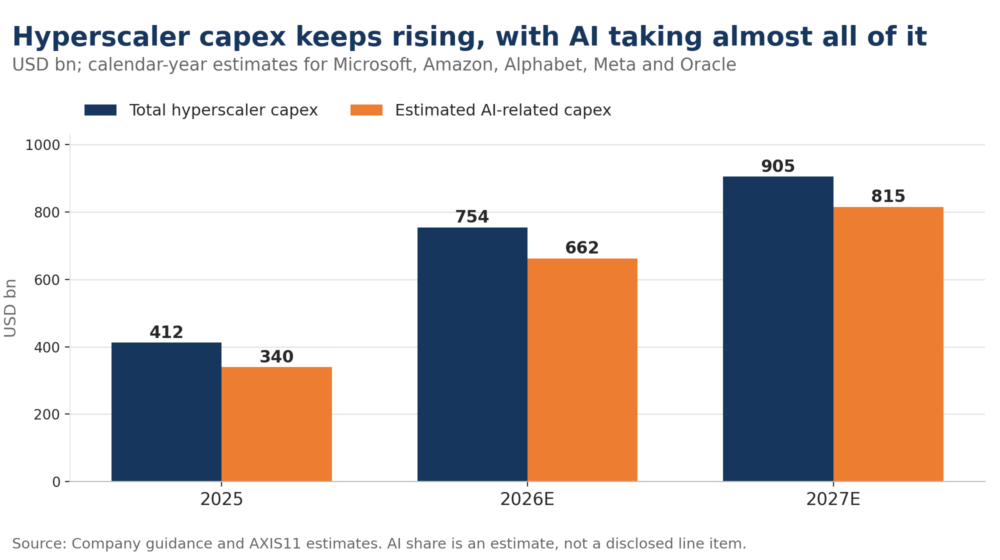
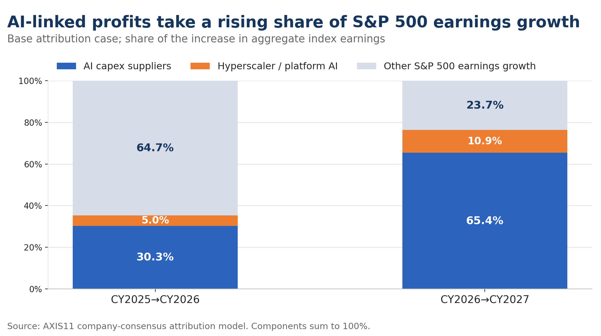
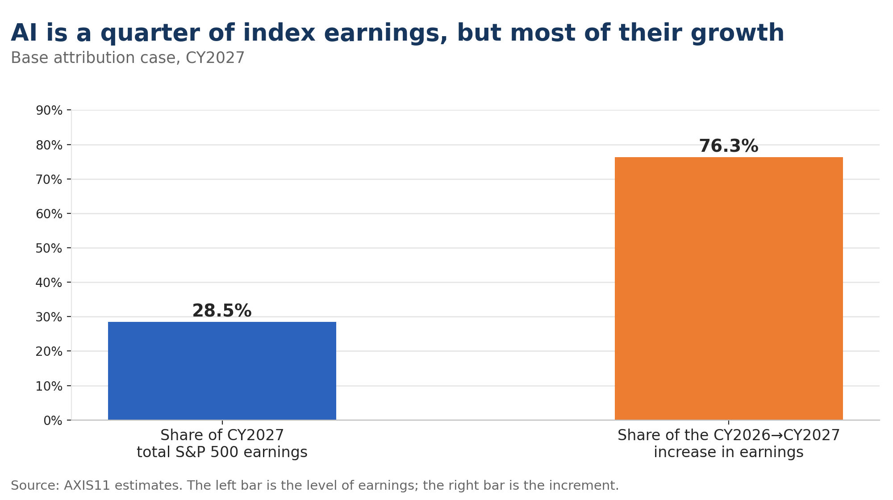
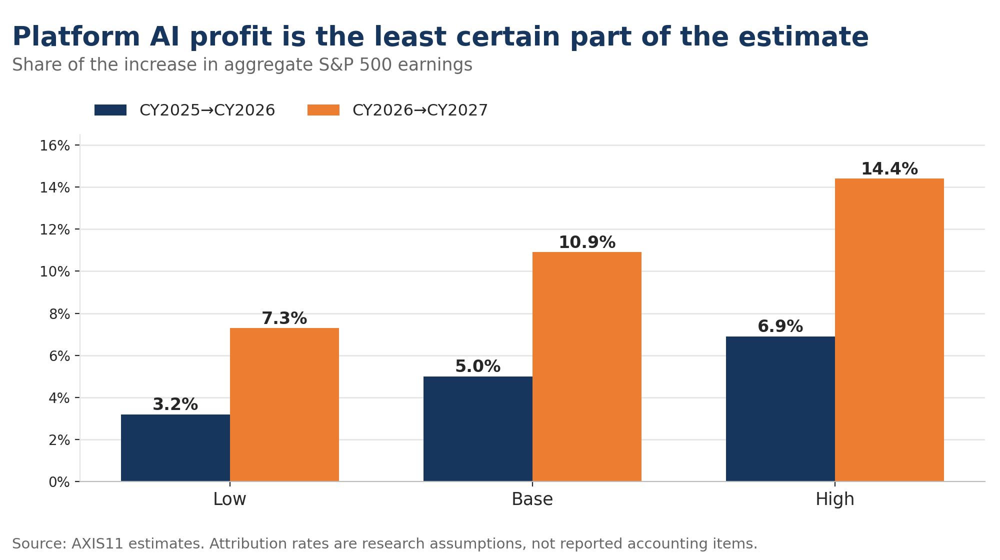
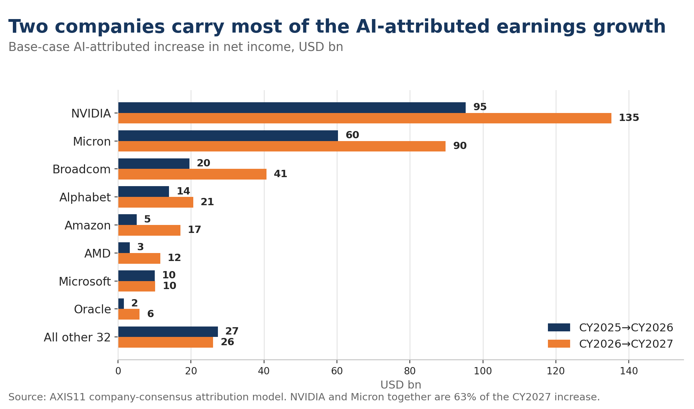
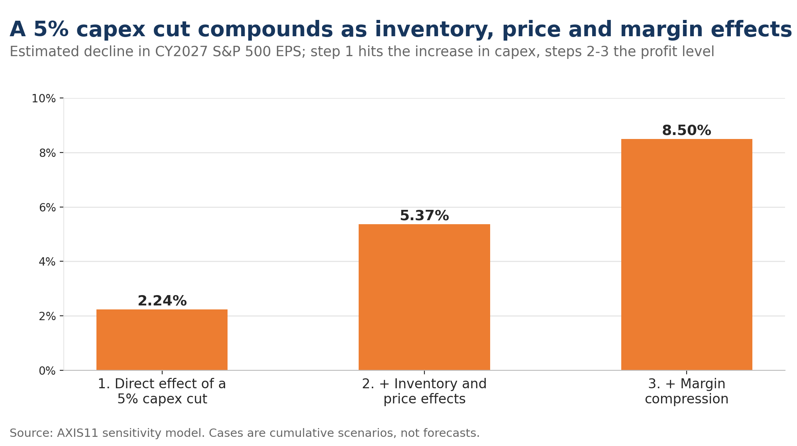

AI capex is no longer just a technology-sector spending story. The buildout reaches across semiconductors, servers, networking, power equipment, cooling, construction and financing, and its scale is now large enough to matter for both US growth and S&P 500 earnings.[^1][^2]

Demand remains strong. I use AI every day and have little difficulty seeing why companies continue to spend heavily on it. Nor is there much evidence yet that the investment cycle is turning.

But that is not the question of this note.

The question is how much of the expected growth in S&P 500 earnings now depends on AI investment continuing at something close to its current pace.

My estimates suggest that this dependence rises sharply between 2026 and 2027. AI-linked businesses account for roughly 35% of the increase in S&P 500 earnings in 2026. On current estimates, that rises to about 76% in 2027.

That does not make an AI downturn the base case. It does mean that the earnings consequences of one are becoming increasingly important.

---

## 1. The AI Capex Cycle Is Still Expanding

Combined capex at Microsoft, Amazon, Alphabet, Meta and Oracle is estimated at about $412bn in 2025, rising to $754bn in 2026 and $905bn in 2027. The AI-related portion is estimated at roughly $340bn, $662bn and $815bn respectively.

| Calendar year | Total capex | AI capex | AI share |
|---|---:|---:|---:|
| 2025 | $412bn | $340bn | 82.5% |
| 2026 | $754bn | $662bn | 87.8% |
| 2027 | $905bn | $815bn | 90.0% |

Growth slows after 2026, but spending continues to rise. Estimated AI capex increases by about $322bn in 2026 and another $153bn in 2027.

There is also room for these estimates to move higher. Capex guidance has repeatedly been revised upwards as hyperscalers secure additional computing capacity, data-centre space and power.

These figures should not be treated as reported accounting data. None of the hyperscalers discloses a clean line item called "AI capex". The estimates allocate reported and guided capex across data centres, servers, accelerators and networking based on company disclosures and other available information.

The exact number is therefore uncertain. The direction is less so: AI infrastructure spending is still rising, even as its growth rate begins to slow.

---

## 2. From Capex to S&P 500 Earnings

AI investment reaches index earnings through two distinct channels.

The first is the **supply chain**. NVIDIA, Broadcom and other semiconductor companies sell the accelerators, memory and networking equipment. Server manufacturers assemble the systems. Power, cooling and data-centre companies supply the infrastructure around them.

Their earnings are the most direct consequence of hyperscaler capex.

The second channel is the **platforms themselves**. Microsoft, Amazon, Alphabet, Meta and Oracle invest in the infrastructure and then try to monetise it through cloud computing, advertising, software and other AI-enabled services.

These profits need to be separated carefully.

NVIDIA's profit from selling a GPU to Microsoft and Microsoft's subsequent profit from selling computing services using that GPU are economically distinct. But Microsoft's existing Azure business cannot simply be relabelled as AI.

I therefore estimate the two channels differently.

For suppliers, I use company earnings growth and estimate the portion attributable to AI exposure. I then cross-check the result against a top-down model based on where AI capex is being spent and the margins earned by the industries supplying it.

For platforms, I attribute only the portion of incremental earnings that appears to come from AI rather than the entire cloud, advertising or software business.

The platform estimate is inevitably less precise because companies still provide limited disclosure on standalone AI revenue and profitability. I therefore use low, base and high attribution cases rather than a single point estimate.

---

## 3. AI Accounts for Roughly 35% of 2026 Earnings Growth

Using calendar-year S&P 500 EPS of 274.19 for 2025 and 360 for 2026,[^3] aggregate index earnings increase by about $733bn.

My base-case estimate attributes roughly $222bn of that increase to AI capex suppliers and another $37bn to incremental AI profits at the major platforms. The 40-company basket accounts for an estimated $200bn of the supplier increase. Assuming it captures roughly 90% of the relevant supply chain, I gross this up to $222bn to account for companies outside the basket.

| Increase in earnings, 2025→2026 | Amount | Share of S&P 500 earnings growth |
|---|---:|---:|
| S&P 500 total | $733bn | 100.0% |
| AI capex suppliers, including outside the basket | $222bn | 30.3% |
| Platform AI business | $37bn | 5.0% |
| **AI-linked total** | **$259bn** | **35.3%** |

The important number here is not $259bn by itself. It is the **35.3% share of total earnings growth**.

Most S&P 500 earnings still come from outside the AI investment chain, and earnings growth in financials, healthcare, industrials and consumer businesses remains important.

Even so, having more than a third of aggregate earnings growth tied to a single investment cycle already represents meaningful concentration.

In 2027, that concentration becomes much larger.

---

## 4. By 2027, Earnings Growth Becomes Far More Concentrated

Assuming S&P 500 EPS reaches 420 in 2027, aggregate earnings rise by about $512bn from 2026.

I estimate that AI suppliers contribute about $335bn of that increase, with another $56bn coming from incremental AI profits at the platforms.

| Increase in earnings, 2026→2027 | Amount | Share of S&P 500 earnings growth |
|---|---:|---:|
| S&P 500 total | $512bn | 100.0% |
| AI capex suppliers, including outside the basket | $335bn | 65.4% |
| Platform AI business | $56bn | 10.9% |
| **AI-linked total** | **$391bn** | **76.3%** |

This is the central result of the exercise.

AI-linked earnings rise between 2026 and 2027, but that is only part of the reason their share jumps from about 35% to about 76%.

At the same time, overall S&P 500 earnings growth is slowing.

S&P 500 EPS rises by 85.81 points between 2025 and 2026, but by only 60 points between 2026 and 2027. Meanwhile, estimated incremental earnings from the AI supply chain continue to increase.

The result is a much greater concentration of **earnings growth**, even though aggregate S&P 500 earnings themselves remain diversified.

This distinction matters. The argument is not that 76% of S&P 500 profits come from AI. They do not; AI-attributed profits are closer to 29% of the CY2027 total. Rather, under these assumptions, AI-linked businesses account for about three-quarters of the increase in S&P 500 earnings from 2026 to 2027.

The estimate is also sensitive to the 420 EPS assumption. Stronger earnings outside AI would reduce the share; weaker earnings would increase it. The 76.3% figure should therefore be read as a measure of concentration under the current earnings assumptions, not as a forecast with false precision.

---

## 5. Why Most of the Earnings Show Up at Suppliers First

The platforms are investing hundreds of billions of dollars, yet their estimated direct AI earnings contribution is relatively modest.

| Period | Platform total earnings increase | AI profit — low | AI profit — base | AI profit — high |
|---|---:|---:|---:|---:|
| 2025→2026 | $88.6bn | $23.3bn | $36.7bn | $50.7bn |
| 2026→2027 | $119.6bn | $37.2bn | $55.7bn | $73.9bn |

That is partly methodological. I deliberately avoid classifying existing cloud, advertising, retail and software earnings as AI simply because those businesses now use AI.

The base case attributes 35% to 55% of incremental earnings to AI across the five platforms: 35% at Amazon, 40% at Microsoft and Meta, 45% at Alphabet and 55% at Oracle. These are assumptions rather than reported accounting figures, and they are the least certain part of the analysis.

The gap between suppliers and platforms also reflects the timing of the investment cycle.

A hyperscaler buying an accelerator creates revenue for the semiconductor supplier immediately. Building a data centre creates orders for networking, power and cooling equipment before the resulting computing capacity has necessarily generated a comparable amount of end-user revenue.

In other words, **the investment is being monetised faster by the companies selling the infrastructure than by the companies buying it.**

That does not mean the platforms will fail to earn an adequate return. It means the earnings sequence matters.

At this stage of the cycle, suppliers capture much of the immediate profit from the buildout while the platforms are still converting the installed capacity into future revenue.

The supplier contribution is itself highly concentrated. NVIDIA and Micron account for roughly 63% of the $302bn in AI-attributed earnings growth identified across the 40-company basket for 2027, making the result particularly sensitive to consensus estimates for those two companies.

---

## 6. Strong AI Demand Does Not Rule Out Overinvestment

There is little evidence today that AI demand is weak.

Microsoft has said that the annual revenue run rate of its AI business has exceeded $37bn and has repeatedly described capacity, rather than demand, as the constraint on growth.[^4] Hyperscaler capex guidance continues to rise, and companies are competing for data-centre capacity, power and advanced computing hardware.

None of that is consistent with an investment downturn already being under way.

But strong demand and overinvestment are not mutually exclusive.

The relevant question is not whether AI will be widely used. It is whether the **aggregate capacity being built by competing companies earns the returns currently expected from it**.

History offers plenty of examples of strong demand coexisting with excessive investment. Railways, telecommunications and internet infrastructure all experienced enormous growth in final demand. In each case, companies could still build overlapping capacity, compete away returns and leave some investors with poor outcomes.

AI may or may not follow that path. The point is that strong final demand alone cannot rule it out.

There is another complication in interpreting capex itself.

Part of the increase in nominal spending reflects higher equipment costs rather than proportionally greater computing capacity. Microsoft, for example, has guided to roughly $190bn of calendar-year 2026 capex, with about $25bn associated with higher memory and component prices rather than additional capacity.[^4]

In other words, a dollar of capex does not buy a constant amount of computing capacity over time.

That distinction becomes particularly important when considering what happens if the cycle turns.

---

## 7. Why a 5% Capex Cut Is Not a 5% Earnings Shock

A 5% cut to 2027 AI capex amounts to about $41bn. Relative to total spending of $815bn, that looks modest. Relative to the $153bn increase from 2026, however, it is much larger: the cut would eliminate roughly 27% of the expected growth in AI capex.

If supplier earnings respond proportionally to that reduction in incremental spending, the impact on 2027 S&P 500 EPS would be approximately **−2.24%**.

That captures only the effect on incremental spending. The next two scenarios assume that the same demand disappointment also affects the existing AI profit base through weaker pricing, excess inventory and lower utilisation. This is why the earnings impact becomes much larger even though the capex cut itself remains at 5%.

| Scenario | What it applies to | 2027 EPS impact |
|---|---|---:|
| 1. Direct effect of a 5% capex cut | The increase in AI capex shrinks by about 27% | **−2.24%** |
| 2. Plus inventory and price effects | −15% of suppliers' AI profit level | **−5.37%** |
| 3. Plus margin compression | A further −15% | **−8.50%** |

The important question is therefore not the arithmetic. It is whether a downturn would remain linear.

Investment cycles rarely turn that cleanly.

During the upswing, shortages encourage customers to order early. High utilisation supports margins. Scarce components command premium prices. Customers may place overlapping orders to secure supply.

When expectations reverse, those effects can reverse with them.

Orders are delayed or cancelled. Inventory accumulates. Lead times shorten. Scarcity premiums disappear. ASPs weaken. Production volumes fall while fixed costs remain.

Revenue can therefore decline faster than end demand, and operating earnings can fall faster than revenue.

This is why I would treat the first row as a simple sensitivity rather than the main downside case.

A more demanding stress test therefore assumes that a modest capex reduction triggers a 15–30% decline in the supply chain's existing AI profits once inventory, pricing and utilisation effects are included.

Under that assumption, the direct impact on 2027 S&P 500 EPS rises to roughly **−5.4% to −8.5%**.

Even that does not capture the full market effect.

---

## 8. The Larger Risk Is Earnings and Valuation Moving Together

A mid-single-digit earnings downgrade may still appear manageable at the index level.

But the market is unlikely to respond to a break in the AI investment cycle by changing earnings estimates alone.

At 2027 EPS of 420 and a 21x P/E, the implied S&P 500 level is 8,820.

The margin-compression scenario lowers EPS to roughly 384.3. If the market simultaneously de-rates from 21x to 20x, the implied index level falls to about 7,685, or 12.8% below the starting point.

At 19x, it falls to roughly 7,301, around 17.2% lower.

These are not price targets. They illustrate the interaction between the two variables.

The larger risk is that an AI capex slowdown hits both sides of the valuation equation: earnings estimates fall while the multiple investors are willing to pay for those earnings also compresses.

That is also where the equity story connects with the financing discussed in *Where Is AI Capex Getting Its Money?*

AI infrastructure is increasingly financed not only from operating cash flow but through corporate bonds, leases, private credit and SPV structures. If expected returns on the investment fall, weaker equity valuations and cash-flow expectations can tighten financing conditions. More expensive financing can then make additional capex less attractive.

There is no evidence today that this feedback loop is creating systemic stress. But the link between capex, earnings, valuation and credit is becoming more important as the scale of investment rises.[^5]

---

## Conclusion

The current evidence still points to a strong AI investment cycle.

Hyperscaler capex is rising, AI services are growing quickly and capacity remains constrained in important parts of the supply chain. A sharp reduction in investment is not the base case suggested by current company guidance.

What is changing is the market's dependence on that investment continuing: an increasing share of S&P 500 earnings growth now comes from the AI buildout.

Under the assumptions used here, AI-linked businesses generate roughly 35% of the increase in S&P 500 earnings in 2026. In 2027, that rises to about 76%.

Most of that contribution comes from the companies supplying the buildout rather than from the direct AI profits of the hyperscalers themselves.

That makes the supply chain the key place to watch for a turn.

The first signs are unlikely to come from a debate about whether AI is useful. They are more likely to appear in capex revisions, supplier backlogs, book-to-bill ratios, inventories, component prices, lead times and utilisation.

The distinction is important.

**AI can remain a transformative technology even if too much capital is invested at one point in the cycle.**

The investment question is therefore not whether AI demand eventually justifies substantial infrastructure. It is whether the current pace of spending, the earnings built around it and the valuations placed on those earnings can all be sustained together.

**The question from here is not whether AI keeps growing, but how much of the market's expected earnings growth now requires the investment boom to continue.**

---

## What to Monitor

The following indicators should be updated as new results and guidance become available:

- Calendar-year hyperscaler capex estimates and revisions
- AI capex allocation across semiconductors, servers, networking, power and construction
- Supplier backlog, book-to-bill, inventory days and ASPs
- GPU, HBM and server lead times and secondary-market prices
- Hyperscaler AI revenue, run rates and margins
- S&P 500 EPS revisions and the contribution from AI suppliers
- Operating cash flow at the major investing companies
- Bond, lease and SPV financing costs

---

## Note on methodology

The AI capex and AI-attributed earnings figures in this note are estimates based on company disclosures, consensus forecasts and business-level exposure.

Companies do not disclose AI revenue, capex or operating profit on a consistent basis, so the estimates should be interpreted as ranges rather than precise accounting figures.

Aggregate S&P 500 earnings are derived from EPS using the index divisor and will change with both the divisor and company-level earnings estimates.

The downside cases are scenario analysis designed to measure earnings concentration and the transmission of a potential capex slowdown. They are not forecasts or S&P 500 price targets.

---

## Notes

[^1]: IMF, "AI: Deployment and Disruption," 2026 Annual Report. The IMF noted that AI-related technology investment contributed about 0.5 percentage points to US GDP growth in 2025, and that on some external estimates global private AI investment could exceed $2 trillion in 2026. <https://www.imf.org/annual-report/2026/in-focus/ai-deployment-and-disruption/>

[^2]: Federal Reserve, "The AI Buildout and the Economy: Publicly Available Data to Assess AI's Impact," 17 July 2026. <https://www.federalreserve.gov/econres/notes/feds-notes/the-ai-buildout-and-the-economy-publicly-available-data-to-assess-ais-impact-20260717.html>

[^3]: Goldman Sachs Research, "The S&P 500 Is Forecast to Climb as Earnings Growth Powers Stocks Higher," 28 May 2026. Goldman's EPS forecasts at the time were $340 for 2026 and $385 for 2027. This note applies CY2025 of $274.19, CY2026 of $360 and CY2027 of $420, so the Goldman figures are used only as an external point of comparison. <https://www.goldmansachs.com/insights/articles/s-and-p-500-forecast-to-climb-as-earnings-growth-powers-stocks-higher>

[^4]: Microsoft, FY2026 Third Quarter Earnings Conference Call, 29 April 2026. <https://www.microsoft.com/en-us/investor/events/fy-2026/earnings-fy-2026-q3>

[^5]: S&P Global Market Intelligence, "Hyperscaler earnings quarterly: What price inference?", 13 March 2026. <https://www.spglobal.com/market-intelligence/en/news-insights/research/2026/03/hyperscaler-earnings-quarterly-what-price-inference>