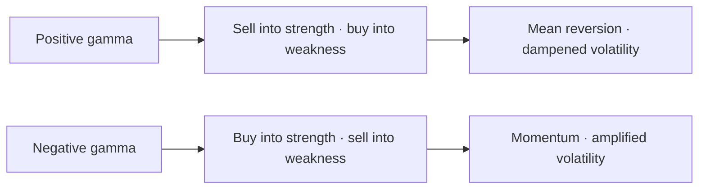
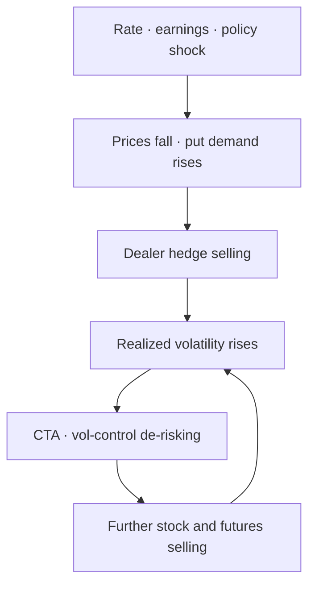

*The invisible hedging flows behind a low VIX*

Terms such as `positive gamma`, `negative gamma`, `zero gamma` and `call wall` have become increasingly common in recent market commentary. When the equity market rebounds, positive dealer gamma is often cited as one reason. When volatility suddenly picks up, negative gamma is often said to have amplified the selling. As trading in 0DTE options — contracts that expire on the same day — has surged, so has the attention paid to the idea that dealer hedging flows in the options market can influence the cash equity market.

I had assumed much the same thing: that a low VIX and heavy options trading could suppress volatility, and that once a shock arrives, dealer hedging and systematic strategies could turn a small move into a larger one. What I had not properly understood was how dealer gamma exposure is actually calculated, how positive and negative gamma relate to calls and puts, and how much the GEX numbers published each day can be trusted.

This note is not an options trading strategy. It sets out what I learned while studying dealer gamma and tries to separate what can and cannot be said when this framework is applied to today's market.

The conclusion, stated simply, is this.

> **Gamma does not determine the direction of the market. Rates, earnings, policy and investor demand determine direction. Dealer positioning can instead affect how the market responds to a shock — dampening the move in some conditions and amplifying it in others.**

---

## 1. Why a Low VIX Makes the Market Look Calm

In August 2026, the S&P 500 rose 2.6%, while the Cboe Magnificent 10 Index, which tracks the largest technology stocks, gained 7.5%. The VIX declined from 15.99 to 14.92 and remained within a relatively narrow range of 14.25–16.50 throughout the month. VIX3M, which measures three-month expected volatility, stood at 17.53, above the one-month VIX. In other words, short-term volatility remained low and the VIX term structure stayed in its normal contango. According to [Cboe's August market data](https://www.cboe.com/insights/posts/index-insights-august-2026), covered-call and put-writing strategies also performed well overall.

In September, technology stocks fell sharply as the 10-year Treasury yield moved above 5% and concerns grew over a possible slowdown in AI investment. The market then rebounded as oil prices declined and the 10-year yield moved back below 5%. On 21 September, the Nasdaq returned to a record high, led by semiconductor stocks. On the same day, [the VIX stood at 14.87](https://www.cboe.com/tradable-products/vix) — still a relatively low level.

This kind of price action is often associated with a positive-gamma regime. In such a regime, dealer hedging tends to involve buying as prices fall and selling as prices rise, which can dampen market moves and help absorb shocks. The recent price action appears consistent with that description, but a low VIX and a quick market rebound do not, by themselves, establish that dealers are positive gamma. Falling yields, stronger earnings expectations and investor risk appetite could produce similar price behaviour without dealer hedging being the main cause.

To understand what dealer gamma can actually tell us, we first need to separate an option's delta from its gamma.

---

## 2. Delta and Gamma: Why Dealers Trade Stocks and Futures

`Delta` measures an option's sensitivity to changes in the price of the underlying asset. A call with a delta of +0.50, for example, would gain approximately $0.50 if the underlying stock rose by $1, while a put with a delta of -0.50 would lose approximately $0.50 from the same move, all else equal.

`Gamma` measures how that delta changes as the underlying price moves. If a call's delta rises from +0.50 to +0.60 as the stock price increases, or a put's delta moves from -0.50 to -0.40, gamma captures the rate at which that sensitivity changes.

In providing options to clients, a dealer can end up holding directional risk. To reduce it, the dealer buys or sells the underlying stock or index futures to keep total delta close to zero. But delta is not fixed. As the underlying price moves, the option's delta changes, requiring the dealer to adjust the hedge. Gamma determines how quickly that delta changes and, therefore, how much the hedge needs to be adjusted. Volatility and time to expiry also affect an option's delta and gamma, making the hedge dynamic rather than static.

Suppose a dealer buys a put with a delta of -0.50.

| Initial position | Delta |
|---|---:|
| Long put | -0.50 |
| Long stock or futures hedge | +0.50 |
| Net delta | 0.00 |

If the underlying rises, the put moves further out of the money and its delta becomes less negative, moving from -0.50 to -0.40. With the +0.50 hedge unchanged, the dealer is left with a net delta of +0.10 and therefore sells 0.10 of stock or futures to return to delta neutral.

If the underlying falls instead, the put's delta becomes more negative, moving from -0.50 to -0.60. The existing hedge is now too small, so the dealer buys another 0.10 of stock or futures.

A long put is a bearish position that gains value when the market falls, but its delta hedge moves in the opposite direction:

- Price rises → sell stock or futures
- Price falls → buy stock or futures

A long call produces the same hedging pattern. Because the call's delta is positive, the initial hedge requires selling stock or futures. If the market rises and the call's delta increases, the dealer sells more stock or futures; if the market falls and the delta decreases, the dealer buys back part of the short hedge.

The point is that **the direction of gamma hedging does not depend on whether the option is a call or a put. It depends on whether the dealer is long or short the option.**

| Option position | Gamma | Hedge when price rises | Hedge when price falls |
|---|---:|---|---|
| Long call | Positive | Sell stock or futures | Buy stock or futures |
| Long put | Positive | Sell stock or futures | Buy stock or futures |
| Short call | Negative | Buy stock or futures | Sell stock or futures |
| Short put | Negative | Buy stock or futures | Sell stock or futures |

A long put has negative delta but positive gamma. A put delta moving from -0.60 to -0.40 is, mathematically, an increase in delta. So for ordinary vanilla options, both long calls and long puts have positive gamma, while both short calls and short puts have negative gamma.

### Gamma Is Not a Fixed Number

Gamma is not fixed when an option is first traded and then held constant until expiry. It changes as the underlying moves, as time to expiry shortens and as implied volatility changes. All else equal, gamma is highest when the underlying is close to the strike — at the money — and declines as the option moves deeper in or out of the money.

The shorter the remaining life of the option, the more concentrated that gamma becomes. Same-day options in particular can carry very high gamma when the underlying is near the strike, but lose much of it once the underlying moves away. That is why 0DTE options can generate large hedging adjustments from relatively small price moves, while their influence can also fade quickly once the market moves beyond a particular strike.

Implied volatility matters as well. When volatility is low, the range of possible prices at expiry narrows and gamma becomes more concentrated around the money. When volatility rises, gamma is distributed across a wider range of strikes. A gamma level observed in the market is therefore not a static number that can be calculated once and used for weeks. It needs to be recalculated as the underlying price, time to expiry and implied volatility change.

---

## 3. What Positive and Negative Gamma Do to the Market

If a dealer's overall option book is positive gamma, the dealer sells stock or futures as prices rise and buys as prices fall. The hedging works against the existing move.

That flow can produce a market with the following features:

- Rallies capped by hedge selling
- Declines cushioned by hedge buying
- Stronger intraday mean reversion
- Pinning, where prices settle around particular strikes
- Lower realized volatility

If the dealer is negative gamma, the opposite holds: buying as prices rise and selling as they fall. The hedging works with the existing move.

- Rallies accelerated by hedge buying
- Declines accelerated by hedge selling
- Momentum rather than mean reversion
- Higher realized volatility
- A greater chance that an external shock develops into an intraday trend

At its simplest:



Gamma is therefore less a directional indicator than a **market reaction function**.

---

## 4. GEX Is an Estimate, Not a Measurement

Aggregate dealer gamma exposure is usually called `GEX`. The standard calculation applies each option's gamma to its open interest, the contract multiplier and the underlying price, then sums the exposure across strikes and expiries.

### What Open Interest Shows

`Open interest` is the number of option contracts still outstanding — not yet expired, exercised or closed. Ten thousand contracts trading today does not necessarily increase open interest by ten thousand. When a new buyer meets a new seller, open interest rises; when existing positions change hands or are closed, trading volume can increase while open interest stays unchanged or falls.

Volume therefore shows how actively contracts have traded, while open interest shows how many contracts remain outstanding. GEX typically uses open interest to estimate the gamma exposure associated with those outstanding positions. But open interest does not reveal who is on each side of the trade, or whether the dealer is long or short the option.

A simplified version of the calculation looks like this:

```
GEX_i ≈ Gamma_i × Open Interest_i × Contract Multiplier × S² × 1%
```

This estimates, in dollar terms, how much option delta changes for a 1% move in the underlying and, by extension, the amount of stock or futures that may need to be traded to maintain a delta hedge.

The difficulty is that public open-interest data shows only the number of outstanding contracts, not whether dealers are long or short those contracts. The sign of actual dealer gamma therefore cannot be observed directly.

To deal with this limitation, a commonly used GEX convention is:

- Apply a positive sign to call open interest.
- Apply a negative sign to put open interest.
- Sum the signed gamma exposure across strikes and expiries to estimate net GEX.

This is not a mathematical property of options. The gamma of both a long call and a long put is positive. Assigning a positive sign to call OI and a negative sign to put OI does not mean that call gamma is inherently positive and put gamma inherently negative. The signs are an empirical assumption used to infer dealer positioning, which public open-interest data cannot reveal directly.

The intuition behind this convention is that clients often sell calls to collect premium and buy puts for downside protection. Dealers taking the other side would therefore be long calls and short puts, leaving them with positive gamma on the calls and negative gamma on the puts. This is the reasoning behind the widely used simple GEX formula.

But it remains an assumption about market positioning. In practice, clients also buy calls, sell puts and trade spreads and other combinations extensively. Open interest alone therefore cannot establish which side of those positions dealers hold. [A 2026 study of GEX construction](https://papers.ssrn.com/sol3/papers.cfm?abstract_id=7131778) makes the same point: call and put gamma at a given strike and expiry are both positive, while the sign assigned to GEX comes from an assumption about who is long and who is short, not from the mathematics of the option. Another study similarly stresses that published GEX is an inference from open interest rather than a direct measurement of dealer inventory. [Without data on who actually holds the positions, even the direction of aggregate dealer gamma remains uncertain.](https://papers.ssrn.com/sol3/papers.cfm?abstract_id=7398538)

**More put open interest than call open interest does not necessarily imply that dealers are heavily negative gamma.** Open interest does not reveal whether dealers are long or short those puts, and the amount of gamma attached to each contract varies widely across strikes and expiries. Multi-leg positions such as put spreads and collars can also generate substantial open interest while leaving much of the exposure offset. And a large position in deep out-of-the-money puts may carry less current gamma than a much smaller position near the money.

Real-world option flow includes all of the following:

- Outright client purchases of calls and puts
- Covered calls and cash-secured put selling
- Call spreads and put spreads
- Institutional collars
- Option selling by volatility funds
- Inter-dealer trading
- New positions and the closing of existing positions

As a result, different data providers can start with the same option chain and still produce different estimates of GEX, zero-gamma levels, call walls and put walls.

### Does an Estimated GEX Still Carry Information?

That leaves the question of whether GEX is useful at all, given that actual dealer inventory cannot be observed. The empirical evidence so far suggests that it can be `useful under certain conditions, but provides much weaker support for using it to forecast market direction`.

[Barbon and Buraschi's *Gamma Fragility*](https://papers.ssrn.com/sol3/papers.cfm?abstract_id=3725454) compared estimated dealer gamma imbalance in single-stock options with intraday price behaviour. On days with large negative gamma imbalance, momentum — the continuation of an existing move — was stronger; on days with large positive gamma imbalance, reversal was stronger. The relationship was also stronger in less liquid underlyings. This is consistent with gamma amplifying or dampening a move already under way, rather than predicting its initial direction.

Peer-reviewed work finds something similar. [Soebhag's *Option Gamma and Stock Returns*](https://doi.org/10.1016/j.jempfin.2023.101442) reports that the lower a stock's net gamma exposure, the higher its realized volatility over the following month. The result remained significant after controlling for past volatility, implied volatility, liquidity and a range of firm characteristics, and the paper attributes the relationship to hedge rebalancing rather than private information. In other words, gamma estimates appear to contain information that is not fully captured by existing volatility measures.

Testing public open interest more directly, [Ardia and Vaudescal's 2026 study](https://papers.ssrn.com/sol3/papers.cfm?abstract_id=7202999) reconstructed net gamma from public option data using about five years of half-hourly SPX observations. A one-standard-deviation increase in non-0DTE net gamma was associated with roughly 36% lower realized variance over the following 30 minutes — the same direction found in earlier work using proprietary trader-type data. This suggests that GEX constructed from public data can still help distinguish short-term volatility regimes.

In the same study, however, the results for 0DTE options were far less stable. Open interest compiled after the previous day's settlement does not capture positions created during the current session, while the long or short direction of market participants remains unknown. [A 2026 study of dealer GEX and overnight gaps](https://papers.ssrn.com/sol3/papers.cfm?abstract_id=6650858) likewise found that the additional predictive power appeared mainly in low-VIX regimes. The information content of GEX therefore depends on both the state of the market and the horizon being measured.

The conclusions supported by the research are therefore relatively narrow:

- Estimated gamma can carry conditional information about subsequent short-term realized volatility.
- Reversal tends to be stronger under positive gamma, while momentum tends to be stronger under negative gamma.
- The relationship varies with market liquidity, the mix of expiries and the volatility regime.
- GEX constructed from public OI appears more informative for non-0DTE options, while measurement error is greater for 0DTE, where same-day positioning changes most rapidly.
- None of this shows that GEX reliably predicts whether the index will rise or fall, or that the market will reverse at the zero-gamma level.

GEX fits the evidence best when it is used not as a standalone directional signal, but as **a state variable for assessing how the market may respond to a given shock — whether the resulting move is more likely to be dampened or reinforced by dealer hedging.**

### If the Position Signs Are Fixed, Why Does Zero Gamma Exist?

`Zero gamma` is the price at which estimated net GEX changes sign when the entire option chain is revalued across a range of assumed underlying prices. The position signs assigned to each contract remain the same. What changes is the gamma of each option: as the underlying moves, gamma increases or decreases at different rates across strikes, allowing the sign of aggregate GEX to flip.

Suppose there is a large amount of positive call GEX at strikes above spot and negative put GEX at strikes below. If the index rises, the calls above spot move closer to the money and their gamma carries more weight, while the puts below spot move further away and contribute less. If the index falls, the opposite occurs: the negative GEX assigned to the puts becomes larger in magnitude as their gamma increases, while the positive call GEX above contributes less. At some price, the positive and negative contributions offset each other, net GEX reaches zero, and beyond that point its sign flips.

The existence of a zero-gamma level therefore does not mean that the assumed position signs are changing. It means that **the gamma of a set of options with fixed position signs varies non-linearly with the underlying price.** As time passes, options expire, implied volatility changes and new positions are created or existing positions are closed, the zero-gamma level moves as well.

`Call wall` and `put wall` generally refer to strikes where estimated call or put gamma exposure is most concentrated. They should not be treated as fixed support or resistance levels:

- Each option's gamma changes as the underlying moves.
- Gamma changes rapidly as expiry approaches.
- Intraday trading can create and close positions that are not captured in earlier open-interest data.
- Changes in implied volatility affect the calculation.
- The assumed signs of dealer positions may be wrong.

Zero gamma and option walls are therefore better understood as conditional reference levels for interpreting market structure, rather than as definitive prices to trade against.

### How to Read a Published Chart

The chart below uses SquawkFlow's published SPX gamma-level data to plot SPX against estimated zero gamma. The dark line is SPX, the brown line is the zero-gamma level estimated each day, and the red shading marks the periods when SPX was below the estimated level.


*Source: SquawkFlow's published SPX gamma-level dataset (CC BY 4.0); AXIS11 calculations and chart. Dealer positioning is estimated from open interest and is not an observation of actual positions.*

This public series only begins in late July 2026, and the early observations cover relatively few contracts. It is therefore used here to show how a zero-gamma chart can be read, not as evidence of predictive power over any length of time.

The chart can be used to examine two hypotheses: that mean-reverting hedging dominates while spot is above the line, and that trend-reinforcing hedging dominates while it is below. But two lines moving together in a short sample does not establish predictive power. That would require a consistent formula from a single provider, along with the distance between spot and zero gamma, actual realized volatility and intraday put flow.

Public GEX and zero-gamma levels are available from option analytics providers such as SquawkFlow and SpotGamma. Because providers differ in data timing, the expiries they include, their assumptions about the sign of dealer inventory and their volatility surfaces, their numbers should not be compared directly with one another. Free data often covers only the latest snapshot or a limited history, which constrains longer-run testing as well.

AXIS11 does not yet have an internal data pipeline that stores the full SPX option chain history and intraday snapshots consistently and estimates dealer inventory from them. The chart in this note is an illustration built on SquawkFlow's public data, not a dealer GEX series independently reconstructed by AXIS11.

---

## 5. Does 0DTE Stabilise the Market or Destabilise It?

A 0DTE option is an option on its expiration day, with no trading days remaining. The shorter the remaining life and the closer the strike sits to spot, the larger gamma can be. Because delta then changes quickly even on small index moves, dealers may have to adjust hedges frequently.

[Cboe's second-quarter 2026 results materials put 0DTE at about 65% of SPX option volume as of May 2026](https://www.investing.com/news/company-news/cboe-q2-2026-slides-record-revenue-0dte-options-surge-to-65-of-spx-93CH-4828641). In the same quarter, 3.1 million of the 5.1 million SPX option contracts traded on an average day were 0DTE. Given that share of volume, it is easy to assume that 0DTE must have a large influence on the underlying market. But trading volume and dealers' net exposure are different things.

If one client buys 50,000 contracts at a strike and another sells 50,000, gross volume is 100,000 contracts while the dealer may be left with almost no net position. Combinations such as spreads and iron condors generate large contract counts while much of the total gamma offsets.

[When Cboe analysed the 2023 market using its own participant-level data](https://www.cboe.com/insights/posts/volatility-insights-evaluating-the-market-impact-of-spx-0-dte-options/), 0DTE dealer net gamma averaged roughly $170–670 million through the trading day, and the potential hedging flow was estimated at about 0.04–0.17% of average daily S&P futures liquidity. On one trading day a put that traded more than 100,000 contracts left dealers with a net position equal to about 3% of that gross volume. Cboe concluded that large notional volume alone is not sufficient reason to blame 0DTE for market moves.

[Cboe's 2025 follow-up](https://www.cboe.com/insights/posts/0-dt-es-decoded-positioning-trends-and-market-impact/) found the same thing at a point when SPX 0DTE had grown to around two million contracts a day: client buying and selling remained broadly balanced, and estimated market-maker hedging reached at most about 0.2% of average daily SPX liquidity. Volume has since risen to 3.1 million contracts a day, but the growth in gross volume still does not appear to have produced a comparable increase in dealers' net risk.

These are exchange-provided analyses, however, and they do not fully capture offsetting positions across all expiries and other products. Recent academic work has not converged on a single answer either.

- One study finds that [0DTE market makers' net gamma is positive on average and negatively related to future intraday volatility](https://papers.ssrn.com/sol3/papers.cfm?abstract_id=4692190).
- Another finds that [SPX intraday volatility was in fact lower on the expiries where 0DTE was introduced](https://papers.ssrn.com/sol3/papers.cfm?abstract_id=5641974).
- Others find the opposite: that [speculative 0DTE trading raises volatility even after controlling for dealer hedging](https://papers.ssrn.com/sol3/papers.cfm?abstract_id=4426358).
- The 2026 study using public data found that non-0DTE positive gamma lowered realized variance over the following 30 minutes, but that for 0DTE the agreement between estimates based on public open interest and participant-level data was much weaker. [Measurement error in conventional GEX calculations grows the closer the option is to same-day expiry.](https://papers.ssrn.com/sol3/papers.cfm?abstract_id=7202999)

0DTE is therefore not inherently destabilising. When client buying and selling balance and dealers hold positive gamma, it can lower intraday volatility. When client flow becomes one-sided and leaves dealers negative gamma, however, their hedging can reinforce the underlying move over a short period.

What matters is not `0DTE volume` but `the net direction of 0DTE flow and the gamma left with dealers`.

---

## 6. The Market in 2026: A Low VIX and Fast Mean Reversion

Two different pictures currently coexist.

First, index volatility is low. The VIX closed at 14.87 on 21 September, near the bottom of its 13.38–35.30 52-week range. In August it also held a narrow range, with three-month VIX above one-month VIX. Investors are not paying much for the possibility of a near-term drop, and there is ample supply of investors willing to sell volatility premium.

Second, low index volatility has not prevented sharp moves beneath the surface. When the 10-year yield rose above 5% and worries about AI investment came to the fore, semiconductors and growth stocks fell quickly. Days later, as yields and oil prices fell, the same stocks rebounded sharply and carried the Nasdaq back to a record. [On 21 September semiconductors led the index higher.](https://www.reuters.com/business/wall-st-futures-rise-ai-stocks-gain-oil-prices-slide-2026-09-21/)

Gamma alone cannot explain these moves. What set the initial direction was long-term yields, oil and expectations for AI demand. But the low-VIX environment and the speed of the rebound are consistent with a market in which volatility-suppressing forces are strong. Positive dealer gamma, if present, could be one of those forces by causing hedging flows to lean against short-term price moves.

> **Published market indicators are consistent with an environment of low volatility and rapid mean reversion. But because actual dealer inventory is not disclosed, this cannot by itself establish that net dealer GEX is positive. Rates, earnings and other fundamental shocks still set the initial direction, while options-market positioning may affect how quickly those moves develop and how far they extend.**

---

## 7. What Turns an External Shock into Gamma Feedback

GEX does not tell us what the next shock will be or which direction the market will move. It is more useful for understanding how options positioning may affect a move once it has begun.

### Scenario 1: The Positive-Gamma Regime Holds

In a positive-gamma regime:

- The VIX is low and the VIX term structure remains in contango
- Realized volatility remains below implied volatility
- Demand for downside puts is limited
- The index remains near major option strikes
- Dealer hedging and option-selling flows absorb short-term moves

In this environment, market declines may be followed by relatively quick rebounds, with more intraday mean reversion and price pinning around major option strikes. External shocks can still determine direction, but positive-gamma hedging, if present, can limit how far the initial move extends.

### Scenario 2: The Cushion Weakens

That cushion can weaken when:

- The index falls below the strikes carrying large positive gamma exposure
- The VIX and downside skew rise together
- Demand for downside puts increases
- The VIX term structure flattens
- Market breadth weakens and liquidity deteriorates

At this stage, estimated GEX may remain positive but decline in magnitude. The hedge buying that previously leaned against market declines may weaken, leaving the market more sensitive to external shocks.

A flattening VIX term structure should not, by itself, be read as a bearish signal. Under normal conditions, short-dated VIX below three-month VIX — contango — is the usual state. When concern about a near-term shock increases, one-month volatility can rise faster than three-month volatility, narrowing the gap. This can indicate that the market is pricing more volatility in the near term relative to later periods.

But flattening alone does not imply that a sharp decline will follow. The curve can also flatten because longer-dated volatility falls, while temporary demand for options ahead of a scheduled event can produce a similar shape. A useful way to read the curve is:

- Normal contango intact: near-term volatility remains priced below longer-dated volatility
- Contango narrowing or flattening: check whether demand for near-term protection is increasing
- VIX above VIX3M, or inversion: near-term volatility is priced above three-month volatility, a pattern more commonly associated with market stress

The VIX term structure is therefore better used alongside GEX as a confirming indicator rather than treated as part of GEX itself. Flattening carries more information when it coincides with spot approaching zero gamma, rising downside skew, net put buying and deteriorating market liquidity.

### Scenario 3: Negative-Gamma Feedback

If dealers are net short downside options and the market falls sharply, put deltas become more negative. Dealers then need to sell more stock or futures to stay delta-neutral. That selling can push the market lower, forcing another round of hedge adjustments and reinforcing the initial decline.



Dealer hedging, CTA and volatility-control selling, and ETF flows are separate mechanisms. Dealers trade stock or futures to manage option delta. CTAs and volatility-control funds adjust exposure in response to trend and realized volatility. ETFs can generate additional flows through investor redemptions or the rebalancing of option overlays.

The mechanisms are different, but they can line up in the same direction when prices fall and volatility rises. In that setting, gamma does not cause the initial shock. It can amplify it by adding dealer hedge selling to other flows already moving in the same direction.

The same mechanism works on the upside. If good news pushes the index higher while dealers are negative gamma, they need to buy more stock or futures as the market rises. That hedging can reinforce the rally and, in some cases, add to a short squeeze. **Negative gamma is therefore not inherently bearish. It tends to reinforce whichever direction the market is already moving.**

### How to Tell When the Gamma Regime Is Changing

Because actual dealer inventory is not observable, there is no single indicator that confirms a shift from positive to negative gamma. The evidence becomes more convincing when several signals begin to move together:

1. Estimated net GEX, calculated on a consistent basis, continues to fall and eventually turns negative.
2. Spot moves below the estimated zero-gamma level and remains there, rather than briefly crossing it intraday.
3. The VIX rises as the term structure flattens or inverts.
4. Downside skew steepens alongside increased net put buying.
5. Intraday rebounds become weaker on down days, while realized volatility rises and price moves become more persistent.
6. Estimated selling from CTAs and volatility-control funds begins to increase as well.

None of these signals is conclusive on its own. A brief move below zero gamma that quickly reverses may reflect estimation error, stale positioning data or temporary flows. But if spot remains below zero gamma while the VIX curve flattens, downside put demand increases and realized volatility rises, the evidence for a shift toward negative-gamma feedback becomes much stronger.

---

## 8. What Investors Should Check

No single GEX number is enough to assess market conditions. Public GEX is an estimate of dealer positioning, not a direct observation of it.

| Indicator | What it tells you | Change in risk |
|---|---|---|
| Estimated net GEX | Whether hedging is mean-reverting or trend-reinforcing | A shrinking positive figure, or a flip to negative |
| Distance between spot and zero gamma | The chance of a gamma-regime change | Spot approaching or breaking below estimated zero gamma |
| GEX by expiry | Separating 0DTE, weekly and monthly effects | Gamma concentrating in a single expiry and nearby strikes |
| Same-day option flow | The actual direction of new buying and selling | Net downside put buying during declines |
| Change in open interest | Separating new positions from closing trades | Rising put OI with falling call OI |
| VIX | 30-day expected volatility | A spike alongside falling prices |
| VIX3M / VIX | The volatility term structure | The ratio approaching or falling below 1 |
| Cboe SKEW | The relative price of extreme downside risk | VIX and SKEW rising together |
| Realized volatility | How the market is actually moving | Persistently above implied volatility |
| Market breadth | Vulnerability inside the index | Advancing issues and equal-weight indices lagging the index |
| CTA and vol-control exposure | The potential for second-round systematic selling | Exposure cut as volatility rises |

A more useful way to work through these indicators is:

1. Start with the shock itself: rates, earnings, policy or a geopolitical event.
2. Check how the VIX, downside skew and put flow respond as prices move.
3. Focus on how estimated GEX is changing, not simply whether it is positive or negative.
4. Separate 0DTE positioning from longer-dated options.
5. Watch whether higher realized volatility begins to trigger selling by CTAs and volatility-control funds.

Starting with GEX and using it to explain every market move reverses the chain of causality. The initial shock and the mechanisms that amplify or dampen it are not the same thing.

---

## Conclusion

The main lesson from studying dealer gamma is that the size of the options market tells us surprisingly little about the size of dealers' actual exposure. SPX 0DTE now accounts for roughly 65% of total SPX option volume, but gross volume can be enormous while the net gamma left with dealers remains relatively small if client buying and selling largely offset.

It is also important to separate gamma from the type of option being traded. Calls are not inherently positive gamma and puts are not inherently negative gamma. What matters is whether the dealer is long or short the option. A positive-gamma dealer tends to sell as the market rises and buy as it falls, leaning against the move. A negative-gamma dealer does the opposite, potentially reinforcing both rallies and declines.

The problem is that public data does not reveal those positions directly. Open interest tells us how many contracts remain outstanding, but not who owns them or which side the dealer holds. Published GEX, zero gamma, call walls and put walls are therefore estimates built on assumptions about positioning. They can be useful reference points, but not definitive support and resistance levels or standalone directional signals.

The evidence nevertheless suggests that estimated gamma contains useful information. Studies have linked gamma exposure to subsequent realized volatility, intraday momentum and mean reversion. The strength of those relationships varies with liquidity, expiry mix and the volatility regime, and measurement becomes particularly difficult for 0DTE because positions can change rapidly during the trading day. The strongest case for GEX is therefore not as a forecast of market direction, but as a way to assess how market structure may respond once a move has begun.

Zero gamma fits into the same framework. The assumed signs of individual positions do not need to change for aggregate GEX to cross zero. As the underlying moves, gamma shifts across strikes at different rates, changing the balance between positive and negative contributions. The zero-gamma level itself also moves as time passes, volatility changes and positions are opened or closed.

As of September 2026, the low VIX, contango in the volatility curve and rapid mean reversion in equities are consistent with a market in which shocks are still being absorbed relatively quickly. That does not establish that dealers are positive gamma. The recent sell-off and rebound in technology stocks were driven first by changes in long-term yields and expectations for AI investment. Options positioning may have influenced how those moves developed, but there is little basis for treating gamma as their original cause.

The more useful question from here is whether that market structure begins to change. A combination of rising VIX and downside skew, increasingly one-sided put demand, weakening estimated GEX, a move through zero gamma and rising realized volatility would make the case for reinforcing flows stronger — particularly if systematic strategies begin cutting exposure at the same time.

> **Gamma does not tell you where the market is going. It can help you judge whether the market is positioned to absorb a shock or amplify it.**

---

## Key sources

- [Cboe: Evaluating the Market Impact of SPX 0DTE Options](https://www.cboe.com/insights/posts/volatility-insights-evaluating-the-market-impact-of-spx-0-dte-options/)
- [Cboe: 0DTEs Decoded—Positioning, Trends, and Market Impact](https://www.cboe.com/insights/posts/0-dt-es-decoded-positioning-trends-and-market-impact/)
- [Cboe: 0DTE Trading Resources](https://www.cboe.com/tradable-products/0dte)
- [Cboe second-quarter 2026 results materials: 0DTE at 65% of SPX volume](https://www.investing.com/news/company-news/cboe-q2-2026-slides-record-revenue-0dte-options-surge-to-65-of-spx-93CH-4828641)
- [Cboe: VIX Volatility Products and Market Data](https://www.cboe.com/tradable-products/vix)
- [Cboe: VIX Term Structure](https://www.cboe.com/tradable-products/vix/term-structure/)
- [Cboe: Index Insights, August 2026](https://www.cboe.com/insights/posts/index-insights-august-2026)
- [SquawkFlow: SPX Gamma Levels](https://squawkflow.com/gex)
- [Gamma Fragility](https://papers.ssrn.com/sol3/papers.cfm?abstract_id=3725454)
- [Option Gamma and Stock Returns](https://doi.org/10.1016/j.jempfin.2023.101442)
- [The Sign of Dealer Gamma: A Reproducible Framework for Computing GEX](https://papers.ssrn.com/sol3/papers.cfm?abstract_id=7131778)
- [Who's Short Gamma? Nobody Knows](https://papers.ssrn.com/sol3/papers.cfm?abstract_id=7398538)
- [0DTEs: Trading, Gamma Risk and Volatility Propagation](https://papers.ssrn.com/sol3/papers.cfm?abstract_id=4692190)
- [Do S&P 500 Options Increase Market Volatility? Evidence from 0DTEs](https://papers.ssrn.com/sol3/papers.cfm?abstract_id=5641974)
- [Does 0DTE Options Trading Increase Volatility?](https://papers.ssrn.com/sol3/papers.cfm?abstract_id=4426358)
- [The Intraday Gamma-Variance Channel with Public Options Data](https://papers.ssrn.com/sol3/papers.cfm?abstract_id=7202999)
- [Dealer Gamma Exposure and Overnight Gap Risk](https://papers.ssrn.com/sol3/papers.cfm?abstract_id=6650858)
- [Reuters: Nasdaq reaches a record as AI stocks rebound and Treasury yields retreat](https://www.reuters.com/business/wall-st-futures-rise-ai-stocks-gain-oil-prices-slide-2026-09-21/)
