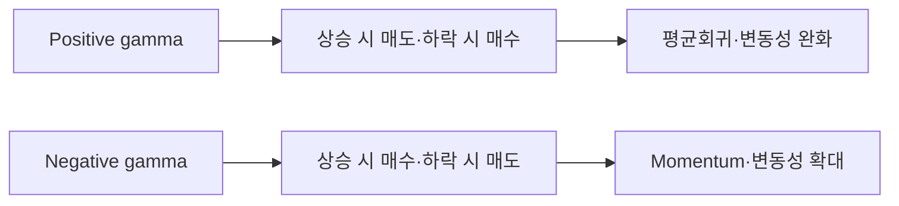
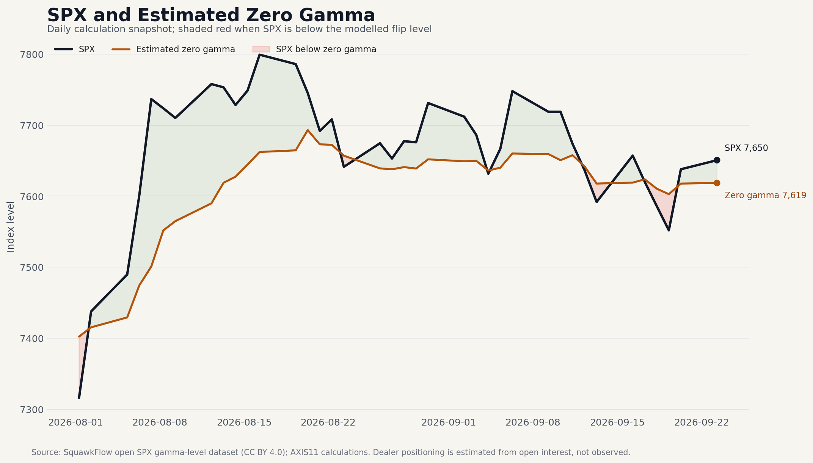
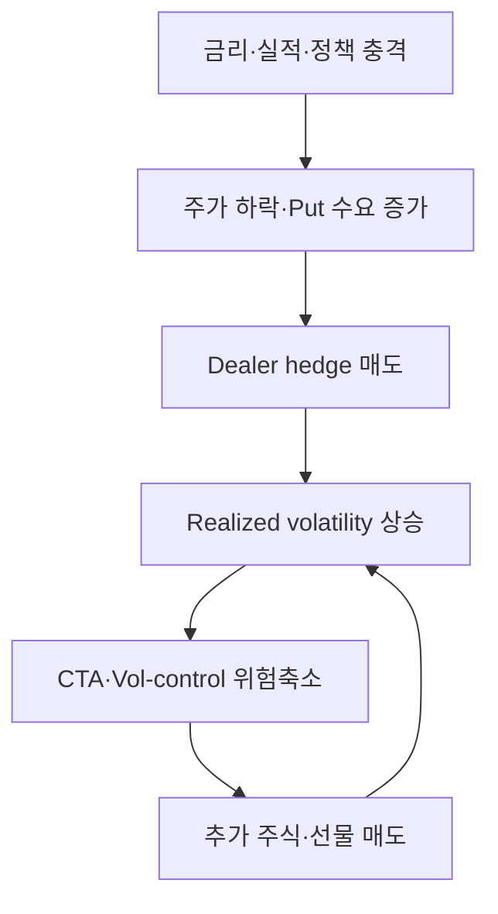

*낮은 VIX 뒤의 보이지 않는 헤지 흐름*

시장에 대한 글을 읽다 보면 `positive gamma`, `negative gamma`, `zero gamma`, `call wall` 같은 표현이 점점 자주 등장한다. 주가가 잘 하락하지 않을 때는 dealer가 positive gamma이기 때문이라고 하고, 갑자기 변동성이 커질 때는 negative gamma가 매도를 증폭시켰다고 설명한다. 특히 만기가 당일 끝나는 0DTE 옵션 거래가 급증하면서 옵션시장의 헤지 흐름이 현물 주식시장을 움직이는 힘도 커졌다는 주장이 많아졌다.

필자 역시 그동안 낮은 VIX와 대규모 옵션 거래가 시장의 변동성을 억제하다가, 충격이 발생하면 dealer의 hedge와 systematic strategy의 매도를 통해 조정을 확대할 수 있다고 생각했다. 그러나 정작 dealer gamma exposure가 어떻게 계산되는지, positive gamma와 negative gamma가 Call·Put의 종류와 어떤 관계가 있는지, 시장에서 매일 제시되는 GEX 숫자를 얼마나 신뢰할 수 있는지는 정확히 이해하지 못했다.

이 글은 옵션 전문가의 매매전략을 제시하기 위한 글이 아니다. 필자가 dealer gamma를 공부하면서 이해한 내용을 정리하고, 이를 현재 시장에 적용할 때 무엇을 말할 수 있고 무엇은 말할 수 없는지를 구분하려는 시도다.

먼저 결론을 간단히 정리하면 다음과 같다.

> **Gamma는 시장의 방향을 결정하지 않는다. 금리, 실적, 정책과 투자자의 수요가 방향을 결정한다. 다만 dealer의 옵션 포지션은 같은 충격이 작은 조정으로 끝날지, 자기강화적인 가격 움직임으로 확대될지를 바꿀 수 있다.**

---

## 1. 낮은 VIX는 왜 시장을 안정적으로 보이게 하는가

2026년 8월 S&P 500은 2.6% 상승했고, 대형 기술주를 묶은 Cboe Magnificent 10 Index는 7.5% 상승했다. 반면 VIX는 15.99에서 14.92로 하락했고 한 달 내내 14.25~16.50의 좁은 범위에서 움직였다. 3개월 기대변동성을 나타내는 VIX3M은 17.53으로, 1개월 VIX보다 높았다. 이는 단기 변동성이 낮고 VIX term structure가 정상적인 contango를 유지한 환경이었다. [Cboe의 8월 시장자료](https://www.cboe.com/insights/posts/index-insights-august-2026)에 따르면 covered-call과 put-writing 전략도 대체로 양호한 성과를 기록했다.

9월에는 10년물 국채금리가 5%를 넘고 AI 투자 둔화 우려가 커지면서 기술주가 빠르게 하락했다. 그러나 유가가 하락하고 10년물 금리가 다시 5% 아래로 내려오자 시장은 곧 반등했다. 9월 21일 Nasdaq은 다시 사상 최고 수준에 도달했고 반도체 주식이 상승을 주도했다. 같은 날 [Cboe가 제시한 VIX 현물가격은 14.87](https://www.cboe.com/tradable-products/vix)로 여전히 낮았다.

이러한 시장은 흔히 positive-gamma regime으로 설명된다. 주가가 하락하면 dealer의 hedge 매수가 들어오고, 주가가 상승하면 hedge 매도가 나타나면서 충격이 빠르게 흡수된다는 것이다. 실제 가격 움직임은 이 설명과 상당히 잘 맞는다. 다만 낮은 VIX와 빠른 반등만으로 dealer가 positive gamma라고 확정할 수는 없다. 금리하락, 기업이익 상향과 투자자의 위험선호만으로도 같은 현상이 나타날 수 있기 때문이다.

Dealer gamma를 이해하려면 먼저 옵션의 Delta와 Gamma를 분리해서 봐야 한다.

---

## 2. Delta와 Gamma: Dealer는 왜 주식과 선물을 거래하는가

`Delta`는 기초자산 가격이 움직일 때 옵션가격이 얼마나 변하는지를 나타낸다. Delta가 +0.50인 Call은 주가가 1달러 오를 때 옵션가격이 대략 0.50달러 상승한다. Delta가 -0.50인 Put은 주가가 1달러 오를 때 옵션가격이 약 0.50달러 하락한다.

`Gamma`는 주가가 움직일 때 Delta가 얼마나 변하는지를 나타낸다. 주가가 상승하면서 Call Delta가 +0.50에서 +0.60으로 변하거나, Put Delta가 -0.50에서 -0.40으로 변한다면 그 Delta 변화의 속도가 Gamma다.

Dealer는 고객에게 옵션을 제공하는 과정에서 방향성 위험을 떠안을 수 있다. 이를 줄이기 위해 주식이나 지수선물을 사고팔아 전체 Delta를 0에 가깝게 만든다. 문제는 Delta가 고정돼 있지 않다는 것이다. 주가, 변동성, 잔존만기가 변할 때마다 Delta도 변하므로 hedge를 계속 조정해야 한다.

예를 들어 dealer가 Delta -0.50인 Put을 매수했다고 가정해 보자.

| 최초 포지션 | Delta |
|---|---:|
| Long Put | -0.50 |
| Long 주식·선물 hedge | +0.50 |
| 순 Delta | 0.00 |

주가가 상승하면 Put은 out-of-the-money 방향으로 이동하고 Delta는 -0.50에서 -0.40으로 덜 음수가 된다. 기존의 +0.50 hedge를 그대로 보유하면 순 Delta가 +0.10이 된다. Dealer는 다시 중립으로 만들기 위해 주식·선물 0.10을 매도한다.

반대로 주가가 하락하면 Put Delta는 -0.50에서 -0.60으로 더 음수가 된다. Dealer는 부족해진 hedge를 채우기 위해 주식·선물 0.10을 추가로 매수한다.

Long Put은 주가 하락에서 이익을 얻는 bearish position이지만, hedge의 조정 방향은 다음과 같다.

- 주가 상승 → 주식·선물 매도
- 주가 하락 → 주식·선물 매수

Long Call도 결과는 같다. Call 자체의 Delta는 양수이므로 최초 hedge는 주식·선물 매도다. 주가가 상승해 Call Delta가 더 커지면 dealer는 선물을 추가 매도하고, 주가가 하락해 Call Delta가 작아지면 기존 short hedge를 되사야 한다.

여기서 중요한 점은 **Call인지 Put인지가 아니라 옵션을 매수했는지 매도했는지**다.

| 옵션 포지션 | Gamma | 주가 상승 시 hedge | 주가 하락 시 hedge |
|---|---:|---|---|
| Long Call | Positive | 주식·선물 매도 | 주식·선물 매수 |
| Long Put | Positive | 주식·선물 매도 | 주식·선물 매수 |
| Short Call | Negative | 주식·선물 매수 | 주식·선물 매도 |
| Short Put | Negative | 주식·선물 매수 | 주식·선물 매도 |

Long Put의 Delta는 음수지만 Gamma는 양수다. Put Delta가 -0.60에서 -0.40으로 움직이는 것도 수학적으로는 Delta가 증가한 것이다. 따라서 일반적인 vanilla option에서는 매수한 Call과 Put 모두 positive gamma이고, 매도한 Call과 Put 모두 negative gamma다.

### Gamma는 고정된 값이 아니다

Gamma는 옵션을 처음 거래할 때 정해져 만기까지 유지되는 값이 아니다. 기초자산 가격이 움직이고, 잔존만기가 줄고, implied volatility가 변할 때마다 Gamma도 달라진다. 일반적으로 다른 조건이 같다면 Gamma는 현물가격이 strike에 가까운 at-the-money 구간에서 가장 크고, deep in-the-money나 deep out-of-the-money로 멀어질수록 작아진다.

잔존만기가 짧을수록 이 집중은 더 강하다. 특히 만기 당일 옵션은 현물이 strike 부근에 있을 때 Gamma가 매우 클 수 있지만, 현물이 해당 strike에서 멀어지면 Gamma가 빠르게 사라진다. 이것이 0DTE가 작은 가격변화에도 큰 hedge 조정을 만들 수 있는 동시에, 특정 strike를 벗어나면 영향력이 급격히 약해질 수 있는 이유다.

Implied volatility도 중요하다. 변동성이 낮으면 만기 시점의 가능한 가격범위가 좁아져 Gamma가 at-the-money 부근에 더 집중될 수 있다. 반대로 변동성이 오르면 Gamma가 더 넓은 strike 구간으로 퍼질 수 있다. 따라서 시장에서 말하는 gamma level은 한 번 계산해 오래 사용하는 숫자가 아니라 현물, 만기와 변동성에 따라 계속 다시 계산해야 하는 값이다.

---

## 3. Positive gamma와 negative gamma가 시장에 미치는 영향

Dealer가 전체 옵션 포트폴리오에서 positive gamma라면 주가가 오를 때 주식·선물을 팔고, 주가가 내릴 때 산다. 기존 가격 움직임의 반대 방향으로 hedge한다.

이러한 흐름은 다음과 같은 시장을 만들 수 있다.

- 상승 시 hedge 매도로 상승폭 제한
- 하락 시 hedge 매수로 하락폭 제한
- 장중 평균회귀 강화
- 특정 strike 주변에서 가격이 머무르는 pinning
- realized volatility 하락

반대로 dealer가 negative gamma라면 주가가 오를 때 주식·선물을 사고, 주가가 내릴 때 판다. 기존 움직임과 같은 방향으로 hedge한다.

- 상승 시 hedge 매수로 상승 가속
- 하락 시 hedge 매도로 하락 가속
- 평균회귀보다 momentum 강화
- realized volatility 상승
- 외부충격이 intraday trend로 발전할 가능성 증가

이를 가장 단순하게 표현하면 다음과 같다.



따라서 gamma는 방향성 지표라기보다 **시장 반응함수**에 가깝다.

---

## 4. GEX는 측정값이 아니라 추정치다

시장에서는 dealer의 전체 Gamma Exposure를 `GEX`라고 부른다. 일반적인 계산은 각 옵션의 Gamma에 open interest, 계약승수와 기초자산 가격을 적용한 뒤 strike와 만기별로 합산하는 방식이다.

### Open interest는 무엇을 보여주는가

`Open interest`는 아직 만기·행사·청산되지 않고 남아 있는 옵션 계약의 수다. 오늘 1만 계약이 거래됐다고 해서 open interest가 반드시 1만 계약 늘어나는 것은 아니다. 신규 매수자와 신규 매도자가 만나면 open interest가 늘지만, 기존 보유자끼리 포지션을 넘기거나 기존 포지션을 청산하면 거래량은 발생해도 open interest는 늘지 않거나 줄 수 있다.

따라서 거래량은 오늘 얼마나 활발하게 손바뀜이 있었는지를, open interest는 장 마감 후 얼마나 많은 계약이 남아 있는지를 보여준다. GEX는 보통 후자를 이용해 다음 거래일에 남아 있을 옵션 위험을 추정한다. 하지만 open interest에는 매수자와 매도자가 각각 누구인지, dealer가 어느 쪽인지가 표시되지 않는다.

단순화한 계산식은 다음과 같다.

```
GEX_i ≈ Gamma_i × Open Interest_i × Contract Multiplier × S² × 1%
```

이 계산은 기초자산이 1% 움직일 때 옵션 Delta가 얼마나 변하고, dealer가 얼마만큼의 주식이나 선물을 추가로 거래해야 할 가능성이 있는지를 달러 단위로 추정한다.

문제는 공개 open interest가 계약 수만 보여줄 뿐 dealer가 long인지 short인지는 알려주지 않는다는 점이다. 그 결과 실제 dealer gamma의 부호도 직접 관측할 수 없다.

시장에서는 흔히 다음과 같은 가정을 사용한다.

- Call open interest에는 양수 부호를 적용한다.
- Put open interest에는 음수 부호를 적용한다.
- 이 부호로 각 strike의 Gamma를 합산해 net GEX를 추정한다.

그러나 이는 옵션의 수학적 성질이 아니다. Long Call과 Long Put의 Gamma는 모두 양수다. Call OI에 양수, Put OI에 음수를 붙이는 것은 Call Gamma가 원래 양수이고 Put Gamma가 원래 음수라는 뜻이 아니다. 이러한 부호는 공개된 Open Interest만으로는 알 수 없는 dealer의 실제 포지션 방향을 추정하기 위해 사용하는 경험적 가정이다. 전형적으로 고객은 Call을 매도해 premium을 받고, Put을 매수해 하방 위험을 헤지하는 전략을 사용한다고 가정할 수 있다. 이 경우 거래의 반대편에 있는 dealer는 Call을 매수하고 Put을 매도하게 되므로, dealer는 Call에서 positive gamma, Put에서 negative gamma를 갖는다. 시장에서 널리 사용되는 단순 GEX 산식이 Call OI에 +, Put OI에 − 부호를 적용하는 배경도 여기에 있다. 다만 이는 어디까지나 시장 포지셔닝에 대한 경험적 가정이다. 실제 시장에서는 고객의 Call 매수와 Put 매도, spread와 같은 복합 전략도 광범위하게 사용되기 때문에 Open Interest만으로 dealer가 어느 방향의 포지션을 보유하고 있는지는 확인할 수 없다. [2026년 공개된 GEX 산출 연구](https://papers.ssrn.com/sol3/papers.cfm?abstract_id=7131778)도 동일 strike와 만기의 Call·Put Gamma가 모두 양수이며, GEX의 부호는 옵션의 수학적 특성이 아니라 누가 long이고 누가 short인지에 대한 포지션 가정에서 나온다고 지적한다. 또 다른 연구는 공개 GEX가 실제 dealer inventory를 측정한 것이 아니라 open interest에서 추론한 값이라는 점을 강조한다. [따라서 실제 보유주체에 대한 자료가 없다면 전체 dealer Gamma의 방향 자체에도 불확실성이 존재한다.](https://papers.ssrn.com/sol3/papers.cfm?abstract_id=7398538)

이 때문에 **Put open interest가 Call open interest보다 많다는 사실만으로 negative gamma가 크다고 결론 내릴 수 없다.** 첫째, dealer가 그 Put을 매수했는지 매도했는지 알 수 없다. 둘째, strike와 만기가 다르면 계약당 Gamma가 크게 다르다. 셋째, put spread나 collar처럼 여러 leg를 묶은 거래는 개별 open interest는 크지만 순위험은 상당 부분 상쇄될 수 있다. 넷째, deep out-of-the-money Put의 계약 수가 많더라도 현재 Gamma는 at-the-money 옵션보다 작을 수 있다.

현실의 거래에는 다음이 모두 포함된다.

- 고객의 Call·Put 단순 매수
- covered call과 cash-secured put 매도
- call spread와 put spread
- 기관투자가의 collar
- volatility fund의 option 매도
- dealer 간 거래
- 신규 포지션과 기존 포지션 청산

따라서 같은 option chain을 사용해도 데이터 업체마다 GEX, zero-gamma level, call wall과 put wall이 달라질 수 있다.

### 추정치인 GEX도 의미 있는 정보를 제공하는가

그렇다면 실제 dealer inventory를 직접 관측하지 못하는 GEX가 시장을 이해하는 데 유효한가라는 질문이 남는다. 현재까지의 실증연구는 `일정한 조건에서는 유효하지만, 그 의미를 시장방향 예측으로 확대해서는 안 된다`는 쪽에 가깝다.

[Barbon과 Buraschi의 *Gamma Fragility* 연구](https://papers.ssrn.com/sol3/papers.cfm?abstract_id=3725454)는 개별주식 옵션에서 추정한 dealer gamma imbalance와 장중 주가 움직임을 비교했다. Negative gamma imbalance가 큰 날에는 기존 가격 움직임이 이어지는 momentum이, positive gamma imbalance가 큰 날에는 가격이 되돌아가는 reversal이 강해지는 경향을 발견했다. 이 관계는 기초주식의 유동성이 낮을수록 강했다. 이는 gamma가 최초의 방향을 예측한다기보다 dealer의 delta hedge가 이미 시작된 움직임을 증폭하거나 완화한다는 설명과 일치한다.

Peer-reviewed 연구에서도 비슷한 결과가 확인된다. [Soebhag의 *Option Gamma and Stock Returns*](https://doi.org/10.1016/j.jempfin.2023.101442)는 개별주식의 net gamma exposure가 낮을수록 이후 한 달의 realized volatility가 높아지는 관계를 보고했다. 과거 변동성, implied volatility, 유동성과 여러 기업특성을 통제한 뒤에도 결과가 유지됐고, 연구는 이를 사적정보보다 hedge rebalancing의 영향으로 해석했다. 즉 gamma 추정치가 기존 변동성지표와 완전히 중복되지 않는 정보를 포함할 수 있다는 증거다.

보다 직접적으로 공개 open interest의 유효성을 시험한 [Ardia와 Vaudescal의 2026년 연구](https://papers.ssrn.com/sol3/papers.cfm?abstract_id=7202999)는 약 5년간의 SPX 30분 자료를 이용해 public option data로 net gamma를 재구성했다. Non-0DTE net gamma가 1표준편차 높을 때 다음 30분의 realized variance가 약 36% 낮았으며, proprietary trader-type data를 이용한 기존 연구와 같은 방향의 관계가 나타났다. 공개자료로 계산한 GEX도 적어도 단기 변동성 regime을 구분하는 데 정보가 있을 수 있다는 결과다.

다만 같은 연구에서 0DTE는 결과가 훨씬 불안정했다. 전일 결제 후 집계되는 open interest가 당일 새로 생긴 0DTE 포지션을 충분히 반영하지 못하고, 실제 거래주체의 long·short 방향도 알 수 없기 때문이다. [Dealer GEX와 overnight gap을 분석한 2026년 연구](https://papers.ssrn.com/sol3/papers.cfm?abstract_id=6650858)도 추가 예측력이 주로 low-VIX regime에서 나타났다고 보고했다. GEX의 정보력이 시장상태와 시간구간에 따라 달라진다는 의미다.

따라서 연구가 뒷받침하는 결론은 제한적이다.

- 추정 gamma는 이후의 단기 realized volatility에 조건부 정보를 줄 수 있다.
- Positive gamma에서는 reversal, negative gamma에서는 momentum이 강해지는 경향이 있다.
- 이 관계는 시장유동성, 만기구성, VIX regime에 따라 달라진다.
- 공개 OI 기반 GEX는 non-0DTE에서 상대적으로 유효하지만 당일 포지션 변화가 큰 0DTE에서는 측정오차가 커진다.
- GEX가 지수의 상승·하락 방향이나 Zero Gamma에서의 반등을 안정적으로 예측한다는 증거는 아니다.

결국 GEX는 독립적인 방향성 signal보다는 **같은 외부충격이 얼마나 큰 변동성과 추세로 연결될지를 판단하는 상태변수**로 사용할 때 연구결과와 가장 잘 부합한다.

### 포지션 부호가 정해져 있는데도 Zero Gamma는 왜 생기는가

`Zero gamma`는 기초자산 가격을 여러 수준으로 가정해 option chain 전체를 다시 평가했을 때 추정 net GEX가 양수에서 음수, 또는 음수에서 양수로 바뀌는 가격이다. 각 계약에 적용한 inventory 부호는 그대로여도, 기초자산 가격이 달라지면 각 옵션의 Gamma 크기가 서로 다른 속도로 변하기 때문에 합계의 부호가 바뀔 수 있다.

예를 들어 현물 위쪽 strike에 양(+)의 Call GEX가 많이 있고, 현물 아래쪽 strike에 음(-)의 Put GEX가 많이 있다고 가정해 보자. 지수가 상승하면 위쪽 Call이 at-the-money에 가까워져 그 Gamma의 비중이 커지고, 아래쪽 Put은 멀어져 비중이 작아질 수 있다. 반대로 지수가 하락하면 아래쪽 Put Gamma의 절대값이 커지고 위쪽 Call Gamma는 작아질 수 있다. 어느 가격에서는 두 합계가 같아져 net GEX가 0이 되고, 그 가격을 지나면 부호가 뒤집힌다.

즉 Zero Gamma의 존재는 포지션 부호가 수시로 바뀐다는 뜻이 아니라, **고정된 부호를 가진 여러 옵션의 Gamma 크기가 현물가격에 따라 비선형적으로 달라진다는 뜻**이다. 만기와 implied volatility가 변하거나 새 거래가 발생하면 그 교차가격도 이동한다.

`Call wall`과 `Put wall`은 일반적으로 Call 또는 Put gamma가 가장 많이 집중됐다고 추정되는 strike를 뜻한다. 하지만 이 수준들은 자연법칙처럼 고정된 지지선과 저항선이 아니다.

- 주가가 움직이면 각 옵션의 Gamma가 바뀐다.
- 만기가 가까워지면 Gamma가 빠르게 변한다.
- 당일 거래로 포지션이 새로 생기거나 청산된다.
- implied volatility 변화도 계산에 영향을 준다.
- dealer inventory에 대한 부호 가정이 틀릴 수 있다.

따라서 zero gamma와 option wall은 확정적인 매매가격이 아니라 시장구조를 해석하기 위한 조건부 수준으로 보는 편이 적절하다.

### 공개 차트는 어떻게 읽어야 하는가

아래 차트는 SquawkFlow가 공개한 SPX gamma-level 자료를 이용해 SPX와 추정 Zero Gamma를 함께 표시한 예시다. 검은선이 SPX, 갈색선이 매일 계산된 Zero Gamma이며, 붉은 음영은 SPX가 추정 Zero Gamma 아래에 있었던 구간이다.



*자료: SquawkFlow 공개 SPX gamma-level dataset(CC BY 4.0), AXIS11 계산·시각화. Dealer positioning은 open interest로부터 추정한 것이며 실제 포지션 관측값이 아니다.*

이 공개 시계열은 2026년 7월 말부터 시작하고 초기 관측치의 분석 계약 수도 상대적으로 적다. 따라서 장기적인 예측력을 검증하기 위한 자료가 아니라, Zero Gamma 차트를 어떤 방식으로 읽을 수 있는지 보여주는 예시로 사용했다.

이 차트로 점검할 수 있는 것은 현물이 선 위에 있을 때는 평균회귀형 hedge가 우세하다는 가설, 아래에 있을 때는 추세강화형 hedge가 우세하다는 가설이다. 그러나 짧은 표본에서 두 선이 함께 움직였다고 해서 예측력이 입증되는 것은 아니다. 동일 공급자의 산식을 일관되게 사용하고, 현물과 Zero Gamma 사이의 거리, 실제 realized volatility, 장중 Put flow를 함께 비교해야 한다.

현재 공개 GEX와 Zero Gamma는 SquawkFlow, SpotGamma 등 옵션 분석업체의 화면에서 확인할 수 있다. 다만 업체별로 데이터 시점, 만기 포함범위, dealer inventory 부호 가정과 volatility surface가 다르므로 숫자를 서로 직접 비교해서는 안 된다. 무료 공개자료는 최신 snapshot이나 제한된 과거치만 제공하는 경우가 많아 긴 시계열 검증에도 제약이 있다.

현재 AXIS11은 전체 SPX option chain의 장기 이력과 장중 snapshot을 일관되게 저장하고, dealer inventory를 추정하는 내부 데이터 파이프라인을 아직 갖추지 못했다. 따라서 본문의 차트는 SquawkFlow 공개자료를 사용한 예시이며, 현재 단계에서 AXIS11이 독자적으로 복원한 dealer GEX 시계열로 보기는 어렵다.

---

## 5. 0DTE는 시장을 안정시키는가, 불안정하게 만드는가

0DTE는 거래 당일 만기가 끝나는 옵션이다. 만기가 짧고 strike가 현물가격과 가까울수록 Gamma가 매우 커질 수 있다. 작은 지수 움직임에도 Delta가 빠르게 변하기 때문에 dealer가 hedge를 자주 조정해야 할 가능성이 있다.

[Cboe의 2026년 2분기 실적자료에 따르면 0DTE는 2026년 5월 기준 SPX option 거래량의 약 65%](https://www.investing.com/news/company-news/cboe-q2-2026-slides-record-revenue-0dte-options-surge-to-65-of-spx-93CH-4828641)를 차지한다. 같은 분기 SPX 옵션 일평균 거래량 510만 계약 가운데 0DTE가 310만 계약이었다. 이 숫자만 보면 0DTE가 현물시장을 지배하는 것처럼 보인다. 하지만 거래량과 dealer의 순위험은 다르다.

고객이 같은 strike에서 5만 계약을 매수하고 다른 고객이 5만 계약을 매도하면 총거래량은 10만 계약이지만 dealer에게 남는 순포지션은 거의 없을 수 있다. Spread와 iron condor처럼 여러 옵션을 결합한 거래도 개별 계약량은 크게 만들지만 전체 Gamma는 상당 부분 상쇄될 수 있다.

[Cboe가 실제 participant 구분자료를 이용해 2023년 시장을 분석한 결과](https://www.cboe.com/insights/posts/volatility-insights-evaluating-the-market-impact-of-spx-0-dte-options/), 당시 0DTE dealer net gamma는 장중 평균 약 1.7억~6.7억 달러였고 잠재 hedge flow는 S&P futures 일평균 유동성의 약 0.04~0.17%로 추정됐다. 특정 거래일에는 10만 계약이 넘게 거래된 Put에서도 dealer에게 남은 순포지션이 총거래량의 약 3%에 불과했다. Cboe는 큰 명목거래량만으로 0DTE가 시장변동을 유발한다고 판단하기 어렵다고 결론 내렸다.

[Cboe의 2025년 후속 분석](https://www.cboe.com/insights/posts/0-dt-es-decoded-positioning-trends-and-market-impact/)에서도 SPX 0DTE가 하루 약 200만 계약까지 성장한 시점에 고객의 매수·매도는 대체로 균형적이었고, 추정 market-maker hedge는 SPX 일평균 유동성의 최대 약 0.2%에 그쳤다. 거래량은 이후 하루 310만 계약으로 더 늘었지만, 거래량 증가가 곧 dealer의 순위험 증가를 뜻하지는 않는다는 결론은 그대로다.

다만 이 분석은 거래소가 제공하는 자료이며, 전체 만기와 다른 상품에 존재하는 상쇄 포지션을 완전히 보여주는 것은 아니다. 최근 학술연구도 하나의 결론으로 모이지 않았다.

- [0DTE market maker의 net gamma가 평균적으로 positive이고 미래 장중 변동성과 음의 관계](https://papers.ssrn.com/sol3/papers.cfm?abstract_id=4692190)가 있다는 연구가 있다.
- [0DTE가 도입된 만기일의 SPX 장중 변동성이 오히려 낮았다](https://papers.ssrn.com/sol3/papers.cfm?abstract_id=5641974)는 분석도 있다.
- 반대로 [dealer hedge를 통제한 뒤에도 투기적 0DTE 거래가 변동성을 높인다](https://papers.ssrn.com/sol3/papers.cfm?abstract_id=4426358)는 결과도 제시됐다.
- 공개자료를 이용한 2026년 연구에서는 non-0DTE positive gamma가 다음 30분의 realized variance를 낮췄지만, 0DTE에서는 공개 open interest 기반 추정치와 거래주체 자료의 일치도가 훨씬 낮았다. [0DTE일수록 기존 GEX 계산의 측정오차가 커질 수 있다는 의미다.](https://papers.ssrn.com/sol3/papers.cfm?abstract_id=7202999)

따라서 0DTE 자체가 항상 시장을 불안정하게 만드는 것은 아니다. 고객의 매수와 매도가 균형을 이루고 dealer가 positive gamma를 보유하면 오히려 intraday volatility를 낮출 수 있다. 반대로 고객의 downside option 매수가 한쪽으로 몰리고 dealer가 negative gamma가 되면 짧은 시간 안에 hedge 매도가 집중될 수 있다.

핵심은 `0DTE 거래량`이 아니라 `0DTE의 순방향 flow와 dealer에게 남은 Gamma`다.

---

## 6. 2026년 현재 시장: 낮은 VIX와 빠른 평균회귀

현재 시장에는 서로 다른 두 모습이 함께 존재한다.

첫째, 지수의 변동성은 낮다. 9월 21일 VIX는 14.87이었고, 52주 범위 13.38~35.30의 하단에 가까웠다. 8월에도 VIX는 좁은 범위에 머물렀고 3개월 VIX가 1개월 VIX보다 높았다. 이는 투자자들이 단기적인 급락 가능성에 높은 가격을 지불하지 않고 있으며, 옵션시장에 volatility premium을 매도하려는 공급도 충분하다는 의미다.

둘째, 지수 내부의 움직임은 작지 않다. 10년물 금리가 5%를 넘고 AI 투자에 대한 우려가 부각되자 반도체와 성장주는 빠르게 하락했다. 불과 며칠 뒤 금리와 유가가 하락하자 같은 주식들이 급반등하며 Nasdaq을 다시 최고치로 끌어올렸다. [9월 21일 시장에서는 반도체 주식이 지수상승을 주도했다.](https://www.reuters.com/business/wall-st-futures-rise-ai-stocks-gain-oil-prices-slide-2026-09-21/)

이 움직임을 Gamma만으로 설명하는 것은 무리다. 최초 방향을 결정한 것은 장기금리, 유가와 AI 수요에 대한 기대였다. 다만 낮은 VIX 환경과 빠른 반등은 dealer hedge와 option-selling strategy가 일상적인 충격을 완화하는 positive-gamma 또는 volatility-suppression regime과 일치한다.

현재 시장을 가장 조심스럽게 표현하면 다음과 같다.

> **공개된 시장지표는 변동성이 억제되는 환경과 일치하지만, 실제 dealer inventory가 공개되지 않으므로 현재 net GEX가 확실히 양수라고 단정할 수는 없다. 시장방향은 여전히 금리와 기업이익이 결정하고 있으며, 옵션시장은 그 움직임의 속도와 형태를 바꾸고 있을 가능성이 있다.**

---

## 7. 외부충격이 Gamma feedback으로 전환되는 조건

GEX가 설명하는 것은 같은 외부충격이 발생했을 때 시장이 얼마나 민감하게 반응할 가능성이 있는가이다.

### 시나리오 1: Positive-gamma regime 유지

조건은 다음과 같다.

- VIX가 낮고 VIX term structure가 contango 유지
- realized volatility가 implied volatility보다 낮음
- downside Put 수요가 제한적
- 지수가 주요 option strike에서 크게 이탈하지 않음
- dealer hedge와 option-selling flow가 충격을 흡수

이 환경에서는 하락 후 반등, 장중 평균회귀와 option strike 주변의 pinning이 반복될 가능성이 높다. 악재가 발생해도 시장은 이를 짧은 조정으로 소화한다.

### 시나리오 2: 완충력 약화

다음 변화가 나타나면 기존의 안정성이 약해질 수 있다.

- 지수가 대규모 open interest가 위치한 strike 아래로 하락
- VIX와 downside skew가 함께 상승
- 신규 Put 매수가 증가
- VIX term structure가 평탄화
- 지수 breadth와 시장유동성 악화

이 단계에서는 추정 GEX가 아직 양수이더라도 규모가 줄어들 수 있다. 하락 시 나타나던 hedge 매수의 힘이 약해지고, 시장이 외부뉴스에 더 크게 반응하기 시작한다.

여기서 VIX term structure의 `평탄화`를 무조건 부정적으로 해석해서는 안 된다. 평상시에는 단기 VIX가 3개월 VIX보다 낮은 contango가 흔하다. 단기 충격 우려가 커지면 1개월 변동성이 3개월 변동성보다 더 빠르게 상승하면서 두 값의 차이가 줄어드는데, 이것이 평탄화다. 이는 투자자가 먼 미래보다 바로 앞의 보호에 더 높은 가격을 지불하기 시작했다는 신호일 수 있다.

그러나 평탄화만으로 급락을 예고할 수는 없다. 장기 변동성이 하락해도 곡선은 평평해질 수 있고, 이벤트 직전의 일시적인 옵션 수요도 같은 모습을 만든다. 경계의 강도는 다음처럼 구분하는 편이 낫다.

- 정상 contango 유지: 단기 충격에 대한 보험료가 상대적으로 낮음
- contango 축소·평탄화: 단기 보호수요가 늘고 있는지 확인할 단계
- VIX가 VIX3M을 상회하는 역전: 가까운 시점의 불확실성이 장기보다 더 비싸진 스트레스 신호

따라서 VIX 곡선은 GEX와 별개의 확인지표다. Zero Gamma 접근, downside skew 상승, Put 순매수와 시장유동성 악화가 동시에 나타날 때 평탄화의 의미가 더 커진다.

### 시나리오 3: Negative-gamma feedback

Dealer가 downside option을 순매도한 상태에서 시장이 빠르게 하락하면 Put Delta가 더 커진다. Dealer는 Delta를 중립화하기 위해 선물과 주식을 추가로 매도해야 한다. 이 매도가 지수를 더 떨어뜨리고 다시 Delta를 변화시키는 자기강화 구조가 만들어질 수 있다.



여기서 dealer hedge, CTA·volatility-control과 ETF 매도는 구분해야 한다. Dealer는 옵션 Delta를 줄이기 위해 주식이나 선물을 거래한다. CTA와 volatility-control fund는 추세와 실현변동성에 따라 exposure를 조정한다. ETF는 투자자의 환매가 있거나 ETF 자체가 option overlay를 조정할 때 별도의 거래를 만든다.

이들은 동일한 메커니즘이 아니다. 그러나 주가하락과 변동성 상승이 동시에 발생하면 여러 전략이 같은 방향으로 매도할 수 있다. 이때 Gamma는 최초 충격의 원인이라기보다 서로 다른 매도경로를 연결하는 증폭장치가 된다.

Negative gamma는 하락만 증폭하는 것도 아니다. 호재로 지수가 상승하면 dealer가 선물을 추가로 매수해야 하므로 상승과 short squeeze를 강화할 수 있다. 다시 말해 negative gamma는 bearish signal이 아니라 trend-amplification signal이다.

### Gamma regime이 바뀌었다는 것을 어떻게 알 수 있는가

실제 dealer inventory를 볼 수 없으므로 regime 변화는 하나의 숫자로 확정하는 사건이 아니라 여러 지표가 동시에 가리키는 상태변화로 판단해야 한다.

1. 동일한 산식의 추정 net GEX가 지속적으로 줄어들고 0 아래로 내려가는지 본다.
2. 현물이 추정 Zero Gamma를 단순 장중 이탈이 아니라 종가와 다음 거래일에도 하향 돌파하는지 본다.
3. VIX 상승과 VIX term structure 평탄화·역전이 동반되는지 본다.
4. downside skew와 Put 순매수가 함께 증가하는지 본다.
5. 하락한 날 장중 반등이 약해지고, realized volatility와 추세성이 높아지는지 본다.
6. 이후 CTA와 volatility-control의 위험축소 추정치까지 커지는지 확인한다.

가장 실용적인 표현은 `regime 전환 확인`보다 `regime 전환 확률 상승`이다. 현물이 Zero Gamma 아래로 잠시 내려갔다가 바로 회복하면 계산오차나 일시적 flow일 수 있다. 반대로 가격·변동성곡선·옵션 flow·실현변동성이 같은 방향으로 움직이면 negative-gamma feedback의 가능성이 높아졌다고 판단할 근거가 강해진다.

---

## 8. 투자자는 무엇을 확인해야 하는가

GEX 숫자 하나를 보고 시장을 판단하는 것은 충분하지 않다. 특히 공개 GEX는 실제 dealer inventory가 아니라 추정치라는 점을 항상 전제로 해야 한다.

| 지표 | 확인하려는 내용 | 위험 변화 |
|---|---|---|
| 추정 net GEX | Hedge가 평균회귀형인지 추세강화형인지 | 양수 규모 축소 또는 음수 전환 |
| 현물과 zero-gamma 간 거리 | Gamma regime 전환 가능성 | 현물이 추정 zero-gamma에 접근·하향 돌파 |
| 만기별 GEX | 0DTE·weekly·monthly 영향 구분 | Gamma가 단일 만기와 가까운 strike에 집중 |
| 당일 option flow | 실제 신규 매수·매도 방향 | 하락 중 downside Put 순매수 증가 |
| Open interest 변화 | 신규포지션과 청산 구분 | Put OI 증가와 Call OI 감소 |
| VIX | 30일 예상 변동성 | 현물 하락과 함께 급등 |
| VIX3M/VIX | 변동성 term structure | 비율이 1에 접근하거나 1 아래로 하락 |
| Cboe SKEW | 극단적 downside 위험의 상대가격 | VIX와 SKEW 동반 상승 |
| Realized volatility | 실제 시장 움직임 | Implied volatility를 지속적으로 상회 |
| 시장 breadth | 지수 내부 취약성 | 지수 대비 상승종목 수와 equal-weight 약화 |
| CTA·Vol-control exposure | 2차 시스템 매도 가능성 | 변동성 상승과 함께 exposure 축소 |

실제 모니터링에서는 다음 순서가 더 유용하다.

1. 금리, 실적, 정책과 지정학적 사건이 최초 충격을 만들었는지 확인한다.
2. 주가하락과 함께 VIX, skew와 Put flow가 얼마나 움직였는지 확인한다.
3. 추정 GEX의 부호보다 규모와 변화방향을 본다.
4. 0DTE와 장기옵션을 분리한다.
5. realized volatility 상승이 CTA와 volatility-control의 매도로 이어질 수준인지 확인한다.

이 순서를 거꾸로 적용해 GEX 숫자 하나로 모든 시장 움직임을 설명하면 원인과 증폭경로를 혼동하게 된다.

---

## Conclusion

Dealer gamma를 공부하면서 가장 먼저 수정하게 된 생각은 옵션 거래량이 크면 dealer의 시장영향도 반드시 커진다는 가정이었다. SPX 0DTE가 전체 SPX 옵션 거래량의 약 65%까지 증가한 것은 무시하기 어려운 변화다. 그러나 gross volume이 크더라도 고객의 매수와 매도가 균형을 이루면 dealer에게 남는 net gamma는 작을 수 있다.

두 번째로 중요한 점은 positive gamma와 negative gamma가 Call과 Put의 구분이 아니라 dealer가 옵션을 순매수했는지 순매도했는지에 의해 결정된다는 것이다. Positive gamma에서는 dealer가 오르면 팔고 내리면 사기 때문에 시장을 안정시키는 방향으로 작동한다. Negative gamma에서는 오르면 사고 내리면 팔기 때문에 상승과 하락 모두를 증폭시킬 수 있다.

세 번째는 시장에서 제시되는 GEX가 실제 dealer 포지션의 관측값이 아니라는 점이다. Open interest만으로는 누가 옵션을 매수하고 매도했는지 알 수 없다. 따라서 GEX, zero gamma, call wall과 put wall에는 거래주체와 inventory에 관한 가정이 들어간다. 이러한 수준은 유용할 수 있지만 확정적인 지지선·저항선이나 방향성 매매신호로 받아들여서는 안 된다.

그럼에도 GEX가 무의미한 것은 아니다. 실증연구에서는 추정 gamma가 이후의 단기 realized volatility와 장중 momentum·reversal을 설명하는 추가 정보를 제공했다. 다만 이 정보력은 non-0DTE, 시장유동성과 volatility regime에 따라 달라졌다. 따라서 GEX의 가장 설득력 있는 용도는 가격방향 예측이 아니라 시장이 충격을 흡수할지 증폭할지를 판단하는 것이다.

네 번째는 Zero Gamma가 고정된 포지션 부호와 모순되지 않는다는 점이다. 현물가격이 움직이면 strike별 Gamma의 크기가 서로 다르게 변하고, 만기와 implied volatility도 달라진다. 그 결과 양의 기여와 음의 기여를 더한 net GEX가 특정 가격에서 0을 통과할 수 있다. Put open interest가 많다는 사실만으로 dealer가 negative gamma라고 말할 수 없는 이유도 여기에 있다.

2026년 9월 현재 낮은 VIX, contango 상태의 변동성곡선과 빠른 주가 평균회귀는 시장이 아직 완충적인 regime에 있음을 시사한다. 그러나 이를 dealer의 positive gamma 때문이라고 단정할 증거는 없다. 최근 기술주의 급락과 반등은 시장방향을 결정한 것이 장기금리와 AI 기대 변화였음을 보여준다. 옵션시장은 그 방향을 만들었다기보다 가격 움직임의 속도와 크기를 바꿨을 가능성이 높다.

따라서 앞으로 확인해야 할 것은 GEX의 절대값보다 regime의 변화다. VIX와 downside skew가 함께 오르고, Put flow가 한쪽으로 몰리며, 현물이 주요 option strike에서 이탈하고, realized volatility 상승이 systematic strategy의 매도로 이어지는지가 중요하다.

> **Gamma는 미래의 시장방향을 알려주는 지표가 아니다. 그러나 시장이 충격을 흡수할 준비가 돼 있는지, 아니면 같은 충격을 더 크게 증폭시킬 구조인지를 판단하는 데 도움을 줄 수 있다.**

---

## 주요 자료

- [Cboe: Evaluating the Market Impact of SPX 0DTE Options](https://www.cboe.com/insights/posts/volatility-insights-evaluating-the-market-impact-of-spx-0-dte-options/)
- [Cboe: 0DTEs Decoded—Positioning, Trends, and Market Impact](https://www.cboe.com/insights/posts/0-dt-es-decoded-positioning-trends-and-market-impact/)
- [Cboe: 0DTE Trading Resources](https://www.cboe.com/tradable-products/0dte)
- [Cboe 2026년 2분기 실적자료: 0DTE가 SPX 거래량의 65%](https://www.investing.com/news/company-news/cboe-q2-2026-slides-record-revenue-0dte-options-surge-to-65-of-spx-93CH-4828641)
- [Cboe: VIX Volatility Products and Market Data](https://www.cboe.com/tradable-products/vix)
- [Cboe: VIX Term Structure](https://www.cboe.com/tradable-products/vix/term-structure/)
- [Cboe: Index Insights, August 2026](https://www.cboe.com/insights/posts/index-insights-august-2026)
- [SquawkFlow: SPX Gamma Levels](https://squawkflow.com/gex)
- [Gamma Fragility](https://papers.ssrn.com/sol3/papers.cfm?abstract_id=3725454)
- [Option Gamma and Stock Returns](https://doi.org/10.1016/j.jempfin.2023.101442)
- [The Sign of Dealer Gamma: A Reproducible Framework for Computing GEX](https://papers.ssrn.com/sol3/papers.cfm?abstract_id=7131778)
- [Who's Short Gamma? Nobody Knows](https://papers.ssrn.com/sol3/papers.cfm?abstract_id=7398538)
- [0DTEs: Trading, Gamma Risk and Volatility Propagation](https://papers.ssrn.com/sol3/papers.cfm?abstract_id=4692190)
- [Do S&P 500 Options Increase Market Volatility? Evidence from 0DTEs](https://papers.ssrn.com/sol3/papers.cfm?abstract_id=5641974)
- [Does 0DTE Options Trading Increase Volatility?](https://papers.ssrn.com/sol3/papers.cfm?abstract_id=4426358)
- [The Intraday Gamma-Variance Channel with Public Options Data](https://papers.ssrn.com/sol3/papers.cfm?abstract_id=7202999)
- [Dealer Gamma Exposure and Overnight Gap Risk](https://papers.ssrn.com/sol3/papers.cfm?abstract_id=6650858)
- [Reuters: Nasdaq reaches a record as AI stocks rebound and Treasury yields retreat](https://www.reuters.com/business/wall-st-futures-rise-ai-stocks-gain-oil-prices-slide-2026-09-21/)
