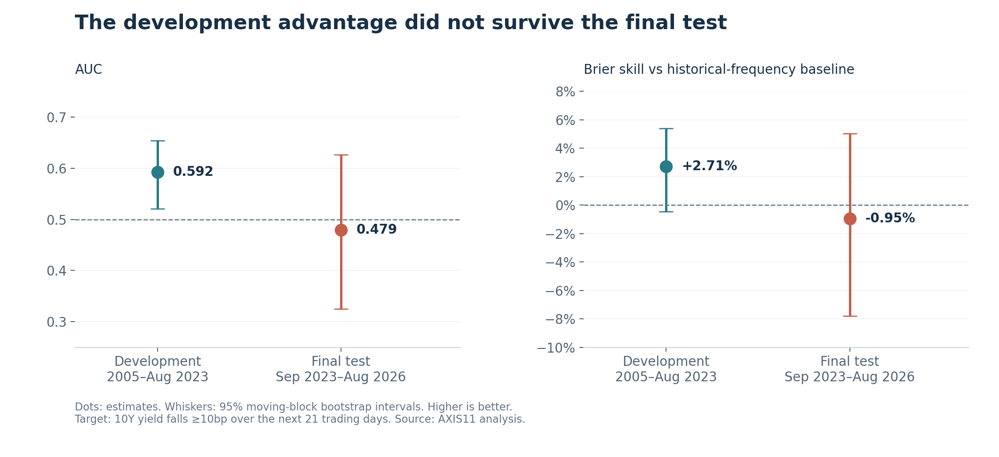
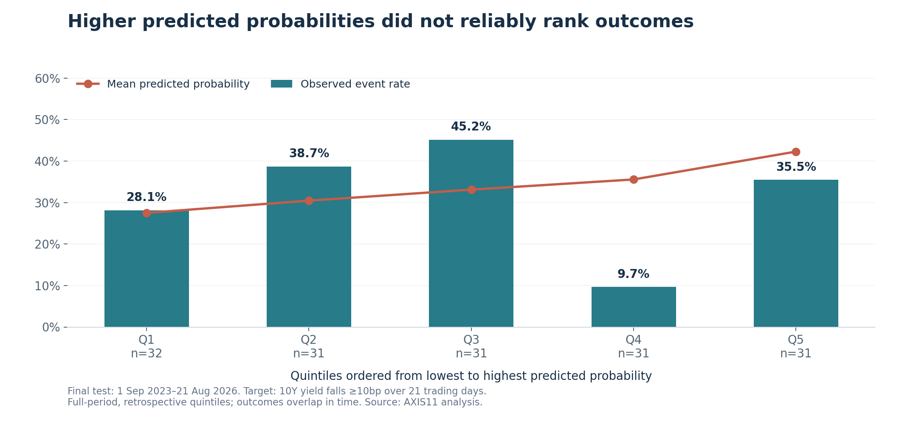

*예측력의 부재가 남긴 결과와 AXIS11의 활용 방향*

미국 10년물 금리의 방향을 예측할 수 있다면 채권의 듀레이션뿐 아니라 주식의 할인율과 자산배분 판단에도 도움이 된다. 그러나 금리와 관련 있는 경제 변수를 찾는 것과, 그 변수로 아직 발생하지 않은 금리 변화를 맞히는 것은 다른 문제다.

이번 연구는 머신러닝이 그 간격을 좁힐 수 있는지 확인하기 위해 시작했다. FRED·ALFRED의 시장 자료에서 출발해 변수의 표현 방식과 모델을 바꾸고, 채권시장 변동성·주식·신용·금 가격 관련 데이터를 추가했다. 개발 과정에서 유망해 보인 모델은 설정을 고정한 뒤 별도로 남겨둔 기간에서 평가했다.

**최종 결과에서는 안정적인 예측력을 확인하지 못했다.** 선정된 모델은 과거 발생 빈도만 사용하는 기준모형보다 확률 예측 오차가 컸고, 사건이 발생할 때 더 높은 확률을 부여하는 능력도 확인되지 않았다. 그렇다고 이 결과를 모든 머신러닝 기법의 한계로 일반화할 수는 없다. 이번 입력 자료와 모델, 예측 기간 및 검증 방식에서 투자 판단에 사용할 근거를 확보하지 못했다는 의미다.

AXIS11이 이 실험에서 얻은 것은 매매 신호보다 연구 방법에 가깝다. 경제적 설명이 실제 예측으로 이어지는지, 추가 데이터가 판단을 개선하는지, 그 개선이 새로운 기간에도 유지되는지를 같은 기준으로 시험할 수 있게 됐다.

## 1. 무엇을 예측하고 어떻게 검증했는가

출발점은 향후 21거래일 동안 미국 10년물 금리가 상승하는지 여부였다. 실험을 확장하면서 5일·63일 예측, 21일 내 10bp 이상 하락, 근사 채권 초과수익의 손실 여부도 살펴봤다. 따라서 후반부 결과는 처음부터 하나의 질문과 모델만 고정해 얻은 것이 아니라, 개발 구간에서 여러 후보를 탐색한 결과다.

입력 자료는 세 단계로 넓혔다. 먼저 금리 모멘텀, 수익률곡선, 금리 변동성, 신용스프레드, VIX와 유가 등 시장 변수를 사용했다. 다음으로 물가·고용·실업·실업수당 청구 자료를 추가했다. 마지막으로 MOVE, S&P 500, 투자등급·하이일드 OAS, 금 가격, 경제 서프라이즈 지수를 추가해 정보의 가치를 비교했다. 이 가운데 경제 서프라이즈 지수와 거시 변수 묶음은 최종 주 모델에는 포함되지 않았다.

로지스틱 회귀, Random Forest, XGBoost뿐 아니라 입력을 과거 분포 내 순위나 표준점수로 바꾸는 방식도 시험했다. 순위 변환은 현재 수치가 과거에 비해 얼마나 높은지 표현한다. 서로 단위가 다른 변수를 비교하고 극단값의 영향을 줄이는 데 유용하지만, 새로운 정보를 만들어내지는 않는다.

최종 평가에 들어간 주 모델은 **시장 변수 23개와 추가 변수 10개를 사용하는 순위 기반 L2 로지스틱 회귀**였다. 예측 대상은 **향후 21거래일 동안 10년물 금리가 10bp 이상 하락할 확률**로 정했다. 모델과 판정 규칙은 평가 전에 기록했다.

| 항목 | 최종 평가 설계 |
|---|---|
| 예측 시점 | 매주 마지막 채권시장 거래일 종가 기준 |
| 주 예측 대상 | 향후 21거래일 동안 10년물 금리 10bp 이상 하락 |
| 모델 | 학습 표본 내 순위 변환＋L2 로지스틱 회귀 |
| 입력 | 기존 시장 23변수＋추가 10변수 |
| 기준모형 | 학습 기간의 해당 사건 발생 빈도 |
| 평가 예측일 | 2023년 9월 1일~2026년 8월 21일 |
| 평가 수 | 주간 예측 156개; 예측 기간 중첩을 고려해야 함 |
| 재학습 | 평가 시작 시점과 이후 각 연도 첫 예측일 |

추가 데이터는 다음과 같이 10개의 입력 변수로 가공했다. 경제 서프라이즈 지수는 개발 과정에서 시험했지만 최종 모델에서는 제외했다.

| 지표 | 최종 모델에서 사용한 형태 | 변수 수 |
|---|---|---:|
| MOVE | 로그 수준, 21거래일 변화, 10년물 실현변동성 대비 로그 비율 | 3 |
| S&P 500 | 21거래일 로그수익률, 최근 252거래일 고점 대비 하락 폭 | 2 |
| 투자등급 OAS | 21·63거래일 변화 | 2 |
| 금 가격 | 21거래일 로그수익률 | 1 |
| 하이일드 OAS | 21·63거래일 변화 | 2 |
| **합계** | | **10** |

*MOVE와 10년물 실현변동성은 기초 대상과 산출 방식이 다르므로, 두 지표의 비율은 상대적 변동성 상태를 나타내는 대용치로 사용했다.*

각 재학습에서는 그때까지 결과가 확정된 과거 사례만 사용했다. 최종 평가 기간의 앞부분에서 발생한 결과가 다음 연도 학습에 들어가는 것은 사전에 정한 순차 재학습 절차다. 평가 기간 전체를 미리 학습한 것은 아니다. 다만 이 검증은 과거 자료를 이용한 시뮬레이션이며, 실시간 운용 실적은 아니다.

## 2. 개발 구간의 개선은 최종 평가에서 유지되지 않았다

추가 데이터를 포함한 최종 후보는 개발 구간에서 비교적 유망했다. 2005년 1월~2023년 8월의 973개 주간 예측에서 AUC는 0.592였고, 과거 빈도 기준모형 대비 Brier 오차는 2.71% 낮았다. 연도별로는 19개 중 17개에서 Brier가 개선됐다.

그러나 이 결과에는 신중하게 볼 이유가 있었다. 여러 모델·변수·예측 대상을 비교한 뒤 선택한 후보였고, Brier 개선도의 블록 부트스트랩 신뢰구간도 0을 포함했다. 개발 구간에서 좋은 결과를 찾는 것과 새로운 기간에서도 같은 성과를 얻는 것은 별개의 검증이다.

| 지표 | 개발 구간 | 최종 평가 구간 |
|---|---:|---:|
| 주간 예측 수 | 973 | 156 |
| 모델 Brier | 0.2166 | 0.2196 |
| 과거 빈도 기준모형 Brier | 0.2226 | 0.2175 |
| 기준모형 대비 Brier 개선도 | +2.71% | −0.95% |
| AUC | 0.592 | 0.479 |

*Brier는 낮을수록 좋고, 개선도는 `1 − 모델 Brier / 기준모형 Brier`이다. AUC는 발생 사례에 더 높은 확률을 부여하는지를 평가하며, 0.5는 순위 구분력이 없는 기준이다. 서로 다른 기간의 Brier 수준은 사건 발생 빈도에도 영향을 받으므로 각 기간의 기준모형과 함께 비교해야 한다.*

*그림 1. 개발 구간의 개선은 최종 평가에서 유지되지 않았다. 오차 막대는 95% 블록 부트스트랩 신뢰구간이며, 두 지표 모두 높을수록 좋다. 자료: AXIS11 자체 분석.*

최종 평가의 사전 판정 규칙에 따른 결과는 `AGAINST`였다. 주 모델의 Brier 개선도는 음수였고 AUC도 0.5 이하였다. 그렇다고 통계적으로 모델의 열등함이 확정된 것은 아니다. Brier 개선도의 95% 신뢰구간은 약 **−7.80%~+5.04%**, AUC는 **0.325~0.627**로 넓었다. 매주 향후 약 한 달의 금리 변화를 예측했으므로, 연속된 예측들은 같은 기간의 금리 움직임을 상당 부분 공유한다. 하나의 시장 충격이 여러 예측의 결과에 동시에 영향을 줄 수 있어, 156개의 예측을 모두 별개의 검증 사례로 보기는 어렵다.

**이번 결과가 지지하는 결론은 예측력의 입증 실패다.** 개발 구간의 개선을 새로운 기간에서도 재현하지 못했으므로, 이 모델을 운용에 채택할 근거가 부족하다.

## 3. 67.9%의 적중률이 성공을 뜻하지 않는 이유

최종 주 모델의 적중률은 67.9%였다. 이 숫자만 보면 높은 성과처럼 보이지만, 예측 대상을 함께 봐야 한다.

156개 평가 사례 중 실제로 금리가 10bp 이상 하락한 경우는 49개, 발생률은 31.4%였다. 나머지 107개에서는 해당 사건이 발생하지 않았다. 따라서 매번 "10bp 이상 하락하지 않는다"고 답하면 **68.6%**를 맞힌다. 여기에는 금리 상승뿐 아니라 보합과 10bp 미만 하락도 포함된다.

| 예측 방식 | 맞힌 사례 | 적중률 |
|---|---:|---:|
| 항상 '10bp 이상 하락하지 않음' | 107/156 | 68.6% |
| 최종 주 모델, 확률 50% 기준 | 106/156 | 67.9% |

주 모델이 하락 확률을 50%보다 높게 제시한 사례는 단 한 번이었으며, 그때는 사건이 발생하지 않았다. 높은 적중률의 대부분은 흔한 결과를 선택한 데서 나왔다. 당시 [HSBC 모델의 65%라는 보도](https://www.marketwatch.com/story/what-this-machine-learning-model-with-65-accuracy-says-is-coming-next-for-the-10-year-treasury-55d76b8f)가 연구의 출발점이었지만, 예측 대상과 평가 표본이 다른 숫자를 직접 비교할 수 없는 이유다.

확률의 순서도 일관되지 않았다. 주 모델의 예측 확률을 낮은 순서부터 다섯 그룹으로 나누면 실제 발생률은 **28.1%, 38.7%, 45.2%, 9.7%, 35.5%**였다. 최상위 그룹이 최하위보다 높다는 한 가지 사실만으로 위험을 잘 정렬한다고 평가할 수 없다. 중간 그룹까지 보면 확률과 실제 결과의 관계가 불규칙하다. 이 그룹들은 최종 기간 전체를 사후적으로 나눈 진단 자료이지, 사전에 정한 거래 규칙도 아니다.

*그림 2. 예측 확률이 높아져도 실제 발생률이 일관되게 높아지지 않았다. Q1은 예측 확률이 가장 낮은 그룹, Q5는 가장 높은 그룹이다. 자료: AXIS11 자체 분석.*

원래 질문에 가까운 '21거래일 후 금리 상승'의 보조 평가에서도 AUC는 **0.449**, 적중률은 **41.0%**였다. 금리 상승 방향 자체를 맞히는 능력 역시 확인되지 않았다.

## 4. 더 많은 데이터와 더 정교한 변환이 답을 보장하지 않았다

같은 최종 평가 날짜에서 추가 변수를 제외한 시장 변수 순위 모델의 AUC는 0.543, Brier 개선도는 +0.49%였다. 추가 데이터를 사용한 주 모델보다 수치는 좋았지만, 신뢰구간이 넓고 개선도도 작아 이 모델을 새로운 승자로 선언하기 어렵다. 주 모델의 Brier는 시장 변수만 사용한 모델보다 약 1.45% 높았으며, 이 차이 역시 통계적으로 확실하지 않았다.

순위를 정규분포 점수로 바꾼 보조 모델도 AUC 0.474, Brier 개선도 −0.46%로 개선을 입증하지 못했다. **데이터가 늘거나 입력 표현이 정교해졌다는 사실은 예측력이 늘었다는 증거가 아니다.**

연도별 결과도 그 이유를 보여준다. 주 모델의 Brier 개선도는 2023년 평가 부분에서 +5.94%, 2024년 +5.18%였으나 2025년에는 −10.47%였다. 2026년 평가 부분은 +0.68%에 그쳤다. 2023년과 2026년 수치는 연간 전체가 아니다. 일부 기간의 개선만으로 안정적인 관계를 추정하면 다른 기간의 실패를 놓칠 수 있다.

### 장기 금리 국면이 바뀌었다면

성과 부진을 해석할 때 고려해야 할 가설은 **학습 자료의 상당 부분이 장기 금리 하락 국면에 속하고, 최종 평가에는 코로나 이후 달라진 금리 환경이 포함돼 있다는 점**이다. 미국 장기금리는 1980년대 이후 수십 년에 걸쳐 하락했고, 코로나 이후에는 인플레이션과 통화 긴축을 거치며 저금리 환경에서 크게 벗어났다. 장기 하락의 배경은 [연준의 관련 연구](https://www.federalreserve.gov/econres/feds/why-have-long-term-treasury-yields-fallen-since-the-1980s-expected-short-rates-and-term-premiums-in-quasi-real-time.htm)에서도 다룬다. 다만 장기 하락기가 영구적으로 끝났는지, 새로운 상승 국면이 얼마나 지속될지는 아직 열린 판단이다.

최종 모델의 학습 자료는 1994년부터 시작한다. 이 기간에는 여러 차례의 금리 상승 사이클도 있었지만, 1980년대 이전의 장기 상승 국면은 포함하지 않는다. 긴 하락 추세 안에서 반복된 관계가 코로나 이후 환경에서도 유지된다고 가정하면, 모델은 새 국면을 잘못 해석할 수 있다. 표본의 행 수가 많더라도 서로 다른 장기 국면의 사례가 충분하다는 뜻은 아니다.

여기서 **장기 금리 수준의 상승과 21거래일 상승 빈도는 구분해야 한다.** 최종 평가 전체에서 21거래일 후 금리가 상승한 비율은 49.4%였지만, 2026년 평가 부분에서는 67.6%였다. 반면 주 예측 대상인 '10bp 이상 하락'의 발생률은 최종 평가 전체에서 31.4%, 2026년 평가 부분에서는 17.6%였다. 최종 평가 구간에서 상승이 더 빈번하고 큰 하락은 드물어졌다는 점은, 학습한 관계가 달라졌을 가능성을 검토할 근거가 된다.

이 가설만으로 실패 원인이 입증된 것은 아니다. 최종 주 모델의 연도별 Brier 개선도가 가장 나빴던 해는 2025년이며, 2026년에는 기준모형 대비 소폭 개선됐다. 국면 변화와 성과 사이의 인과관계를 확인하려면 학습 기간과 재학습 방식 등을 분리해 비교해야 한다.

### 그럼에도 최신 기간에서 평가한 이유

최신 기간을 최종 평가로 남긴 것은 **과거의 정보에서 학습한 관계가 이후의 결과를 예측하는 데 실제로 도움이 되는지** 확인하기 위해서다. 운용 시점에는 앞으로 같은 국면이 이어질지 미리 알 수 없다. 따라서 학습 구간과 다른 환경이 나타났다는 사실은 실패를 이해하는 단서인 동시에, 모델이 넘어야 할 실제 운용상의 조건이다.

이번 검증은 과거 중 비슷한 환경을 골라 설명하는 능력보다, 시간 순서상 뒤에 오는 자료로 지식이 이어지는지를 평가했다. 최신 평가가 과거와 달라 어려웠다는 이유로 이를 제외하면 연구의 원래 질문을 바꾸게 된다.

### 더 긴 데이터가 도움이 될까

가능성은 있다. 금리처럼 수십 년에 걸친 추세가 중요한 대상은 1960~1980년대의 상승·고인플레이션 환경까지 포함하면, 하락 국면에서만 자주 관찰한 관계에 의존하는 문제를 줄일 수 있다. **중요한 것은 관측치 수를 늘리는 것보다 서로 다른 국면과 전환 사례를 더 확보하는 것이다.**

그러나 오래된 자료를 단순히 추가하는 것이 반드시 유리하지는 않다. 통화정책 체계와 시장 구조가 달라 과거 관계의 적용 가능성이 낮을 수 있고, 현재 사용한 모든 지표를 같은 정의와 발표 시점 기준으로 수십 년 더 확보하기도 어렵다. 금리 자료만 길게 확보했다고 현재의 33변수 모델을 그대로 더 오래 학습할 수 있는 것도 아니다.

후속 연구에서는 장기간 일관되게 확보할 수 있는 소수 변수로 여러 국면을 학습하는 모델과, 최근 자료에 더 큰 비중을 두는 모델을 비교할 수 있다. 다양한 과거를 학습하는 이점과 오래된 관계를 덜 반영하는 이점 중 어느 쪽이 더 큰지는 미리 정할 수 없다. **더 긴 역사적 데이터가 국면 변화에 대한 적응력을 높일 수 있는가는 이번 연구가 남긴 열린 질문이다.**

## 5. AXIS11은 머신러닝을 어디에 사용할 것인가

현재 예측 모델을 자산배분 신호로 사용하기에는 근거가 부족하다. 대신 이번 연구에서 구축한 데이터 처리와 비교·검증 절차는 바로 활용할 수 있다. 시장 상태 분석과 새로운 예측 과제는 그 기반 위에서 확장하되, 활용 가능성과 입증된 성과를 구분해야 한다.

### 가설과 추가 데이터의 가치를 검증하는 도구

AXIS11의 리서치는 "신용스프레드 확대가 금리 하락 가능성을 높이는가", "고용 둔화가 기존 시장 가격 정보에 무엇을 더하는가" 같은 가설을 다룬다. 머신러닝은 여러 조건을 동시에 고려한 뒤, 해당 변수를 넣었을 때와 뺐을 때의 표본외 오차를 비교하는 데 사용할 수 있다.

이번 실험에서 추가 데이터의 효과를 같은 날짜의 시장 변수 모델과 비교한 것이 그 사례다. 개발 구간에서는 개선이 보였지만 최종 구간에서는 유지되지 않았다. 이 결과는 특정 변수가 무의미하다는 인과적 결론이 아니라, **이번 예측 목적에서 지속적인 추가 가치를 확인하지 못했다는 판단**을 가능하게 한다.

AXIS11은 이런 비교를 데이터 구매, 모델 복잡도, 연구 우선순위를 결정하는 근거로 쓸 수 있다. 유의미한 성과를 찾지 못한 실험도 근거가 약한 신호를 운용에 채택하지 않도록 돕는다.

### 시장 상태를 같은 기준으로 비교하는 도구

순위 변환으로 만든 변수는 현재 시장을 과거와 비교하는 데 재사용할 수 있다. 금리 모멘텀, 커브 기울기, 금리 변동성, 신용스프레드가 각각 과거 분포의 어디에 있는지 함께 표시하면, 매번 다른 표현으로 시장을 평가하는 문제를 줄일 수 있다.

예를 들어 "금리는 빠르게 올랐지만 신용스프레드는 상대적으로 안정적이다"라는 판단을 변수별 역사적 위치로 확인할 수 있다. 유사한 조건이 나타났던 과거 사례를 찾아, 금리 방향뿐 아니라 변동 폭과 결과의 분산을 보여주는 연구 화면으로도 확장할 수 있다.

여기서 **개별 변수의 순위 표시는 통계적 정리이며, 그것만으로 머신러닝의 예측 성과가 입증되는 것은 아니다.** 군집화나 유사 사례 검색으로 확장하더라도 처음에는 현재 상태를 기술하고 질문을 찾는 용도로 사용해야 한다. 유사 사례의 이후 수익률을 제시하려면 당시 이용 가능한 정보만 사용해 사례 선택 규칙을 별도로 검증해야 한다.

### 모델과 분석가의 판단을 함께 평가하는 도구

이번 실험에서는 67.9% 적중률보다 68.6%의 단순 기준이 더 중요했다. 같은 원칙을 분석가의 시나리오에도 적용할 수 있다. 예측 대상과 기간, 확률을 미리 기록하고 결과가 확정되면 Brier와 확률 구간별 실제 발생률을 계산하는 방식이다.

이를 통해 AXIS11은 모델뿐 아니라 자체 판단이 과도하게 확신하는지, 특정 환경에서 반복적으로 틀리는지 확인할 수 있다. 검증된 예측력을 갖추기 전에는 이번 모델의 확률을 분석가 확률과 기계적으로 평균하거나 포지션 크기에 연결하지 않는다. 비교 기록을 먼저 쌓아 어떤 판단이 단순 기준보다 나은지 확인한다.

### 다음 연구는 별도의 성공 기준을 가져야 한다

금리 방향 외에도 향후 변동 폭, 큰 금리 상승에 따른 손실 위험, 기업 간 상대수익률 같은 문제는 후속 연구 대상이 될 수 있다. 특히 AXIS11의 주식 팩터 연구에서는 기존 팩터 대비 추가 설명력과 종목 순위의 안정성을 시험할 수 있다.

하지만 이번 금리 모델의 실패가 다른 과제의 성공 가능성을 입증하지는 않는다. 변동성 예측은 단순 실현변동성 기준과, 주식 순위 모델은 기존 팩터 기준과 비교해야 한다. 목적을 바꿔도 표본외 개선을 확인해야 한다는 원칙은 같다.

| AXIS11 활용 | 현재 판단 |
|---|---|
| 가설·데이터 묶음의 추가 가치 비교 | 이번 연구 절차를 바로 활용 가능 |
| 변수별 역사적 위치와 모델 오류 기록 | 기술적 분석·연구 관리에 활용 가능 |
| 군집화·유사 사례 검색 | 구축 가능한 후속 도구; 예측 효용은 미검증 |
| 변동 폭·손실 위험·주식 상대수익률 예측 | 별도의 사전 설계와 표본외 검증 필요 |
| 현재 모델로 듀레이션·포지션 크기 결정 | 채택 근거 부족 |

## 6. 결론

머신러닝은 이번 실험에서 미국 10년물 금리의 안정적인 예측 신호를 제공하지 못했다. 개발 구간의 유망한 결과는 최종 평가에서 유지되지 않았고, 단순 기준과 비교하자 높은 적중률도 투자 우위로 해석할 수 없었다.

AXIS11은 이 모델을 매매 신호로 채택하지 않는다. 대신 **가설을 같은 조건에서 비교하고, 추가 정보의 가치를 검증하며, 판단 오류를 기록하는 연구 절차**를 활용한다. 시장 상태를 정리하거나 다른 예측 문제로 확장할 때도, 이번 결과에서 입증되지 않은 능력을 이미 확보한 것처럼 취급하지 않는다.

이번 실패가 금리 예측의 본질적 한계 때문인지, 장기 하락 국면에 치우친 역사적 경험 때문인지, 혹은 모델의 적응 방식 때문인지는 아직 구분되지 않았다. 더 긴 자료로 여러 금리 국면을 학습하면 나아질 수도 있고, 오래된 자료의 비중을 줄이는 편이 나을 수도 있다. 그 가능성은 후속 검증에 남겨둔다.

최신 기간을 평가한 이유는 과거 정보가 미래에도 도움이 되는지를 묻기 위해서였다. 이미 확인한 최종 평가 기간은 다음 모델의 새로운 독립 검증 구간이 될 수 없다. 후속 연구는 이번 결과를 개발 자료로 삼되, 변경 이유와 성공 기준을 먼저 정하고 이후 새로 확보되는 자료에서 다시 평가해야 한다. **현재 모델의 예측력은 확인하지 못했지만, 더 다양한 금리 국면을 학습한 모델이 다른 결과를 낼 수 있는지는 열린 결론으로 남긴다.**

---

## 분석 범위와 유의점

자료 가공, 모델 구축, 검증 및 도표 작성은 AXIS11이 수행했다. 결과는 과거 자료를 이용한 표본외 시뮬레이션이며 실제 운용 수익이 아니다. 평가 마지막 예측일은 2026년 8월 21일이고, 해당 예측의 정답은 이후 21거래일 자료로 확정했다. 금리 방향과 확률 예측의 정확성을 평가했으며, 거래비용을 반영한 수익성은 입증하지 않았다.

주간 예측의 결과 기간이 서로 겹치므로 신뢰구간은 시간적 의존성을 고려한 블록 부트스트랩으로 산출했다. 개발 과정의 다수 후보 비교와 최종 평가의 제한된 표본 수를 함께 고려해야 한다. 최종 평가 확률과 주요 성과 수치는 같은 코드·자료로 재현했다.

발표 시점과 평가 경계의 처리에는 보완할 부분이 남아 있다. 유효연방기금금리의 발표 시차와 개발 구간 말미 일부 예측의 정답 기간이 최종 평가 시작 이후에 걸치는 문제다. 따라서 완전한 실시간 투자 검증으로 해석하지 않으며, 후속 연구에서는 이를 정비한 뒤 새로운 자료로 평가해야 한다.
