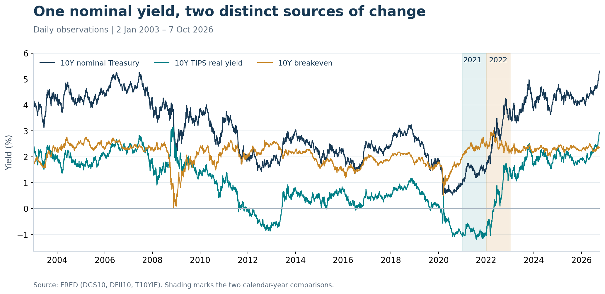
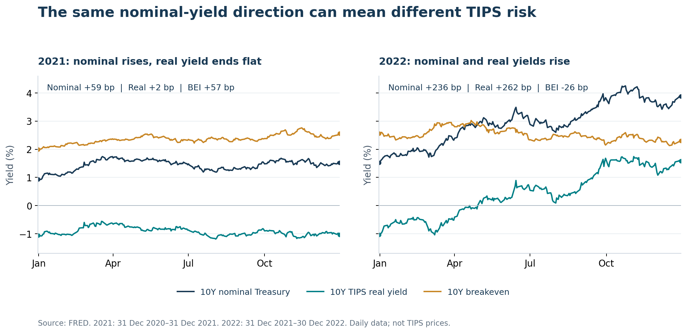
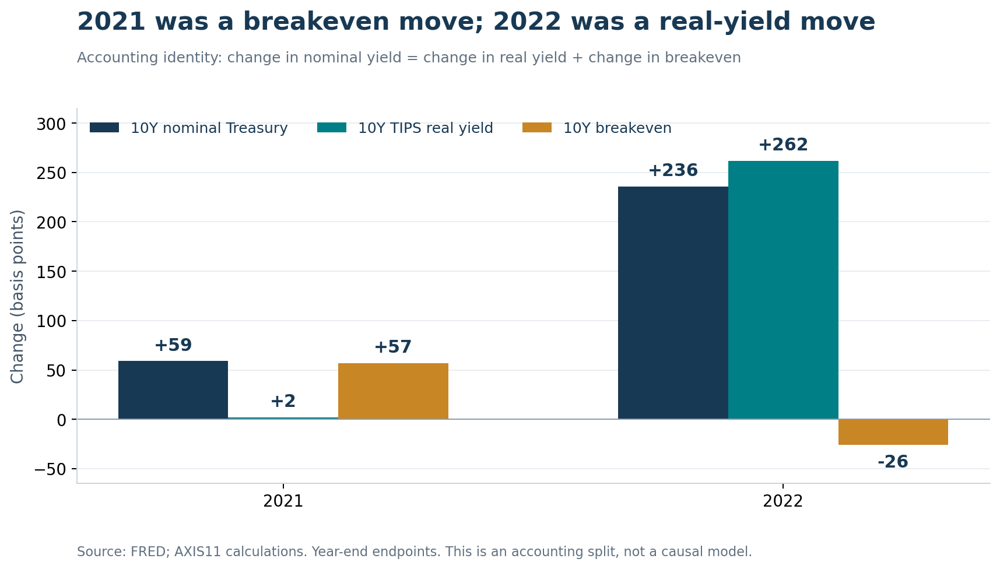

*높은 물가 환경에서조차 물가연동채 투자자가 손실을 보는 이유*

인플레이션이 높아지면 물가연동채를 사야 한다는 생각은 자연스럽다. 미국의 Treasury Inflation-Protected Securities(TIPS)는 소비자물가에 따라 원금을 조정하기 때문이다. 그러나 물가가 오르는 동안에도 TIPS 가격은 하락할 수 있고, 이자와 물가 보상을 합친 총수익률까지 마이너스가 될 수 있다.

이것은 물가연동 장치가 작동하지 않아서 생기는 일이 아니다. **물가 상승은 받을 금액을 늘리지만, 실질금리 상승은 그 금액의 현재가치를 낮춘다.** 두 효과 중 어느 쪽이 큰지가 보유기간 수익을 결정한다.

이전 노트 [「5%에 가까운 미국 10년물: 인플레이션보다 더 불편한 신호」](/axis11.github.io/research/equities-bonds/us-10y-real-rate-repricing/ko)는 명목금리 상승을 물가 하나로 설명하기 어렵다고 봤다.[^5] 기대 실질 단기금리와 실질 기간 프리미엄이 함께 올라간다면, 그 부담은 일반 국채뿐 아니라 TIPS에도 나타난다. 이번 노트는 그 논리를 물가연동채 투자자의 손익으로 살펴봤다.

## 세 금리의 전체 흐름

*그림 1. 2003년 1월 2일부터 최신 공통 관측일인 2026년 10월 7일까지의 일별 데이터. 단위 %. 음영은 아래에서 비교할 2021년과 2022년이다. 출처: FRED DGS10·DFII10·T10YIE, AXIS11 작성.[^6]*

명목금리만 보면 서로 비슷해 보이는 상승도 TIPS 실질금리와 Breakeven으로 나누면 다른 모습을 드러낸다. 세 지표 사이에는 **명목금리 = TIPS 실질금리 + Breakeven**이라는 관계가 있다. 아래에서 볼 2021년에는 주로 Breakeven이 올랐고, 2022년에는 실질금리가 급등했다.

Breakeven은 실제 CPI 상승률이 아니라 채권시장에서 거래되는 물가 보상이다. 실질금리에는 실질 기간 프리미엄과 TIPS 유동성 요인도 들어간다. 따라서 이 차트는 DKW처럼 기대와 위험 프리미엄을 분리한 모형 결과가 아니라, 관측 수익률의 움직임을 보여준다.

## 1. TIPS가 보호하는 것은 무엇인가

TIPS의 쿠폰금리는 고정돼 있지만, 쿠폰을 계산하는 원금은 미국 소비자물가지수에 따라 조정된다. 원금이 1,000달러이고 쿠폰금리가 연 1%인 채권을 예로 들면, 물가 반영 후 원금이 1,050달러가 됐을 때 연간 이자도 10달러에서 10.50달러로 늘어난다. 물가 조정분은 원금에 누적되며, 개별 채권에서는 전액이 매번 현금으로 지급되는 것이 아니다.[^1]

그러나 **조정원금과 시장가격은 서로 다르다.** 조정원금은 계약에 따라 받을 금액을 정하는 기준이고, 시장가격은 투자자가 그 계약을 오늘 얼마에 거래할 것인지를 뜻한다. 원금이 늘어나도 시장에서 요구하는 수익률이 더 빠르게 오르면 거래가격은 내려간다.

만기에는 물가 조정원금과 최초 발행원금 중 큰 금액이 지급된다. 이 하한은 투자자의 매입가격을 보장하지 않는다. 유통시장에서 프리미엄을 지불하거나 과거 물가 상승분이 누적된 채권을 매입했다면, 지불한 금액 전체가 이 하한으로 보호되는 것은 아니다.[^1]

따라서 TIPS의 물가 보호는 계약상 현금흐름의 물가 연동으로 이해해야 한다. 투자계좌의 평가액이 항상 오르거나, 언제 팔아도 손실이 없다는 의미는 아니다.

## 2. 원금이 늘어도 가격이 떨어지는 계산

TIPS는 물가에 연동된 미래 현금흐름을 지급하는 장기채다. 이를 실질 단위로 보면, 고정된 실질 현금흐름을 시장 실질수익률로 할인하는 채권으로 이해할 수 있다.

기존 채권이 제공하는 실질수익률이 1%인데 새로 살 수 있는 비슷한 채권의 실질수익률이 2%가 됐다고 하자. 투자자가 기존 채권을 같은 가격에 살 이유는 줄어든다. 기존 채권 가격이 내려가야 새 채권과 경쟁할 수 있다. 물가가 원금을 올려주는 기능은 남아 있지만, 이 기능만으로 실질수익률 차이를 없앨 수는 없다.

짧은 기간의 손익을 이해하는 데에는 다음 근사가 유용하다.

> **명목 총수익률 ≈ 실질 캐리 + 해당 기간의 물가 반영분 − 실질 듀레이션 × TIPS 실질수익률 변화**

실질 캐리는 쿠폰과 가격의 만기 수렴 등을 포함하는 보유수익이다. 듀레이션은 수익률 변화에 대한 가격 민감도이며, 단순히 잔존만기와 같지는 않다. 실제 수익에는 곡선 형태 변화, 볼록성, 물가 반영 시차, 거래비용과 운용보수도 영향을 준다.

연간 실질 캐리 1%, 물가 반영분 5%, 실질 듀레이션 8년을 가정하면 다음과 같다.

| 1년간 TIPS 실질수익률 변화 | 실질 캐리 | 물가 반영분 | 금리 변화에 따른 가격효과 | 근사 명목 총수익률 |
|---|---:|---:|---:|---:|
| 변화 없음 | +1% | +5% | 0% | +6% |
| +0.5%p | +1% | +5% | −4% | +2% |
| +1.0%p | +1% | +5% | −8% | −2% |
| +1.5%p | +1% | +5% | −12% | −6% |

*설명용 가정이며 실제 상품의 수익률 전망이 아니다. 듀레이션을 일정하게 두고 교차항과 볼록성을 생략한 1차 근사다.*

이 예에서는 물가가 5% 올랐어도 실질수익률이 1%p 상승하면 총수익률은 약 −2%다. 물가 보상은 정상적으로 누적됐지만 금리 상승에 따른 가격 하락이 더 컸기 때문이다. 실질 구매력 기준의 손실은 명목 손실보다 더 커진다.

**인플레이션 전망이 맞았다는 사실만으로 TIPS 투자 결과까지 맞는 것은 아니다. 실질금리 전망과 보유기간도 함께 맞아야 한다.**

## 3. 인플레이션 충격이 TIPS에 불리하게 전달될 수 있다

물가 상승과 실질금리 상승은 서로 배타적인 현상이 아니다. 인플레이션 충격이 통화정책 전망을 바꾸면 동시에 발생할 수 있다.

물가가 예상보다 끈질기게 높게 유지되면 시장은 금리 인하 시점을 늦추거나 향후 정책금리 경로를 높일 수 있다. 이때 예상 명목 정책금리가 기대 물가보다 더 크게 올라가면 기대 실질 단기금리도 상승한다. TIPS 투자자는 더 많은 물가 보상을 받는 동시에 더 높은 할인율을 적용받는다.

또한 장기 실질금리의 불확실성이 커지면 투자자가 장기채를 보유하기 위해 요구하는 실질 기간 프리미엄이 높아질 수 있다. 실제 TIPS 수익률에는 유동성 요인도 들어간다. 거래 여건이 악화돼 추가 수익률을 요구하면 가격에는 또 다른 하락 압력이 생긴다.[^2]

이를 이전 노트의 분해 방식에 연결하면 다음과 같다.

| 금리 구성요소 | TIPS 투자자에게 전달되는 경로 |
|---|---|
| 기대 실질 단기금리 | 향후 실질 단기금리 경로가 높아지면 기존 TIPS의 할인율 상승 |
| 실질 기간 프리미엄 | 장기 실질금리 위험의 보상이 커지면 기존 TIPS 가격 하락 |
| 기대 인플레이션 | 향후 물가 조정에 대한 기대와 일반 국채 대비 상대가치에 영향 |
| 인플레이션 위험 프리미엄 | 일반 국채가 부담하는 물가 위험의 가격으로, TIPS와의 금리 차이에 영향 |
| TIPS 유동성 프리미엄 | 유동성 부족에 대한 추가 보상이 커지면 TIPS 수익률 상승·가격 하락 |

앞의 두 요인이 TIPS에 직접적인 실질 할인율 부담을 준다. 마지막 요인은 관측 TIPS 수익률을 해석할 때 추가로 고려해야 한다. 따라서 TIPS 수익률 상승을 전부 중립 실질금리 상승으로 읽는 것도 부정확하다.[^2]

이전 노트의 2026년 해석은 기대 실질 단기금리가 다시 상승하는 가운데 실질 기간 프리미엄도 함께 올라갔다는 것이었다. **같은 실질 할인율 충격이 주식의 미래 이익과 TIPS의 미래 지급액을 모두 누를 수 있다.** 물가연동채라는 이름만으로 이 위험에서 벗어나는 것은 아니다.

## 4. 2021년과 2022년: 명목금리는 올랐지만 TIPS의 부담은 달랐다

대표 구간은 임의의 저점과 고점보다 비교 기준이 명확한 두 달력연도로 설정했다. 2021년은 2020년 12월 31일부터 2021년 12월 31일까지, 2022년은 2021년 12월 31일부터 2022년 마지막 관측일인 12월 30일까지다.

*그림 2. 동일한 세 금리를 같은 세로축으로 비교했다. 일별 경로를 모두 표시하므로 연말 변화가 작은 경우에도 연중 변동을 확인할 수 있다. 출처: FRED, AXIS11 작성.[^6]*

| 비교 구간 | 10년 명목금리 | 10년 TIPS 실질금리 | 10년 Breakeven |
|---|---:|---:|---:|
| 2021년 | 0.93% → 1.52% | −1.06% → −1.04% | 1.99% → 2.56% |
| 변화 | **+59bp** | **+2bp** | **+57bp** |
| 2022년 | 1.52% → 3.88% | −1.04% → 1.58% | 2.56% → 2.30% |
| 변화 | **+236bp** | **+262bp** | **−26bp** |

*1bp = 0.01%p. 금리는 연말 관측치이며 변화는 양 끝값의 차이다.*

### 2021년: 물가 보상은 커졌지만 실질 할인율은 연말 기준 거의 그대로였다

2021년에는 경제 재개와 강한 수요 회복에 공급망 병목, 노동공급 제약과 에너지 가격 상승이 겹쳤다. 미국 CPI의 전년 대비 상승률은 2020년 12월 1.4%에서 2021년 12월 7.0%로 높아졌다.[^7][^8]

그럼에도 연준은 그해 정책금리를 0~0.25%로 유지했고, 11월 성명에서도 높은 물가의 상당 부분을 일시적 요인으로 설명했다. 자산매입 속도를 줄이기 시작했지만 순매입은 계속됐다.[^7][^9] 물가가 오르고 있어도 실질금리를 크게 끌어올리는 정책 전환이 연말까지 완전히 반영된 상황은 아니었다.

채권시장에서는 명목금리가 59bp 상승하는 동안 Breakeven이 57bp 올라 그 상승분의 거의 전부를 설명했다. TIPS 실질금리는 −1.06%에서 −1.04%로 2bp 오르는 데 그쳤다. **명목금리 상승이 TIPS에 같은 크기의 할인율 상승으로 전달되지 않은 구간**이다.

이 상황에서 TIPS는 물가 조정분을 누적하면서도, 연말 간 비교에서는 실질금리 상승에 따른 가격 하락 부담이 작았다. 동일한 듀레이션의 명목채와 비교하면 중요한 차이다. 듀레이션을 8년으로 고정한 1차 근사에서 금리 변화에 따른 가격효과는 명목채 약 −4.72%, TIPS 약 −0.16%다. 이는 쿠폰·물가 조정·롤다운·볼록성을 제외한 할인율 효과만의 설명용 계산이다.

다만 **2021년 내내 TIPS 가격이 유지됐다는 뜻은 아니다.** 그림 2에서 실질금리는 봄에 상승했다가 여름에 하락하는 등 움직였다. DFII10은 일정 만기의 수익률곡선 지표이므로 이 자료만으로 특정 채권이나 ETF의 가격·총수익률을 확정할 수 없다. 여기서 확인한 것은 연말 간 실질 할인율 변화가 매우 작았다는 점이다.

### 2022년: 높은 물가에 대한 정책 대응이 실질금리 충격으로 바뀌었다

2022년에도 물가는 높았다. 연말 CPI 상승률은 6.5%였고, 러시아의 우크라이나 침공은 에너지·원자재 시장에 추가 부담을 줬다.[^8][^10] 그러나 TIPS 손익에서 더 중요한 변화는 통화정책 대응이었다.

연준은 3월 순자산매입을 종료하고 금리 인상을 시작했다. 한 해 동안 정책금리를 총 425bp 올려 연말 목표범위를 4.25~4.50%로 높였으며, 6월에는 보유자산 축소도 시작했다.[^11] 물가에 대한 우려가 장기간 더 높은 실질금리를 요구하는 방향으로 전달될 수 있는 정책 환경이었다.

10년 명목금리는 236bp 상승했고, TIPS 실질금리는 그보다 큰 262bp 올랐다. Breakeven은 오히려 26bp 하락했다. **높은 현재 물가와 하락하는 장기 Breakeven, 급등하는 실질금리가 동시에 나타난 것이다.**

높은 당장의 CPI는 이미 발생한 물가를 보여주고, 10년 Breakeven은 앞으로의 물가 보상을 반영한다. 긴축이 장기 물가를 억제할 것이라는 기대와 경기 둔화 우려가 함께 작용할 수 있으므로 둘의 방향이 항상 같을 필요는 없다. 다만 세 시계열만으로 Breakeven 하락의 원인을 기대 인플레이션·위험 프리미엄·유동성별로 확정할 수는 없다.

TIPS 투자자는 계속 물가 보상을 받았지만 훨씬 높은 실질 할인율도 적용받았다. 듀레이션 8년을 고정하면 262bp 상승에 따른 1차 가격효과는 약 −21%다. 큰 금리 변화에서 이 근사의 오차는 커지고 실제 채권의 듀레이션도 바뀐다. 따라서 이를 실제 연간 수익률로 읽어서는 안 되지만, 높은 물가 보상마저 압도할 수 있는 할인율 충격의 크기를 보여준다.

*그림 3. 2021년의 +59bp는 실질금리 +2bp와 Breakeven +57bp의 합이다. 2022년의 +236bp는 실질금리 +262bp와 Breakeven −26bp의 합이다. 관측금리의 산술적 분해이며 정책의 인과효과나 DKW 기대 실질금리 기여도를 추정한 차트는 아니다. 출처: FRED, AXIS11 계산.[^6]*

두 구간의 차이는 물가가 높았는지 여부만으로 설명되지 않는다. **물가 상승이 실질 할인율의 상승으로 이어졌는지가 TIPS의 가격 부담을 갈랐다.** 이전 10년물 노트의 기대 실질 단기금리·실질 기간 프리미엄 프레임이 필요한 이유도 여기에 있다.

## 5. 실제로도 만기가 다르면 결과가 달라진다

2026년 10월 7일 운용사 공개자료에서 일반 TIPS ETF와 초단기 TIPS ETF는 다음과 같은 차이를 보였다.[^3][^4]

| 상품 | 유효 듀레이션 | 연초 이후 NAV 총수익률 |
|---|---:|---:|
| iShares TIPS Bond ETF (TIP) | 6.14년 | −1.94% |
| iShares 0–1 Year TIPS Bond ETF (ICPI) | 0.49년 | +3.74% |

*두 상품 모두 2026년 10월 7일 기준. 총수익률은 분배금 재투자를 반영한 운용사 수치이며 단순 가격변동률과 다르다.*

같은 TIPS 투자라도 금리 민감도가 크게 다르면 결과가 달라질 수 있다. 실질수익률이 평행하게 1%p 상승할 때의 1차 가격효과는 듀레이션 6.14년이면 약 −6.14%, 0.49년이면 약 −0.49%다. 물가 보상은 두 상품에 모두 발생하지만 장기금리 변화가 평가액에 미치는 영향은 훨씬 다르다.

다만 이 표만으로 두 상품의 실제 수익률 차이 전부를 실질금리에 귀속할 수는 없다. 보유종목, 물가 반영 시점, 수익률곡선과 운용비용도 다르다. 이 비교는 TIPS의 손익에서 만기 구조를 빼놓을 수 없다는 사례다.

일반적인 TIPS ETF는 채권이 만기되거나 지수 편입요건에서 벗어나면 다른 채권으로 교체한다. 개별 채권처럼 투자자가 기다릴 하나의 만기일은 없다. "만기까지 보유하면 된다"는 개별 채권의 논리를 일정 듀레이션을 유지하는 ETF에 그대로 적용할 수 없는 이유다. 만기가 정해진 ETF는 별도로 구분해야 한다.

개별 TIPS를 만기까지 보유하면 중간 평가손실이 매각손실로 확정되는 문제는 줄어든다. 그러나 매입 실질수익률이 음수였다면 만기 보유도 양의 실질수익을 보장하지 않는다. 물가 연동과 매입가격의 적정성은 별개의 문제다.

## 6. 물가 전망을 TIPS 투자로 옮길 때 확인할 것

투자 판단에서는 "인플레이션이 높을 것인가" 다음에 세 가지 질문이 필요하다.

첫째, 그 물가 전망이 정책금리 전망을 어떻게 바꿀 것인가. 물가 상승이 인하 지연과 실질금리 상승으로 연결된다면 장기 TIPS에는 불리할 수 있다. 반대로 기대 실질금리가 안정되거나 내려간다면 물가 보상과 가격 상승이 함께 작용할 수 있다.

둘째, 얼마 동안 보유하며 어느 정도의 듀레이션을 부담할 것인가. 가까운 시기의 물가 상승을 방어하려는 목적과 장기간 실질수익률을 확보하려는 목적은 서로 다른 만기 구조를 요구한다. 장기 TIPS는 물가 보호와 장기 실질금리 노출을 함께 담은 투자다.

셋째, 무엇을 손실로 측정하는가. 가격 하락만 볼 것인지, 이자와 분배금을 포함한 명목 총수익률을 볼 것인지, 물가를 차감한 실질수익률을 볼 것인지 구분해야 한다. 비달러 투자자는 여기에 환율과 환헤지 비용까지 더해진다.

## 결론

TIPS의 원금이 물가에 따라 늘어난다는 사실과 투자자가 손실을 본다는 사실은 동시에 성립할 수 있다. 미래 지급액의 증가보다 실질 할인율 상승에 따른 가격 하락이 크면 된다.

이전 10년물 노트에서 지적했던 기대 실질 단기금리와 실질 기간 프리미엄의 상승은 바로 이 경로를 설명한다. 높은 물가가 금리 인하를 늦추고 장기 실질금리 위험의 보상을 높인다면, TIPS는 물가를 보상하면서도 가격은 하락할 수 있다.

**TIPS를 매입한다는 것은 물가 연동을 확보하는 동시에 일정 기간의 실질금리 위험을 부담한다는 뜻이다. 물가 전망만큼이나 매입 실질수익률, 듀레이션, 보유기간이 중요하다.**

---

## 참고자료

[^1]: [U.S. Treasury, Treasury Inflation-Protected Securities](https://www.treasurydirect.gov/marketable-securities/tips/) — 원금 조정, 고정 쿠폰, 만기 상환 하한.
[^2]: [Federal Reserve Board, Tips from TIPS: Update and Discussions, 21 May 2019](https://www.federalreserve.gov/econres/notes/feds-notes/tips-from-tips-update-and-discussions-20190521.html) — 실질수익률 분해와 BEI·TIPS 유동성 프리미엄.
[^3]: [BlackRock, iShares TIPS Bond ETF (TIP)](https://www.blackrock.com/us/individual/products/239467/ishares-tips-bond-etf) — 2026년 10월 7일 NAV 총수익률 및 유효 듀레이션.
[^4]: [iShares, iShares 0–1 Year TIPS Bond ETF (ICPI)](https://www.ishares.com/us/products/347171/ishares-0-1-year-tips-bond-etf) — 같은 날짜의 NAV 총수익률 및 유효 듀레이션.
[^5]: AXIS11 Research, [「5%에 가까운 미국 10년물: 인플레이션보다 더 불편한 신호」](/axis11.github.io/research/equities-bonds/us-10y-real-rate-repricing/ko), 16 September 2026 — 기존 노트의 최신 수정본과 연결. 당시 금리 분해의 해석을 사용하며 최신 기여도를 재추정하지 않음.
[^6]: FRED: [DGS10](https://fred.stlouisfed.org/series/DGS10), [DFII10](https://fred.stlouisfed.org/series/DFII10), [T10YIE](https://fred.stlouisfed.org/series/T10YIE) — 2026년 10월 9일 NZT 다운로드. 일별, 단위 %, 비계절조정. 원본 CSV는 1962년부터이나 세 지표의 공통 시작일은 2003년 1월 2일. 차트는 세 지표가 모두 존재하는 관측일만 사용하며 결측값을 보간하지 않음. T10YIE만 있는 2026년 10월 8일은 비교 차트에서 제외.
[^7]: [Federal Reserve, Monetary Policy Report, February 2022](https://www.federalreserve.gov/monetarypolicy/2022-02-mpr-summary.htm) — 2021년 수요 회복·공급 병목·노동공급과 통화정책 배경.
[^8]: [BLS, Consumer Price Index: 2022 in review](https://www.bls.gov/opub/ted/2023/consumer-price-index-2022-in-review.htm) — 2020·2021·2022년 12월 CPI 전년 대비 상승률.
[^9]: [Federal Reserve, FOMC Statement, 3 November 2021](https://www.federalreserve.gov/newsevents/pressreleases/monetary20211103a.htm) — 당시 물가 판단, 정책금리와 자산매입 감속.
[^10]: [Federal Reserve, Inflation since the Pandemic: Lessons and Challenges](https://www.federalreserve.gov/econres/feds/files/2025070pap.pdf) — 공급 충격과 우크라이나 전쟁의 에너지·원자재 경로.
[^11]: [Federal Reserve, The Federal Reserve's responses to the post-Covid period of high inflation, 14 February 2024](https://www.federalreserve.gov/econres/notes/feds-notes/the-federal-reserves-responses-to-the-post-covid-period-of-high-inflation-20240214.html) — 2022년 순자산매입 종료, 정책금리 425bp 인상, 6월 보유자산 축소 시작.
