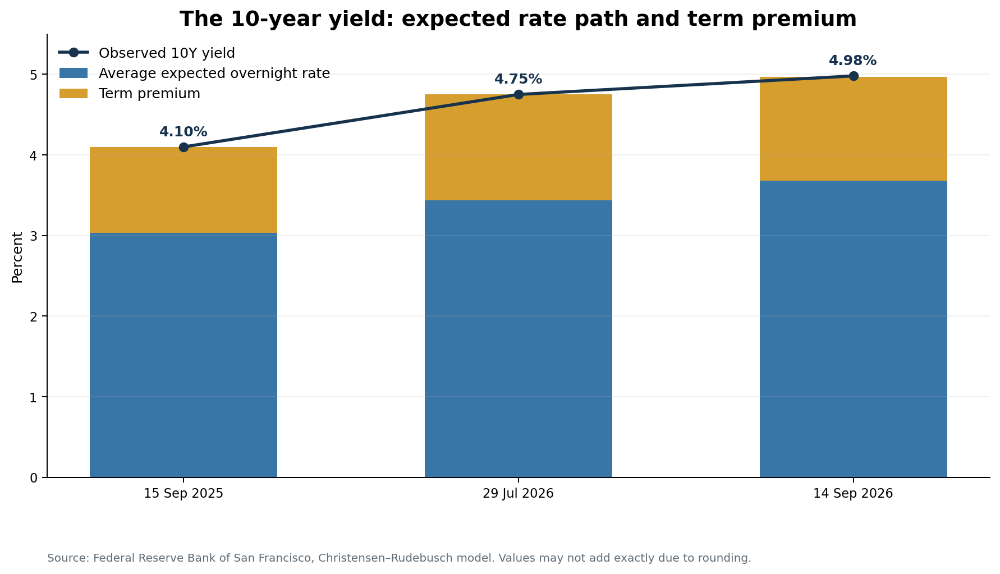
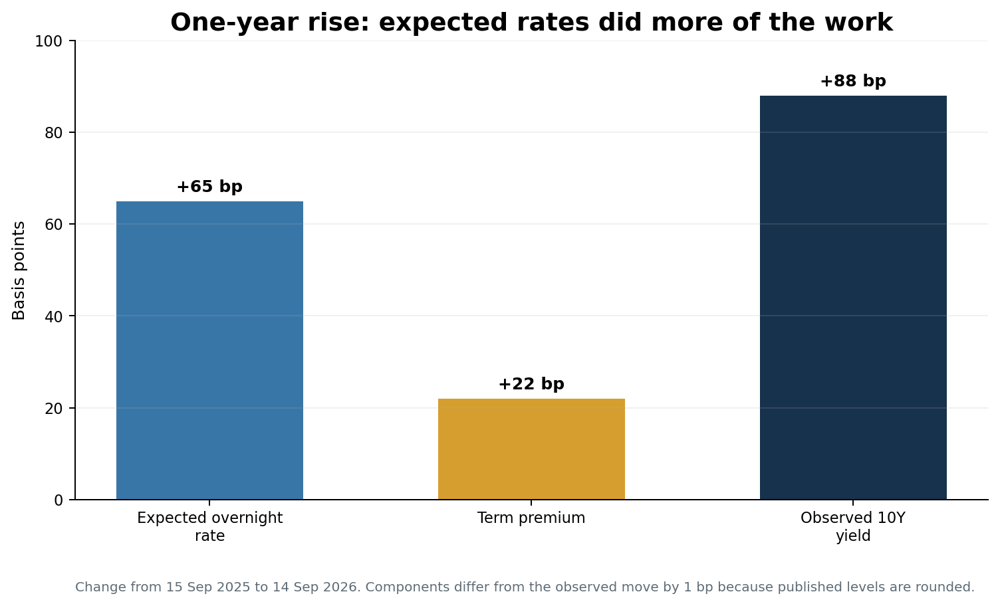
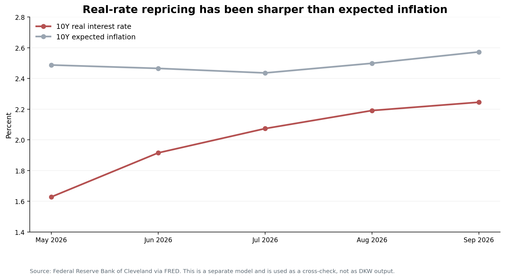

*The two stages of the 2022–2026 rate regime, read through the DKW model*

> **Research note**  
> This note is not intended to predict the direction of the bond market or identify a near-term peak in equities. Instead, it seeks to better understand U.S. long-term yields, which have become one of the key risk variables for financial markets, by examining the factors behind both their current level and recent movements.

> My background is primarily in equities rather than fixed income, so the analysis does not rely on any single term-structure model as a definitive explanation. Instead, I focus on the signals that are broadly consistent across several Federal Reserve models and use them as a framework for understanding what has been driving long-term yields.

## Key conclusion

The most important development in U.S. long-term yields in 2026 has not been a sharp rise in inflation expectations. Rather, it has been the renewed increase in the **expected real short rate.**

The rise in long-term yields since 2022 can broadly be divided into two phases.

1. **Phase 1 — 2022–2025: from policy repricing to a structural term premium**  
   The two halves of this period were driven by different components. During 2022 the expected real short rate rose 142 basis points while the real term premium added 34. From the end of 2022 through 2025 that shifted: the expected real short rate gave back 11 basis points, and the real term premium became the main source of upward pressure, adding another 31. Larger fiscal financing needs, increased Treasury issuance, the withdrawal of Federal Reserve purchases and greater interest-rate volatility all contributed to higher compensation for holding long-duration bonds.

   The resulting rise in the real term premium, concentrated from 2023 onward, suggests that Treasury yields were adjusting to a different pricing environment from the one that prevailed during the zero-rate and quantitative-easing era.

2. **Phase 2 — 2026: The expected real short rate moves higher again**  
   Through August 2026 the DKW fitted 10-year yield rose 57 basis points. The expected real short rate accounts for 25 of those, the real term premium 16, expected inflation 12 and the inflation risk premium 4. Expected real rates are the largest single contributor, and markets have increasingly reassessed the possibility that economic and inflation conditions may not allow the Federal Reserve to ease policy as previously expected. The term premium, however, rose alongside them rather than simply staying high.

A 10-year Treasury yield approaching 5% should not be interpreted purely as an inflation story. An increasingly important part of the repricing is coming from higher expected real rates—and therefore **a higher real discount rate applied across financial assets.**

---

## 1. How DKW separates one yield into four different stories

Conceptually, the 10-year nominal yield can be decomposed as follows:

> **Nominal yield = Expected real short rate + Real term premium + Expected inflation + Inflation risk premium**

- **Expected real short rate:** The average expected path of real short-term interest rates over the life of the bond. It reflects expectations for monetary policy as well as broader assumptions about the equilibrium real rate and the economic conditions that influence it.
- **Real term premium:** The additional return investors require to hold a long-term real bond rather than continuously rolling over short-term securities.
- **Expected inflation:** The average rate of inflation expected over the life of the bond.
- **Inflation risk premium:** The additional compensation investors require for the uncertainty surrounding future inflation.

The [D’Amico–Kim–Wei (DKW) model](https://www.federalreserve.gov/econres/notes/feds-notes/tips-from-tips-update-and-discussions-20190521.html) uses nominal Treasury yields, TIPS yields, CPI data and survey expectations. Importantly, it does not treat the observed TIPS yield as a pure real yield; it explicitly allows for a TIPS liquidity premium. This enables the model to separate expected inflation from inflation risk compensation more carefully than a simple calculation of `nominal yield − TIPS yield`. The Federal Reserve [updates the DKW dataset monthly](https://www.federalreserve.gov/econres/economic-research-data.htm), with the current release extending through 31 August 2026.

A key feature of the DKW model is that it decomposes the nominal yield into these four components. None of them, however, can be observed directly; each is estimated by the model. Estimates of long-run real rates and risk premia can also vary materially depending on model specification and implementation. For this reason, the analysis focuses less on the precise level of each component and more on how they move, and which components are driving changes in the overall yield.

The chart below shows the four DKW components of the 10-year Treasury yield at each month-end from January 2022 through August 2026. Together, they sum to the nominal yield implied by the DKW model.

```chart
{
  "type": "line",
  "title": "DKW decomposition of the 10-year Treasury yield",
  "subtitle": "Monthly observations, Jan 2022 – Aug 2026 · the four components sum to the fitted nominal yield",
  "source": "Federal Reserve Board, D'Amico–Kim–Wei model (DKW_updates.csv). AXIS11 calculations.",
  "x": "date",
  "xType": "date",
  "yLabel": "Percent",
  "decimals": 2,
  "height": 420,
  "markers": [{ "x": "2025-12-31", "label": "2026 repricing" }],
  "series": [
    { "key": "fitted_yield", "label": "10Y fitted nominal yield", "role": "total" },
    { "key": "exp_real_short_rate", "label": "Expected real short rate" },
    { "key": "exp_inflation", "label": "Expected inflation" },
    { "key": "real_term_premium", "label": "Real term premium" },
    { "key": "inflation_risk_premium", "label": "Inflation risk premium" }
  ],
  "dataFile": "dkw_10y_components.csv"
}
```

*Figure 1. Last complete observation of each month, in percent. Hover any month to read all five values. The fitted nominal yield is the sum of the four components, so it is drawn as the total rather than as a fifth component; displayed values are rounded and may not add exactly. Source: Federal Reserve Board; AXIS11 calculations.*

The time series shows a clear shift in the drivers of long-term yields. The Expected Real Short Rate rose sharply during the initial tightening cycle in 2022, adding 142 basis points over that year alone. From the end of 2022 through 2025 it gave back 11 basis points, and the Real Term Premium became the main source of upward pressure, adding 31.

In 2026 both have risen together. Of the 57-basis-point increase in the fitted yield through August, the Expected Real Short Rate accounts for 25 basis points and the Real Term Premium for 16, with expected inflation contributing 12 and the inflation risk premium 4. The point is not that the term premium has stopped moving — it has not — but that expected real rates are climbing again, this time from an already elevated premium. **Rather than two separate episodes, these developments have built on one another.**

## 2. The key point in 2026: the change in expected rates, not only the level of the term premium

Charles Schwab reached a similar conclusion using the DKW framework. Its decomposition of the change in the 10-year Treasury yield from 2 January to 31 July 2026 shows that the increase was driven primarily by higher expected short-term rates, with the expected real short rate contributing more than expected inflation.

This fits the broader pattern seen in the DKW time series. Much of the increase in the term premium had already occurred between 2022 and 2025, and what stands out in 2026 is the renewed upward shift in expected real rates on top of it.

The same direction is visible in other Federal Reserve term-structure models. For example, the San Francisco Fed’s Christensen–Rudebusch (CR) model attributes the change in the 10-year Treasury yield between 15 September 2025 and 14 September 2026 to the following components.



The observed 10-year yield increased by 88 basis points, from 4.10% to 4.98%. Over the same period, the model’s 10-year average expected overnight rate rose by **65 basis points**, from 3.03% to 3.68%, while the term premium increased by **22 basis points**, from 1.07% to 1.29%.

The two models agree on the direction but not on how lopsided the move was. Grouping the DKW components the way CR splits the yield — expectations as the expected real short rate plus expected inflation, the term premium as the real term premium plus the inflation risk premium — DKW attributes 36 basis points to expectations and 26 to the term premium between the end of September 2025 and the end of August 2026, a ratio of roughly 1.4 to 1. CR puts it closer to 3 to 1. Part of the gap is the fortnight the CR window adds, over which yields rose further; the rest is the difference between the models themselves. That is the distinction section 6 returns to: what carries across models is the direction of each component, not the size of its contribution.



The distinction is important.

- **The level of yields**: A term premium of 1.29% remains substantial and is an important structural reason for the weakness of long-duration bonds.
- **The recent change in yields**: Over the past year, the repricing of the expected short-rate path has made the larger contribution.

In other words, 2026 is not a reversal of Phase 1. It is **Phase 2 being added on top of Phase 1**.

## 3. The expected real short rate is more than a Fed forecast

A rise in the expected real short rate should not be interpreted simply as a change in the near-term Fed outlook. Because the measure captures the expected path of real short-term rates over a much longer horizon, several factors can influence it.

1. **Delayed easing**: Persistent inflation may leave the Fed with less room to cut rates than markets had previously expected.
2. **A higher neutral real rate**: Fiscal deficits, government borrowing, AI-related investment and stronger productivity growth may be raising the real interest rate consistent with economic equilibrium.
3. **Resilient growth**: Continued economic strength may allow the economy to sustain higher interest rates for longer, reducing the need for near-term policy easing.

For equity and bond markets, the key structural question is whether the **neutral real rate has moved higher.** The timing of Fed easing and the strength of economic growth are largely cyclical. A sustained increase in the neutral real rate would be more significant because it would imply a higher underlying level of real interest rates—and, potentially, a higher discount rate across financial assets.

The difficulty is that the neutral real rate cannot be observed directly. TIPS yields include a real term premium and liquidity effects, while the DKW Expected Real Short Rate is itself a model estimate. It should therefore not be treated as a direct measure of the neutral real rate. Instead, a persistent rise in the Expected Real Short Rate, particularly across different term-structure models, may be **a signal that the market is pricing a higher equilibrium level of real interest rates.**

## 4. Rising real rates have different implications for equities

The source of a rise in nominal yields matters for equities. When yields rise alongside inflation expectations, companies may also benefit from higher nominal revenues and earnings as prices increase. Higher inflation can still put pressure on margins and valuations, but some of the increase in the discount rate may be accompanied by stronger nominal cash flows.

The implications are different when nominal yields rise primarily through real rates while inflation expectations remain relatively stable. In that case, the discount rate rises without a comparable inflation-driven increase in nominal earnings. This makes a real-rate-driven increase in yields potentially more important for equity valuations.

One complication is that inflation expectations are not directly observable. The most widely followed market measure is **Breakeven Inflation (BEI)**, the difference between nominal Treasury and TIPS yields at the same maturity. But BEI is not a pure measure of expected inflation. In the DKW framework, it also reflects the Inflation Risk Premium and is affected by the TIPS Liquidity Premium. The Expected Inflation component used here is therefore a model estimate designed to separate these effects from underlying inflation expectations.

The Cleveland Fed model provides a useful cross-check. Its estimate of 10-year expected inflation increased only modestly, from approximately 2.49% in May 2026 to 2.57% in September. Over the same period, its estimate of the 10-year real interest rate rose from 1.63% to 2.24%. The contrast supports the broader picture from the term-structure models: the recent increase in long-term yields has been much more pronounced in real rates than in expected inflation.



This is not a DKW estimate. Nevertheless, it supports the same broad interpretation: **the current rate shock is more closely associated with the real discount rate than with expected inflation**.

## 5. The inflation risk premium is a separate issue

Stable expected inflation does not mean that inflation risk has disappeared. **Expected inflation** represents the market’s central view of the future inflation path. The **inflation risk premium**, by contrast, is the additional compensation investors require for the uncertainty around that outlook.

That distinction remains important in 2026. Oil supply disruptions can create renewed inflation pressure, while climate and food shocks remain potential sources of supply-side inflation. At the same time, rapid AI infrastructure investment is increasing demand for electricity, data-centre capacity, semiconductors, copper and capital. None of these risks necessarily means that inflation will remain persistently higher, but they increase the range of possible inflation outcomes.

This is why expected inflation and the inflation risk premium do not have to move together. **The market can maintain a relatively stable central inflation forecast while still demanding greater compensation for the risk that inflation turns out materially higher or lower than expected.** In the context of the DKW decomposition, the two components should therefore be interpreted separately.

## 6. How the other models differ

| Model | Main inputs | Decomposition | Strengths | Main limitations |
|---|---|---|---|---|
| **DKW** | Nominal Treasuries, TIPS, CPI and surveys | Expected real short rate, real term premium, expected inflation and inflation risk premium | Most detailed separation of real-rate and inflation components; adjusts for TIPS liquidity | Sensitive to model structure and estimation assumptions; subject to monthly revision |
| **ACM** | Nominal Treasury yield curve | Expected nominal short rate + nominal term premium | Long history and daily updates; convenient for market monitoring | Does not directly use TIPS or inflation data, so it cannot separate real-rate and inflation components |
| **Kim–Wright** | Nominal yields + interest-rate surveys | Expected short rate + term premium | Uses survey information to constrain long-run expectations | Sensitive to the effective lower bound and sample selection |
| **CR** | Nominal off-the-run zero-coupon yields | Expected overnight rate + term premium | Relatively simple and useful for cross-checking recent changes | As a nominal model, it does not directly separate real rates from inflation risk |
| **Cleveland Fed** | Treasuries, inflation swaps, inflation data and surveys | Real rate, expected inflation, real risk premium and inflation risk premium | Useful monthly cross-check of inflation and real-rate estimates | Variable definitions and estimation structure differ from DKW |

The [New York Fed’s ACM model](https://www.newyorkfed.org/research/data_indicators/term-premia-tabs) and the [San Francisco Fed’s CR model](https://www.frbsf.org/research-and-insights/data-and-indicators/treasury-yield-premiums/) can produce different numerical estimates. This is not necessarily an error. Expectations and risk premia are unobservable, and each model identifies them by imposing different restrictions.

The absolute levels across models are therefore less important than two questions:

1. Are several models revising the expected short-rate path in the same direction?
2. Are nominal and real yields rising even though expected inflation has not increased materially?

At present, the answer to both questions appears to be broadly **yes**.

## 7. What higher real rates mean for equities

Higher real rates affect equities through several channels.

First, it creates **valuation compression**. An increase in the real discount rate has the largest present-value effect on companies whose valuations depend heavily on long-dated growth expectations.

Second, it intensifies **competition for capital**. When long-term real Treasury yields are above 2%, investors can earn a meaningful real return without taking equity risk. This raises the return that equities need to offer through either earnings growth or a more attractive valuation.

Third, the **earnings offset is weaker**. Unlike a rise in yields led by expected inflation, an increase in real rates is not naturally offset by higher nominal revenue. At the same time, higher financing costs weigh on corporate investment and interest expense.

None of this implies that high real yields are, by themselves, a signal that equities must fall. If the rise in expected real rates reflects stronger productivity and growth expectations, improved earnings forecasts could absorb part of the discount-rate shock. The central question is whether **earnings revisions can keep pace with the real discount-rate shock**.

## 8. Signals to monitor

The interpretation in this note would be strengthened if:

- DKW’s Expected Real Short Rate continues to rise while expected inflation remains stable.
- The expected short-rate component contributes more than the ACM or CR term premium when the 10-year yield rises.
- Fed funds futures price fewer cuts, or the possibility of renewed tightening extends further along the curve.
- Earnings revisions fail to keep pace with the rise in real rates.

The interpretation would weaken if:

- Most of the increase in long-term yields shifts back to the inflation risk premium or the term premium.
- Slower growth lowers the expected real short rate, while higher long-term yields reflect Treasury supply pressure alone.
- AI investment and productivity improvements translate into earnings growth faster than the rise in real rates.

## Conclusion

The rise in U.S. long-term yields since 2022 has not been driven by a single factor. From 2022 through 2025, much of the adjustment came through a higher real term premium as Treasury markets moved away from the pricing environment of the zero-rate and quantitative-easing era. In 2026, the Expected Real Short Rate has begun to rise again while the term premium has remained elevated.

A 10-year Treasury yield close to 5% therefore does not carry a single message that “inflation is returning.” More importantly, the market is reassessing **the speed of monetary easing, the neutral real rate, and long-run growth**.

Long-term yields now reflect both an elevated term premium and a higher expected path for real rates. For equities, this means a higher real discount rate without a corresponding rise in expected inflation that could support nominal earnings. **The key question for equities is whether earnings growth can continue to offset a higher real discount rate.**

---

<section class="article-notes" aria-label="Data notes and sources">

### Data notes and sources

- Federal Reserve Board, [Tips from TIPS: Update and Discussions](https://www.federalreserve.gov/econres/notes/feds-notes/tips-from-tips-update-and-discussions-20190521.html); DKW data through 31 August 2026.
- Federal Reserve Bank of San Francisco, [Treasury Yield Premiums](https://www.frbsf.org/research-and-insights/data-and-indicators/treasury-yield-premiums/); values as of 14 September 2026.
- Federal Reserve Bank of New York, [Treasury Term Premia — ACM](https://www.newyorkfed.org/research/data_indicators/term-premia-tabs).
- Federal Reserve Bank of St. Louis, [10-Year Treasury yield](https://fred.stlouisfed.org/series/DGS10), [10-Year real interest rate](https://fred.stlouisfed.org/series/REAINTRATREARAT10Y), and [10-Year expected inflation](https://fred.stlouisfed.org/series/EXPINF10YR).
- Charles Schwab, [Fed and Treasury Update: Higher-for-Longer Yields](https://www.schwab.com/learn/story/fed-and-treasury-update-higher-longer-yields), 12 August 2026; DKW-based interpretation of the 2026 year-to-date move.

</section>
